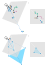
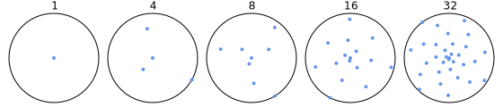

# Cameras

Cameras are classes that inherit from the `Camera` abstract class and represent objects that are used to project points from 3D space to 2D space. In general, a camera works by projecting the 3D points to a plane (the "camera plane") in 3D space, and then manipulating the camera plane so that it is perpendicular to one of the three axes. This way, one of the coordinates can be dropped for each point, transforming the 3D points in their 2D representation. The camera plane is then cropped to obtain a 2D image of the required size.

### The `Camera` abstract class

The `Camera` class defines the following abstract members:

* `Point TopLeft { get; protected set; }`

    This represents the 2D coordinates of the top left corner of the image on the camera plane.

* `Size Size { get; protected set; }`

    This represents the size of the 2D image.

* `double ScaleFactor { get; }`

    This value represents a scale factor that is used to transform between coordinates on the camera plane and in the 2D image.

* `Point3D ViewPoint { get; }`

    This point represents the "position" of the camera, which is used by light sources to compute how much reflected light reaches the camera eye from a certain point in the 3D space.

* `Point Project(Point3D point);`

    This is the main method that a camera class needs to implement: this method transforms a point in 3D space into a point in 2D space, using a camera-specific approach (e.g. a perspective projection or an orthographic projection).

* `Point3D Deproject(Point point, Line3DElement element);`

    `Point3D Deproject(Point point, Triangle3DElement element);`

    These methods perform the conceptually opposite task of the `Project` method: given a point in 2D space and a 3D element (line or triangle), the methods return the 3D point of the 3D element whose projection corresponds to the specified 2D point. These methods assume that it has already been determined that the 2D point corresponds to a point belonging to the 3D line or triangle (e.g. by checking that the 2D point is enclosed within the 2D projection of the 3D element).

* `double ZDepth(Point3D point)`

    This method returns a value describing how "far" from the camera a 3D point is. This could be e.g. the distance from the camera eye, or from the camera plane. The smaller the value returned by this method, the closer to the camera the object is.

* `bool IsCulled(Element3D element)`

    This method determines whether the specified element should be "culled" when rendering the scene using the current camera. Culling elements improves performance by making it possible to avoid any rendering computation on objects that would be invisible. For example, culled elements could include elements that are placed behind the camera or elements that face the opposite way from the camera.

The camera class also defines a `virtual int Compare(Element3D element1, Element3D element2)` method. This method is used to compare two elements and determine whether one is in front of the other or they do not overlap. This method can return `-1` if `element1` is in front of `element2`, `1` if `element2` is in front of `element1`, or `0` if the elements intersect or do not overlap. Renderers can use this information to determine in which order to draw the elements. The default implementation of this method checks whether the 2D representations of the two elements overlap and, if they do, uses the `ZDepth` method to determine which one is in front of the other.

### The `CameraWithControls` abstract class

Cameras can optionally inherit from the `CameraWithControls` abstract class (which inherits from `Camera` itself). This class defines abstract methods to move and rotate the camera in the 3D space:

* `void Orbit(double theta, double phi)`

    This method is used to rotate the camera around a fixed pivot. The two arguments represent the rotation angles; `theta` is the rotation around the y-axis, and `phi` is the rotation around the camera x-axis.

* `void Pan(double x, double y)`

    This method is used to move the camera without changing the direction towards which it is facing. `x` and `y` are expressed in 2D space units.

* `void Zoom(double amount)`

    This method is used to increase (when `amount` is positive) or decrease (when `amount` is negative) the size of the objects projected by the camera.

### The `IBlurrableCamera` interface

Cameras can also implement the `IBlurrableCamera` interface. This interface represents a camera that can cause some degree of "blurring" e.g. to objects that are out of focus. In principle this can also be used to model visual anomalies. The blurring is obtained by rendering a scene with multiple cameras and then averaging the result. Objects that are projected in the same position by all cameras (e.g. objects on the focus plane) will have a sharp appearance, while other objects will be blurred.

The interface defines only one method:

* `Camera[] GetCameras()`

    This method is used to obtain the cameras that will be used to blur the rendering.

Note that not all renderers support blurring: currently, only the `RaycastingRenderer` correctly takes into account blurred cameras; an approach to simulate this in other renderers would be to "manually" render the scene with each camera obtained from the `GetCameras` method, and then blend the resulting images.

VectSharp.ThreeD currently contains two cameras: a `PerspectiveCamera` and an `OrthographicCamera`; both of them inherit from the `CameraWithControls` class. The `PerspectiveCamera`, in addition, implements the `IBlurrableCamera` interface.

## The `PerspectiveCamera` class

The `PerspectiveCamera` class represents a camera that uses perspective projection to transform the 3D points in 2D coordinates. The camera is characterised by the position  of the camera "eye", the direction  towards which the camera points, and the distance  between the camera eye and the camera plane  (which is perpendicular to ).

This class inherits from the `CameraWithControl` class and thus overrides all the abstract members in that class and in the `Camera` class; in addition, it defines the following public members:

* `Point3D Position { get; }`

    This point represents the position of the eye of the camera. This is  in the equations below. The `ViewPoint` property also returns this point.

* `NormalizedVector3D Direction { get; }`

    This vector represents the direction towards which the camera is pointing. This is  in the equations below.

* `double Distance { get; }`

    This value represents the distance between the camera eye and the camera plane. This is  in the equations below.

* `Point3D OrbitOrigin { get; }`

    This point represents the pivot for camera rotations performed using the `Orbit` method.

* `double LensWidth { get; set; }`

    Lens radius, used for focus blurring (see below). The default value is `0`.

* `int SamplingPoints { get; set; }`

    Number of sampling points/cameras used for focus blurring (see below). The default value is `1`.

The constructor has 5 arguments, representing the position of the eye of the camera, the direction towards which the camera points, the distance between the eye of the camera and the camera plane, the size of the area captured by the camera (in 2D camera plane units), and the scale factor.

### Projection

To obtain the 2D projection of a point , consider first:

* The point , which is the projection of the camera eye on the camera plane along the camera direction.
* A 3x3 rotation matrix  such that , where  is the direction of the z-axis of the 3D coordinates reference system.
* A reference vector  and the corresponding versor  (which will correspond to the y-axis of the 2D coordinate system).
* Another 3x3 rotation matrix  representing a rotation around the z-axis by an angle , where .

Now, the intersection  between the segment joining  with  and the camera plane  is computed. Let  and . Then:

The 2D coordinates of the point are then computed by performing a translation, two rotations, and a scaling:

The translation (i.e. ) makes sure that  corresponds to the origin of the 2D coordinate system, while the first rotation (i.e. multiplying by ) aligns the camera plane with the xy-plane (thus ensuring that the z-component of  is always 0) and the second rotation (i.e. multiplying by ) makes sure that the y-axis points in the right direction. The scaling is obtained by multiplying the coordinates by , which is the `ScalingFactor` of the `PerspectiveCamera`; this is useful to avoid numerical issues when the 2D coordinates of the point are subsequently manipulated.

The z-component of  (which is always 0) is ignored, while the x- and y-components of this point represent the 2D coordinates of the projection of z-component of the camera projection of .

The figures on the right show how a point and a triangle are projected by a `PerspectiveCamera`. The left side shows the scene seen by an external camera, while the right side shows the scene as it is seen by the camera placed at .

Note that this approach is equivalent to projecting the points on a plane that is _behind_ the camera at a distance  through a "pinhole" located at the camera's position.

### Z-depth

The z-depth of a point  with respect to a `PerspectiveCamera` (as returned by the `ZDepth` method) is the square of the distance between the point and the camera position: . Using the square of the distance rather than the distance itself makes it possible to obtain better performance by avoiding to compute the square root (and, since the square function is monotonous, this does not affect the sorting of points based on their z-depth).

### Deprojection

To obtain the 3D coordinates corresponding to a 2D point, the camera uses an approach that is the inverse of the projection: given a 2D point , the 3D point on the camera plane  is computed:

Then, the intersection  between the target (i.e. a line identified by two points, or a plane identified by a triangle) and the line passing through  and  is computed. If  exists, this is the return value of the `Deproject` methods.

### Culling

* A `Point3DElement`  is culled if it lies behind the position of the camera's eye, i.e. if .

* A `Line3DElement` is culled if both the start and the end point of the line lie behind the camera.

* A `Triangle3DElement` is culled if all three vertices lie behind the camera, or if the triangle's `ActualNormal`  points away from the camera, i.e. if  (where  is the centroid of the triangle).

### Controls

The `Orbit` method of the `PerspectiveCamera` class rotates the eye of the camera around a fixed pivot and updates the direction of the camera so that it is always pointing towards the pivot. The pivot point can be accessed through the `OrbitOrigin` property of the camera.

The `Pan` method, instead, moves the camera eye and the pivot point, while keeping the direction unchanged.

The `Zoom` method, finally, moves the camera forwards or backwards along its direction.

### Focus blur

This class implements the `IBlurrableCamera` interface. Focus blur is implemented considering a camera lens of a finite size (defined by the `LensWidth` property). The number of cameras returned by the `GetCameras` method is determined by the `SamplingPoints` property of the camera; each of these cameras points in the same direction as the original camera, but has a `Position` that lies on a different point on the lens. The following figure shows which points are sampled with different values for the `SamplingPoints` property (the circle represents the lens, the centre of the circle is the `Position` of the original camera, and the number of `SamplingPoints` is written above each image):

Since all of these points lie on the same plane (perpendicular to the camera's `Direction`) and the cameras all have the same `Distance`, points that lie on the camera plane are perfectly in focus, while points that are closer or farther are out of focus. The camera's `Distance` thus represents the focal length of the camera. The amount of blurring (and, thus, the depth of field of the camera) depends instead on the `LensWidth` property: larger values will result in more blurring and thus a smaller depth of field, while smaller values will result in less blurring and a higher depth of field.

By default, focus blur is disabled because the `LensWidth` is 0 (i.e. a point-like lens) and the `SamplingPoints` property is equal to 1 (i.e. only the centre of the lens is used). It can be enabled by changing the value of both of these properties.

The following figures show the effect of various values for the `LensWidth` property (on the horizontal axis) and the `SamplingPoints` (on the vertical axis) property. The `Distance` property is the same in all cases, and is such that the middle of the sphere in the front is in focus (you may have to zoom to appreciate the effect).

It should be noted that, depending on the renderer, increasing the value of `SamplingPoints` will likely have an adverse effect on computation time, because the scene effectively has to be rendered once for each sampling point. In the current implementation of the `RaycastingRenderer` this effect is approximately a linear in computation time (however, since the sampling is done on a per-pixel basis, it does not have a significant effect on the amount of memory used).

## The `OrthographicCamera` class

The `OrthographicCamera` class represents a camera that uses an orthographic projection to transform the 3D points in 2D coordinates. The camera is characterised by the position  of the camera (used mainly when performing reflection computations or when determining whether an object is in front of or behind the camera) and the direction  towards which the camera points. The camera plane  is perpendicular to  and passes through .

This class inherits from the `CameraWithControl` class and thus overrides all the abstract members in that class and in the `Camera` class; in addition, it defines the following public members:

* `Point3D Position { get; }`

    This point represents the position of the camera. This is  in the equations below. The `ViewPoint` property also returns this point.

* `NormalizedVector3D Direction { get; }`

    This vector represents the direction towards which the camera is pointing. This is  in the equations below.

* `Point3D OrbitOrigin { get; }`

    This point represents the pivot for camera rotations performed using the `Orbit` method.

The constructor has 4 arguments, representing the position of the camera, the direction towards which the camera points, the size of the area captured by the camera (in 2D camera plane units), and the scale factor.

### Projection

To obtain the 2D projection of a point , consider first:

* A 3x3 rotation matrix  such that , where  is the direction of the z-axis of the 3D coordinates reference system.
* A reference vector  and the corresponding versor  (which will correspond to the y-axis of the 2D coordinate system).
* Another 3x3 rotation matrix  representing a rotation around the z-axis by an angle , where .

Now, the projection  of  on  along  is computed:

Similarly to the `PerspectiveCamera` case, the 2D coordinates of the point are then computed by performing a translation, two rotations, and a scaling:

The translation (i.e. ) makes sure that  corresponds to the origin of the 2D coordinate system, while the first rotation (i.e. multiplying by ) aligns the camera plane with the xy-plane (thus ensuring that the z-component of  is always 0) and the second rotation (i.e. multiplying by ) makes sure that the y-axis points in the right direction. The scaling is obtained by multiplying the coordinates by , which is the `ScalingFactor` of the `OrthographicCamera`; this is useful to avoid numerical issues when the 2D coordinates of the point are subsequently manipulated.

The z-component of  (which is always 0) is ignored, while the x- and y-components of this point represent the 2D coordinates of the projection of z-component of the camera projection of .

The figures on the right show how a point and a triangle are projected by a `OrthographicCamera`. The left side shows the scene seen by an external (perspective) camera, while the right side shows the scene as it is seen by the `OrthographicCamera`.

### Z-depth

The z-depth of a point  with respect to an `OrthographicCamera` (as returned by the `ZDepth` method) is the distance of the point from the camera plane: .

### Deprojection

Similarly to the `PerspectiveCamera` case, to obtain the 3D coordinates corresponding to a 2D point, the works in reverse: given a 2D point , the 3D point on the camera plane  is computed:

Then, the intersection  between the target (i.e. a line identified by two points, or a plane identified by a triangle) and the line passing through  with direction  is computed. If  exists, this is the return value of the `Deproject` methods.

### Culling

* A `Point3DElement`  is culled if it lies behind the camera plane, i.e. if .

* A `Line3DElement` is culled if both the start and the end point of the line lie behind the camera.

* A `Triangle3DElement` is culled if all three vertices lie behind the camera, or if the triangle's `ActualNormal`  points away from the camera, i.e. if  (where  is the centroid of the triangle).

### Controls

The `Orbit` method of the `OrthographicCamera` class rotates the position of the camera around a fixed pivot and updates the direction of the camera so that it is always pointing towards the pivot. The pivot point can be accessed through the `OrbitOrigin` property of the camera.

The `Pan` method, instead, moves the camera eye and the pivot point, while keeping the direction unchanged.

The `Zoom` method does not move the camera, because the position of the camera in an orthographic projection does not have an effect on the size of the projected objects; instead, it updates the `Size` of the camera.

## Creating new cameras

To define a new camera, it is sufficient to create a class inheriting from the `Camera` abstract class (or from the `CameraWithControls` abstract class). The performance of the `Project`, `Deproject` and `ZDepth` methods is important, because these methods will be called many times by the renderer. All implementations of methods from the `Camera` class should be thread-safe.