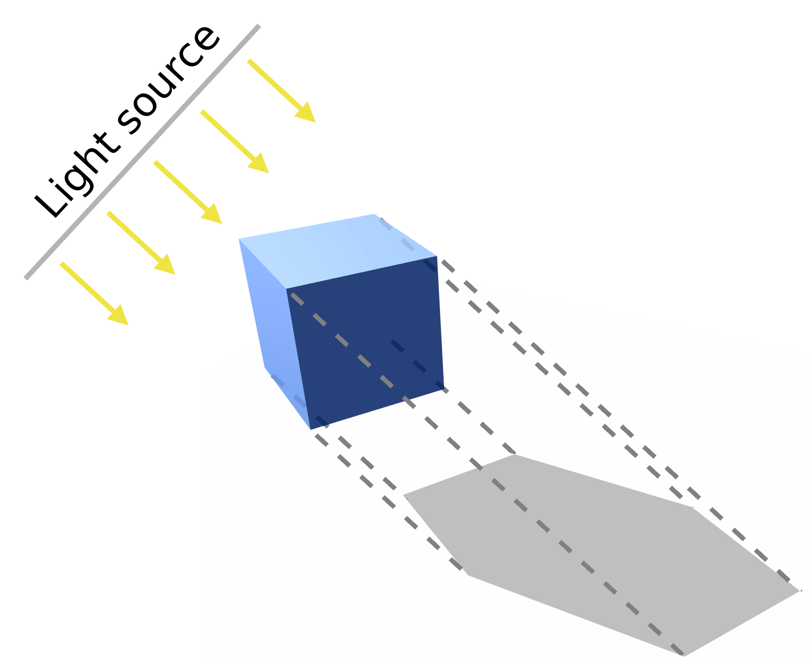
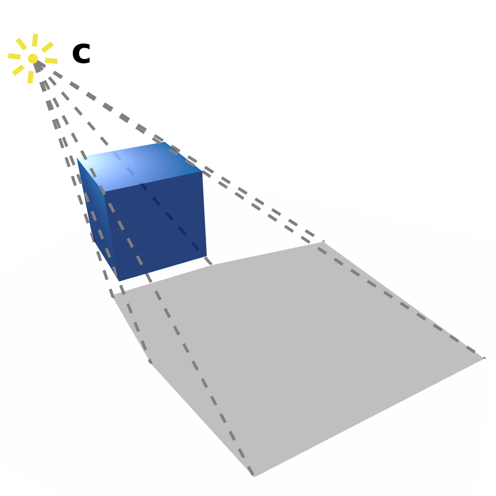
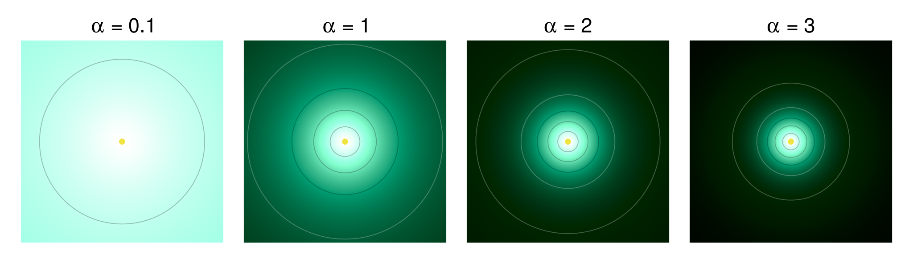
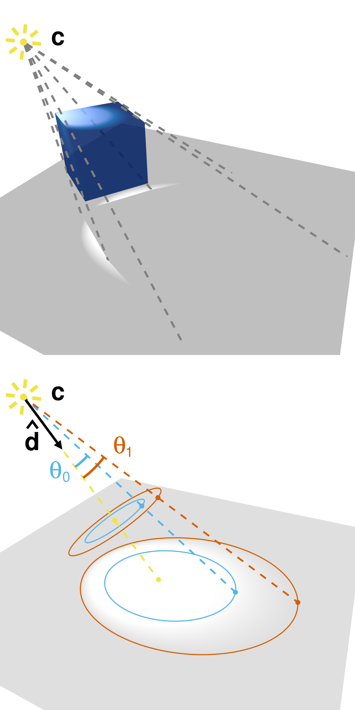
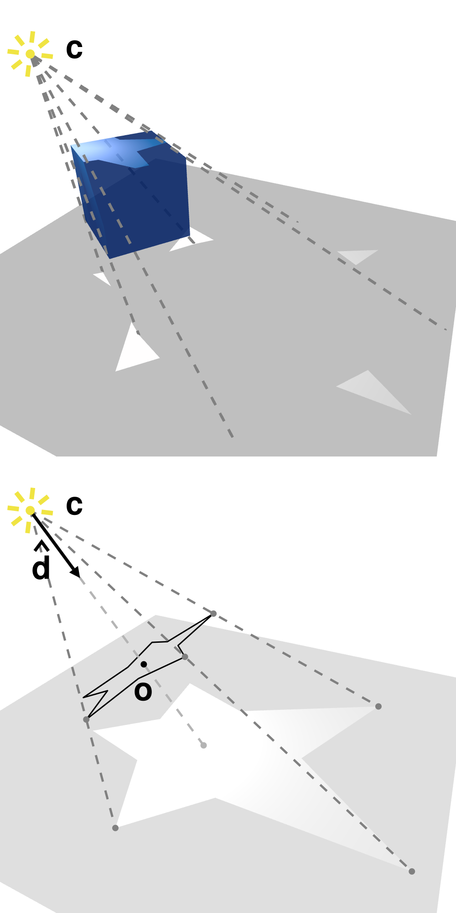
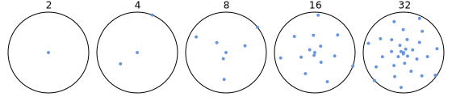
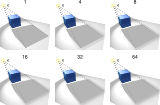
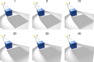

# Lights

Light sources are necessary to make the elements in the scene visible. For example, if you remove the light source in the example code (passing an empty `ILightSource` array to the `renderer.Render` method), you will notice that the cube is completely black.

A light source implements the `ILightSource` interface, which stipulates that it must be able to determine how intense the light is at any point in 3D space, whether the light casts a shadow or not, and whether the light is obstructed or not at any point in space. The interface contains the following members:

* `LightIntensity GetLightAt(Point3D point);` 

    This method returns the light intensity and direction at any point in space. The `LightIntensity` struct contains two field members: a `double Intensity` and a `NormalizedVector3D Direction`.

    * The `Intensity`, unsurprisingly, represents how intense the light is at the specified point. How this value is interpreted depends on the specific `IMaterial` implementation (more on this later), but currently in the `PhongMaterial` an `Intensity` of 0 represents complete darkness (i.e. all colours appear as black), while an `Intensity` of 1 represent maximum brightness (i.e. all colours appear white).

    * The `Direction` represents the direction of incident light. For example, a point light source situated at point `A` would cast a light in point `B` along the direction of `B - A` (i.e. this vector points *from* the light source *to* the point). If the light does not have any specific direction (e.g. ambient light), a `NormalizedVector` whose three components are all `double.NaN` should be returned.

* `bool CastsShadow { get; }`

    This property determines whether the light source is able to cast a shadow or not. The interface requires only a `get`ter method, but implementations are free to include a `set` method as well, if appropriate. This makes it possible, for example, to disable shadow generation for a particular light source, while leaving it on for others. If this property is `false`, the renderer will *usually* save time by not testing whether the light is obstructed or not; it is however recommended that the value of this property be coherent with the output of `GetObstruction` (i.e. if this property is always `false`, `GetObstruction` should always return `0`).

* `double GetObstruction(Point3D point, IEnumerable<Triangle3DElement> shadowingTriangles);`

    This method determines how much of the light reaches a certain point in space, given a set of triangles that could potentially cast a shadow ecompassing the point. For example, this could be achieved by following the light direction in reverse from the point to the source, and checking whether this ray of light intersects any of the triangles. If the returned value is `0`, the light is completely unobstructed. If the returned value is `1`, the light is completely obstructed. Values in the middle can be used to produce soft shadows.

VectSharp.ThreeD currently contains multiple `ILightSource` implementations:
* `AmbientLightSource`, which produces a diffuse ambient light that does not cast shadows;
* `ParallelLightSource`, which produces light that travels along a fixed direction (such as a very distant light source like the sun);
* `PointLightSource`, which emanates light from a point in all directions (similar to a lightbulb);
* `SpotLightSource`, whose light starts from a point and expands in a cone centred along a fixed direction (akin to a lamp with a shade);
* `MaskedLightSource`, which is similar to a `SpotLightSource`; however, instead of a conic light beam, it has a beam following an arbitrary shape (like a lightbulb in front of which a stencil mask has been placed).

## The `AmbientLightSource` class

Instances of the `AmbientLightSource` class represent ambient lights, i.e. diffuse lights that illuminate every point of the scene uniformly, without the light coming from any specific direction.

In addition to the members defined in the `ILightSourceInterface`, this class defines only one additional member: `double Intensity { get; set; }`, which determines the light's intensity. The constructor requires a single parameter, which is again the intensity of the light. The `GetLightAt ` method returns a `LightIntensity` struct whose `Intensity` is the same as the light's, and direction has all components set to `double.NaN`; `CastsShadow` always returns `false` and `GetObstruction` always return `0`.

## The `ParallelLightSource` class

Instances of the `ParallelLightSource` class represent light sources that illuminate the scene with light coming always from the same direction. This is somewhat similar to how the sun works in real life. This class defines the following additional members:

* `double Intensity { get; set; }`

    This value represents the light's intensity.

* `NormalizedVector3D Direction { get; }`
* `NormalizedVector3D ReverseDirection { get; }`

    These vectors represent the light's direction (and its opposite, which is used when determining whether the light is obstructed).

The constructor requires two arguments, corresponding to the intensity of the light and its direction. The `CastsShadow` property of instances of this class can be `set`, to determine whether a particular light casts shadows or not. The default value is `true`. The `GetLightAt` method always returns a `LightIntensity` struct whose `Intensity` and `Direction` are the same as the light's. The `GetObstruction` method checks whether any of the shadowing triangles intersects the light beam directed at the specified point before it reaches the point. If so, it returns `1`; otherwise, it returns `0`. The figure on the right shows the effect of a parallel light source on a cube.

## The `PointLightSource` class

Instances of the `PointLightSource` class represent point light sources, i.e. light that originates from a point  and expands in all directions from that point. The intensity  of the light at a point  depends on how distant that point is from , according to the following equation:

Where  is the base intensity of the light (i.e. the intensity of the light at a distance of 1 units) and  is an exponent determining how fast the light decays. The figure on the right shows the effect of a point light source on a cube. 

This class defines the following public properties:

* `Point3D Position { get; set; }`

    This point represents the light's position in 3D space. The light expands outwards from this point. This is  in the equation above.

* `double Intensity { get; set; }`

    This value represents the light's intensity for a point at a distance of 1 unit from the light's `Position`. This is  in the equation above.

* `double DistanceAttenuationExponent { get; set; }`

    This value represents how fast the light attenuates at locations further away from its `Position`. The higher this value, the faster the light dissipates. If this value is 0, the light has a constant intensity everywhere. This is  in the equation above. The default value is 2.

The constructor requires two arguments, corresponding to the intensity of the light and its position. The `CastsShadow` property of instances of this class can be `set`, to determine whether a particular light casts shadows or not. The default value is `true`.

The `GetLightAt` method returns a `LightIntensity` struct whose `Intensity` is computed as explained above and `Direction` is the direction joining the subject point and the light's position, i.e. . The `GetObstruction` method checks whether any of the shadowing triangles intersects the segment joining the subject point and the light's position. If so, it returns `1`; otherwise, it returns `0`.

The figure below shows the effect of various values of  on the light's decay. The light source and the camera are both directly above the surface (the yellow dot in the centre of each image represents the light source's projection). The contours represent the regions of the surface that receive a light intensity of 0.9 (innermost circle), 0.7, 0.5, 0.3 and 0.1 (outermost circle). The light intensity in each image has been normalised so that the intensity at the point closest to the light source (i.e. the point directly below it) is 1. The surface normals have been altered to remove effects due to the light direction (so that the given light intensity values depend only on the distance of the points from the light source).

    

## The `SpotlightLightSource` class

Instances of the `SpotlightLightSource` class represent spotlights, i.e. light sources whose light has a point source and expands in a cone with a defined angular amplitude along a specified direction. An additional, larger, cone is also defined such that elements outside the main cone of light but within this second cone also receive light that fades gradually until elements outside the second cone do not receive any light at all.

To compute the light intensity at a certain point , first of all the angle  between the light source, light direction and point is computed:

Where  is the position of the light source and  is the direction of the spotlight. The  function chooses an angle such that . Then, let  be the beam cone angular size and  the cutoff angular size. The light intensity  is then:

Where  is the base intensity of the light (i.e. the intensity of the light at a distance of 1 units),  is an exponent determining how fast the light decays with increasing distance, and  is an exponent determining how fast the light decays when  goes from  to . The figure on the right shows the effect of a spotlight on a cube and the spotlight cone without the cube.

This class defines the following public properties:

* `Point3D Position { get; set; }`

    This point represents the light's position in 3D space. This is  in the equations above.

* `NormalizedVector3D Direction { get; set; }`

    This vector represents the direction of the light cone's axis. This is  in the equations above.

* `double Intensity { get; set; }`

    This value represents the light's intensity for a point within the cone beam at a distance of 1 unit from the light's `Position`. This is  in the equation above.

* `double BeamWidthAngle { get; set; }`

    This value represents the angular width of the light cone. This is  in the equations above.

* `double CutoffAngle { get; set; }`

    This value represents the angular width of the cutoff cone. This is  in the equations above.

* `double DistanceAttenuationExponent { get; set; }`

    This value represents how fast the light attenuates at locations further away from its `Position`. The higher this value, the faster the light dissipates. If this value is 0, the light has a constant intensity everywhere. This is  in the equation above. The default value is 2.

* `double AngleAttenuationExponent { get; set; }`

    This value represents how fast the light attenuates at angles outside of the main light cone but within the cutoff cone. The higher this value, the faster the light dissipates. If this value is 0, the light has the same intensity within the cutoff cone as within the main light cone. This is  in the equation above. The default value is 1.

The constructor requires five arguments, corresponding to the intensity of the light, its position, its direction, the beam width angle and the cutoff angle. The `CastsShadow` property of instances of this class can be `set`, to determine whether a particular light casts shadows or not. The default value is `true`.

The `GetLightAt` method returns a `LightIntensity` struct whose `Intensity` is computed as explained above and `Direction` is the direction joining the subject point and the light's position, i.e. . Note that for points that fall outside of the cutoff cone, the light intensity will be 0, but the light direction will be computed normally. The `GetObstruction` method checks whether any of the shadowing triangles intersects the segment joining the subject point and the light's position. If so, it returns `1`; otherwise, it returns `0`.

## The `MaskedLightSource` class

Instances of the `MaskedLightSource` represent light sources that are equivalent to a spotlight, in front of which a "mask" (like a stencil) has been placed. The light emitted thus takes the shape of the mask. The mask is placed on a plane  that is perpendicular to the direction of the light's axis at a specified distance. To determine whether a certain point  is illuminated or not, the line connecting  and the light position  is intersected with . If the intersected point lies outside the area of the mask, the light intensity  is 0; otherwise (as in the spotlight case), let  be the angle between the light source, light direction  and point:

If  the light intensity is 0. Otherwise it is:

Where  is the base intensity of the light (i.e. the intensity of the light at a distance of 1 units),  is an exponent determining how fast the light decays with increasing distance, and  is an exponent determining how fast the light decays when  goes from 0 to . The figure on the right shows the effect of a light with a star-shaped mask on a cube and the same light cone without the cube.

This class defines the following public properties:

* `Point3D Position { get; }`

    This point represents the position of the light source in 3D space. This is  in the equations above.

* `Point3D Origin { get; }`

    This point is the projection of the light's `Position` on the mask plane . This is  in the figure.

* `NormalizedVector3D Direction { get; }`

    This vector represents the direction of the light cone's axis. This is  in the equations above.

* `double Distance { get; }`

    This value represents the distance between the light's `Position` and the mask plane . This is the distance . Equivalently, .

* `ImmutableList<Point3D[]> TriangulatedMask { get; }`

    This represents a list of triangles lying on the mask plane  constituting the mask. If a point's projection on  lies within any of these triangles, the point receives light.

* `double Intensity { get; set; }`

    This value represents the light's intensity for a point within the beam at a distance of 1 unit from the light's `Position`.

* `double DistanceAttenuationExponent { get; set; }`

    This value represents how fast the light attenuates at locations further away from its `Position`. The higher this value, the faster the light dissipates. If this value is 0, the light has a constant intensity everywhere. This is  in the equations above. The default value is 2.

* `double AngleAttenuationExponent { get; set; }`

    This value represents how fast the light attenuates as the angle between the direction of the light  and the line connecting the point  to the light position  increases. The higher this value, the faster the light dissipates. If this value is 0, the light has the same intensity everywhere. This is  in the equations above. The default value is 1.

This class defines two constructors:

* `MaskedLightSource(double intensity, Point3D position, NormalizedVector3D direction, double distance, GraphicsPath mask, double maskOrientation, double triangulationResolution)`

    The first four arguments represent the intensity of the light, the position of the light source, the direction of the ligh's axis and the distance between the light source and the mask plane. The `mask` should be a 2D path representing the mask. The origin of the 2D coordinate system will be placed at the light's `Origin`. The `maskOrientation` is an angle that determines the orientation of the axes of the 2D coordinate system on the mask plane. The `triangulationResolution` will be used to linearise curved segments when triangulating the mask. If the mask path only contains straight lines, this value is inconsequential.

* `MaskedLightSource(double intensity, Point3D position, NormalizedVector3D direction, double distance, IEnumerable<GraphicsPath> triangulatedMask, double maskOrientation)`

    Same as the previous constructor, except that this constructor takes a 2D path that has already been triangulated. The constructor expects that each element of `triangulatedMask` be a `GraphicsPath` describing a triangle (i.e. containing three points); if this is not the case, only the first three points of each path will be considered.

The `CastsShadow` property of instances of this class can be `set`, to determine whether a particular light casts shadows or not. The default value is `true`.

The `GetLightAt` method returns a `LightIntensity` struct whose `Intensity` is computed as explained above and `Direction` is the direction joining the subject point and the light's position, i.e. . Note that for points that fall outside of the lighted area, the light intensity will be 0, but the light direction will be computed normally. The `GetObstruction` method checks whether any of the shadowing triangles intersects the segment joining the subject point and the light's position. If so, it returns `1`; otherwise, it returns `0`. Note that for points that fall outside of the lighted area (as defined by the mask) but are otherwise not obstructed by any shadowing triangle, this method will return `0` (even though no light actually reached them).

## The `AreaLightSource` class

The `AreaLightSource` class represents lights that are conceptually similar to spotlights, except that the light is assumed to come from a circular region of a plane perpendicular to the light's axis, rather than from an individual point. This is mainly relevant when computing shadows: unlike spotlights, which produce crisp shadows, area lights produce soft shadows.

An area light is defined by a light plane  perpendicular to the light direction , a point  on the plane representing the centre of the light source, a radius  representing the radius of the light-emitting circle, another radius  representing the radius of the penumbra circle, and a distance  between  and a virtual point  representing the focal point of the light rays coming from the area light. The smaller , the wider the beam of light. In the limit of very small , the light floods the entire half-space defined by ; in the limit of very large , the light travels in parallel beams.

A spotlight can be converted in an equivalent area light using the following formulae:

Where quantities with the prime symbol () refer to the area light source, and quantities without the symbol refer to the spotlight.

The light intensity at a point  for an area light is determined by computing the intersection  between the line joining  and the virtual point  and the light plane :

Based on the distance between  and , the light intensity is computed:

Where  is the base intensity of the light (i.e. the intensity of the light at a distance of 1 units),  is an exponent determining how fast the light decays with increasing distance, and  is an exponent determining how fast the light decays when the distance  goes from  to .

This value is the amount of light that an _unobstructed_ area light casts on . If the light can cast a shadow (i.e. its `CastsShadow` property is `true`), how much light actually reaches the point depends on the amount of obstruction. This is computed by considering multiple "sample points" within the light's area (i.e. the circle centred at  with radius ) and determining whether each of these points is visible from . The amount of obstruction is the proportion of sampling points that are _not_ visible from the target point (e.g. if all the points are visible, the obstruction is `0`; if none of them is visible, the obstruction is `1`). The number of points considered is determined by the `ShadowSamplingPointCount` property of the `AreaLightSource` and has a linear effect on the time required to determine the amount of obstruction for a point. The image below shows which points are sampled for various values of this property (shown above each circle):

    

Note that, in addition to these points, the point  is always sampled. If `ShadowSamplingPointCount` is set to `1`, only  is sampled, which leads to a shadow that looks exactly like the one cast by a spotlight. Otherwise, the multiple points that are sampled contribute to creating a "soft" shadow, with sharper edges close to the objects, and softer edges further away. The images below show the effect of an area light with various values of `ShadowSamplingPointCount` on a cube (shown above each scene; in all cases, the light had an  of about `11.5`).

    

The images below, instead, show the effect of an area light with various values of  (shown above each scene). The value of  was altered appropriately to make sure that each light cone the same angular spread. All of these scenes use a `ShadowSamplingPointCount` of `64`.

    

The `AreaLightSource` class defines the following properties:

* `Point3D Center { get; }`

    This point represents the center of the light-emitting circle in 3D space. This is  in the equations above.

* `NormalizedVector3D Direction { get; }`

    This vector represents the direction of the light cone's axis. This is  in the equations above.

* `double Intensity { get; set; }`

    This value represents the light's intensity for an unobstructed point within the cone beam at a distance of 1 unit from the light's `Position`. This is  in the equation above.

* `double Radius { get; }`

    This value represents the radius of the light-emitting circle. This is  in the equations above.

* `double PenumbraRadius { get; }`

    This value represents the radius of the penumbra circle. This is  in the equations above.

* `double SourceDistance { get; }`

    This value represents the distance between the light's `Center` and the virtual point representing the focal point of the light rays coming from the light source. This is  in the equations above.

* `int ShadowSamplingPointCount { get; }`

    This value indicates the number of points that are sampled to determine how much of the light reaches a certain point. Low values produce more approximate shadows, higher values produces more accurate soft shadows at the cost of reduced performance. Note that the "softness" of shadows is not influenced by this (it depends on the `Radius`); this parameter only affects the performance and accuray of the rendering.

* `double DistanceAttenuationExponent { get; set; }`

    This value represents how fast the light attenuates at locations further away from the light plane. The higher this value, the faster the light dissipates. If this value is 0, the light has a constant intensity everywhere. This is  in the equation above. The default value is 2.

* `double AngleAttenuationExponent { get; set; }`

    This value represents how fast the light attenuates outside of the main light-emitting circle but within the penumbra circle. The higher this value, the faster the light dissipates. If this value is 0, the light has the same intensity within the penumbra circle as within the main light-emitting circle. This is  in the equation above. The default value is 1.

The constructor requires seven arguments, corresponding to the intensity of the light, the position of its centre, the radius of the light circle, the radius of the penumbra circle, the direction of the light, the distance between the centre and the focal point of the light, and the number of points to sample when computing light obstruction. The `CastsShadow` property of instances of this class can be `set`, to determine whether a particular light casts shadows or not. The default value is `true`.

The `GetLightAt` method returns a `LightIntensity` struct whose `Intensity` is computed as explained above and `Direction` is the direction joining the subject point and the light's virtual focal point, i.e. . Note that for points that fall outside of the penumbra circle, the light intensity will be 0, but the light direction will be computed normally. The `GetObstruction` method determines which portion of the light circle's area is visible from the point, as explained above.

## Creating new light sources

To define a new light source, it is sufficent to create a class implementing the `ILightSource` interface. However, care should be taken to ensure that the `GetLightAt` and `GetObstruction` methods are implemented efficiently, as these will be called at least once for each pixel or triangle (depending on the renderer) in the scene. All of the members of the interface should also be thread-safe.

## Shadows

Shadows are caused by a light source being obstructed on a way to a triangle. Not all triangles cast shadows: the ones whose `CastsShadow` property is `false` let any light pass through them. Furthermore, not all triangles can receive a shadow; the ones whose `ReceivesShadow` property is `false` are unaffected by shadows.

For performance reasons, the default values for `CastsShadow` and `ReceivesShadow` are `false`, i.e. no triangle casts or receives a shadow. Therefore, shadows need to be explicitly enabled for them to be rendered. For the same performance reasons, ideally shadows should only be enabled for those triangles that effectively cast or receive a shadow. Note that a triangle never casts a shadow on itself.

To render shadows, when rendering a triangle that can receive a shadow, the renderer checks how much the triangle (or the pixel) can see each of the light sources in the scene (using the light sources' `GetObstruction` method). Only the lights that are visible are taken into account when computing the colour of the triangle (or the pixel). This way, the intensity of the shadow matches the intensity of the light, and multiple light sources, each casting its own shadow, can be accounted for. Furthermore, soft shadows can be obtained assuming that the `GetObstruction` method returns the appropriate value.