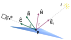
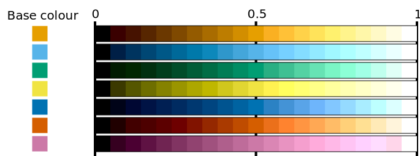
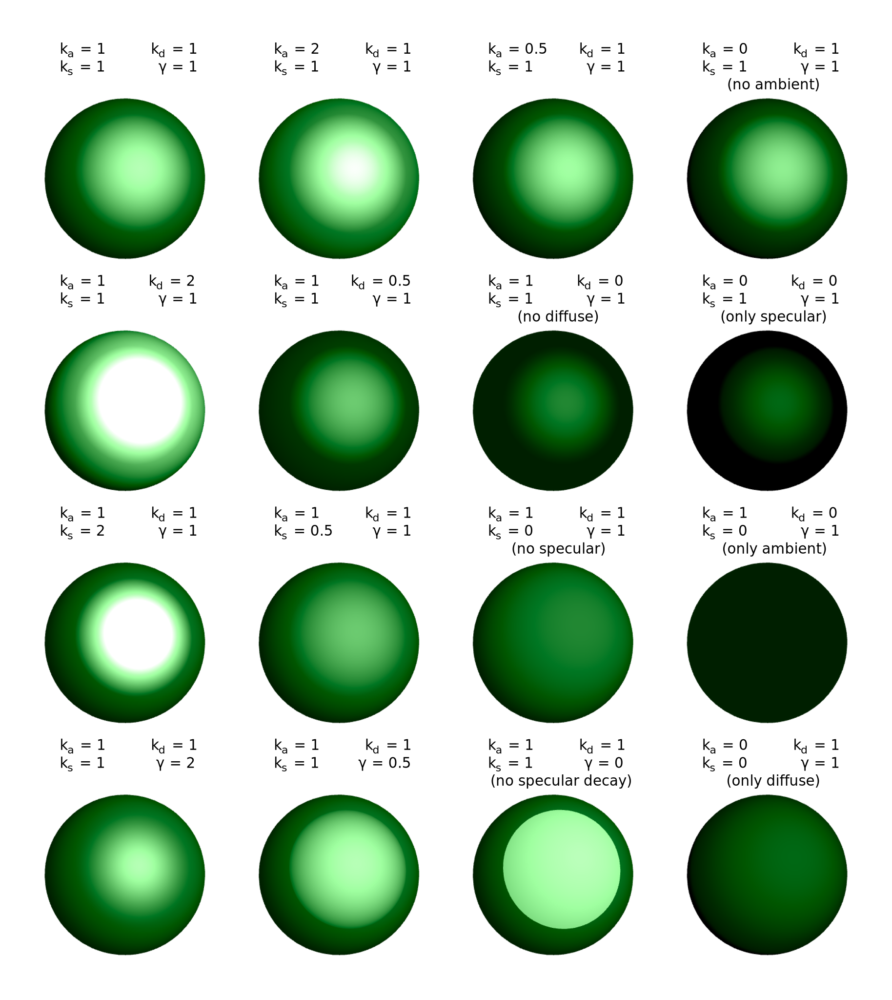

# Materials

Materials are used to determine how a triangle's surface reacts to incoming light. Materials implement the `IMaterial` interface, which defines a single method:

* `Colour GetColour(Point3D point, NormalizedVector3D surfaceNormal, Camera camera, IEnumerable<ILightSource> lights)`

    This method returns the colour of the specified 3D point, given the surface normal, camera and light sources. Note that this method does not check whether each light is obstructed or not - that should have been done before, so that only unobstructed lights are passed to this method.

VectSharp.ThreeD currently includes two implementations of this interface: the `ColourMaterial` and `PhongMaterial`.

### The `ColourMaterial` class

The `ColourMaterial` is a very simple material, which always appears of the same colour, regardless of how much light hits it. It has a single public property, `Colour Colour { get; }` which returns the colour of the material, and its constructor accepts a single argument, which is also the colour of the material.

### The `PhongMaterial` class

The `PhongMaterial` class represents a material which uses a Phong reflection model. This means that the light intensity at each point provided by any light source (except for ambient lights) is determined based on the angle of incidence of the light on the triangle surface, as well as the angle formed between the light, the point, and the camera viewpoint.

Let  be the intensity of light  at point . If the light is an ambient light, the contribution of this light to the total illumination of  is:

Where  is the ambient reflection coefficient which can be set through the `AmbientReflectionCoefficient` property of the `PhongMaterial`.

If the light is a "directional" light (e.g. a point light source, a spotlight or a parallel light source), let  be the (normalised) direction of the light and  the surface normal, as shown in the figure on the right. Then consider the dot product of the light direction and surface normal .

If , the light does not contribute to the illumination of  at all.

Otherwise, consider the reflection direction  and its normalisation . Finally, consider the normalised camera direction , where  is the camera viewpoint, and the dot product . 

If , the light's contribution to the illumination at  is:

Where  is the diffuse reflection coefficient which can be set through the `DiffuseReflectionCoefficient` property of the `PhongMaterial`.

If 0">, the light's contribution to the illumination at  is instead:

Where  is the specular reflection coefficient which can be set through the `SpecularReflectionCoefficient` property of the `PhongMaterial` and  is the "shininess" of the surface, which can be set using the `SpecularShininess` property.

To sum it up, let  be the set of ambient lights,  the set of directional lights, and:

 0 \\ 0 %26 \mathrm{otherwise} \end{array} \right .">
 
 0 \ \ \mathrm{and} \ \ s > 0 \\ 0 %26 \mathrm{otherwise} \end{array} \right .">
 

The total light intensity  is then:

The light intensity is then used to determine which colour the point should have: if the light intensity is 0, the point is black; if the light intensity is 1, the point is white; if the light is 0.5, the point has a certain "base colour" that was defined upon creation of the material. Otherwise, the colour is interpolated between these three colours, using the CIELAB colour space as much as possible, and the HSL colour space when changing the _L*_ component would result in the colour falling outside of the sRGB colour spectrum.

Here is an example of how some colours would look at various illumination levels:

This material has the following properties:

* `Colour Colour { get; set; }`

    This is the base colour of the material. This is the colour that the material will have when the total light intensity is `0.5`.

* `double AmbientReflectionCoefficient { get; set; }`

    This coefficient is multiplied with the intensity of ambient lights to determine how much each ambient light contributes to the overall light intensity at the point. This is the  in the formulae above.

* `double DiffuseReflectionCoefficient { get; set; }`

    This coefficient is multiplied with the intensity of diffuse lights (which depends on the light direction and surface normal) to determine how much they contribute to the overall light intensity. This is the  in the formulae above.

* `double SpecularReflectionCoefficient { get; set; }`

    This coefficient is multiplied with the intensity of specular reflected lights (which depends on the light direction and the camera viewpoint position) to determine how much they contribute to the overall light intensity. This is the  in the formulae above.

* `double SpecularShininess { get; set; }`

    This coefficient determines how "shiny" the surface is, i.e. how large or small the specular highlight is. If this value is high, the specular highlight is small and vice versa. This is the  in the formulae above.

The following figures show the effect of different values of these properties on a sphere:

The sharp contour shown in the case  denotes the points in which .

## Creating new materials

To define a new material, it is sufficent to create a class implementing the `IMaterial` interface. However, care should be taken to ensure that the `GetColour` method is efficient, as this will be called at least once for each pixel or triangle (depending on the renderer) in the scene. The method should also be thread-safe.