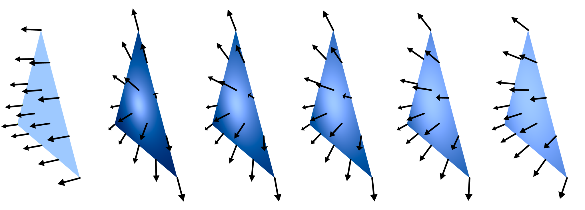
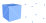

# 3D primitives

## Points and vectors

Coordinates in `VectSharp.ThreeD` are expressed as points and vectors. A `Point3D` represents a point, while a `Vector3D` represents a displacement; the two are mostly equivalent and, accordingly, a `Point3D` can be implicitly converted into a `Vector3D` and a `Vector3D` can be cast into a `Point3D`. Furthermore, a `NormalizedVector3D` represents a vector with a modulus that is guaranteed to be 1. These types are all defined as `readonly struct`s.

Note that the y axis of the 3D reference system (just like the y axis of the 2D reference system) points towards the **bottom** - with all the consequences for the right-hand rule that this entails.

### `Point3D`

The `Point3D` struct only has three `double` fields (`X`, `Y` and `Z`), representing the 3D coordinates of the point. It also defines a `DropZ()` method, that returns a 2D `Point` element with the same `X` and `Y` coordinates as the `Point3D`. Finally, in addition to the implicit conversion to `Vector3D`, the struct defines the following operators:

* `Vector3D operator -(Point3D endPoint, Point3D startPoint)`

    This operator returns a vector pointing from `startPoint` towards `endPoint` (e.g `A - B` is the vector pointing from `B` towards `A`).

* `Point3D operator *(double[,] matrix, Point3D point)`

    This operator performs a matrix multiplication between a 3x3 `matrix` and the `point`. If the matrix is larger than 3x3, additional entries are ignored. If the matrix is smaller, an `IndexOutOfRangeException` is thrown. This operator is used internally an it is public only due to requirements of the C# language. For more flexibility in transforming points and 3D elements, see the section on transforms below.

### `Vector3D`

The `Vector3D` struct, in addition to the `X`, `Y` and `Z` fields, defines a `Modulus` property, which returns the modulus of the vector. It also has a `Normalize()` method, which returns a `NormalizedVector3D` with the same direction as the current vector, but with modulus 1. In addition to the explicit conversion to `Point3D`, the `Vector3D` struct also defines many operators corresponding to the usual vector operations:

* `Vector3D operator *(Vector3D vector, double times)`

    `Vector3D operator *(double times, Vector3D vector)`

    These represent the (commutative) multiplication between a vector and a scalar, which returns another vector.

* `Vector3D operator +(Vector3D vector1, Vector3D vector2)`

    `Point3D operator +(Point3D point, Vector3D vector)`
    
    `Point3D operator +(Vector3D vector, Point3D point)`

    `Vector3D operator -(Vector3D vector1, Vector3D vector2)`

    `Point3D operator -(Point3D point, Vector3D vector)`

    These operators represent the sum/subtraction between vectors. When two vectors are added to or subtracted from each other, the result is still a vector. If a vector is added to or subtracted from a point, the result is a point.

* `double operator *(Vector3D vector1, Vector3D vector2)`

    This operator represents the dot product between two vectors. This is a real number representing the cosine of the angle between the two vectors times the moduli of the two vectors.

* `Vector3D operator ^(Vector3D vector1, Vector3D vector2)`

    This operator represents the cross product between two vectors. This is a vector that is perpendicular to both `vector1` and `vector2` and whose length is the product of the moduli of the vectors times the sine of the angle between them.

### `NormalizedVector3D`

The `NormalizedVector3D` also has `X`, `Y` and `Z` fields, but does not have a `Modulus` property (because the modulus is always 1). When a `NormalizedVector3D` is created using the public constructor, the coordinates are normalized and the normalized value is stored in the fields. This struct has a `Reverse()` method that returns a `NormalizedVector3D` pointing in the opposite direction of the current instance (this is faster than multiplying by -1 or because it avoids the renomarlisation). In addition to the implicit conversion to `Vector3D` this struct also defines the following operators:

* `Vector3D operator *(NormalizedVector3D vector, double times)`
    
    `Vector3D operator *(double times, NormalizedVector3D vector)`

    These operators represent the multiplication of a normalized vector times a scalar. This returns a `Vector3D` with the same direction as the `NormalizedVector3D`, but with modulus equal to the scalar.

* `double operator *(NormalizedVector3D vector1, NormalizedVector3D vector2)`

    This operator represents the dot product between two normalized vectors, i.e. the cosine of the angle between them.

* `Vector3D operator ^(NormalizedVector3D vector1, NormalizedVector3D vector2)`

    This operator represents the cross product between two normalized vectors, i.e. a vector that is perpendicular to both and whose modulus is the sine of the angle between the two vectors.

## 3D Elements

The 3D elements that are included in a VectSharp.ThreeD scene all inherit from the `Element3D` abstract class. This class implements the `IReadOnlyList<Point3D>` interface; thus, in a way, elements can be seen as collections of 3D points. There are three kinds of 3D elements in VectSharp.ThreeD, depending on how many points they contains:

* The `Point3DElement` class represents individual points. Instances of this class contain only one `Point3D`.
* The `Line3DElement` class represents 3D segments. Instances of this class contain two points (i.e. the start and end point of the segment).
* The `Triangle3DElement` class represents 3D triangles. Instances of this class contain three points (the three vertices of the triangle).

More complex 3D objects (e.g. polygons or solids) are represented by combinations of these simple elements.

The `Element3D` class cannot be inherited by classes outside of the VectSharp.ThreeD assembly. In addition to the members required by the `IReadOnlyList<Point3D>` interface, the class defines the following abstract members:

* `string Tag { get; set; }`

    This property defines an arbitrary string payload associated with the element. This can be used e.g. to identify elements belonging to the same 3D object. The `VectorRenderer` included in VectSharp.ThreeD also transfers this tag to the 2D vector elements it draws.

* `int ZIndex { get; set; }`

    This property can be used as a "hint" to the renderer to determine in which order the elements should be drawn. Elements with a higher `ZIndex` should appear in front of elements with a lower `ZIndex`. Elements with the same `ZIndex` should instead be ordered based on the algorithm specified by the camera's `ZDepth` and `Compare` methods.

* `void SetProjection(Camera camera)`

    This method computes the 2D projection of the points constituting the element (using the `camera`'s `Project` method) and stores it within the element. The projection can then be retrieved using the next method. This is useful when the projected points are needed more then once, as it is more efficient than recomputing the projection every time.

* `Point[] GetProjection()`

    This method returns the 2D projection of the element's points that has been computed during the previous call to `SetProjection`. If `SetProjection` has never been called, this method returns `null`.

## The `Point3DElement` class

Instances of this class represent individual points in 3D space that appear as circles when rendered. The class defines the following properties:

* `Point3D Point { get; }`

    This is the 3D coordinates of the point to be drawn.

* `double Diameter { get; set; }`

    This represents the diameter of the circle representing the point in camera plane units. Note that the circle will always have this diameter, regardless of where it is in the space (e.g. how far it is from the camera).

* `Colour Colour { get; set; }`

    This is the colour with which the circle will be filled, regardless of any lighting.

The class also defines the following public method:

* `T ToDerivedPoint<T>()`

    This method converts the `Point3DElement` into a derived type `T` (`T` must inherit from `Point3DElement`). See below [**Adding properties to 3D elements**](#addingProperties).

The constructor for this class accepts a single argument, i.e. the coordinates of the point.

## The `Line3DElement` class

Similarly, instances of this class represent segments between two 3D points. The following properties are defined:

* `Point3D Point1 { get; }`
* `Point3D Point2 { get; }`

    These points represent the coordinates of the start and end point of the segment.

* `Colour Colour { get; set; }`

    This is the line's colour (again, regardless of any light source).

* `double Thickness { get; set; }`

    The thickness in camera plane units of the line. The line will have a constant thickness, regardless of the positioning of the start and end point in 3D space.

* `LineCaps LineCap { get; set; }`

    The cap that will be used at each end of the line (`Butt`, `Round` or `Square`).

* `LineDash LineDash { get; set; }`

    The line dash pattern with which the line will be drawn.

The class also defines the following public method:

* `T ToDerivedLine<T>()`

    This method converts the `Line3DElement` into a derived type `T` (`T` must inherit from `Line3DElement`). See below See below [**Adding properties to 3D elements**](#addingProperties).

The constructor for this class requires two arguments, corresponding to the start and end point of the line.

## The `Triangle3DElement` class

`Triangle3DElement` instances represent a single triangle in 3D space. This is the base shape to draw all sorts of 3D solids and surfaces. A `Triangle3DElement` has the following public properties:

* `Point3D Point1 { get; set; }`
* `Point3D Point2 { get; set; }`
* `Point3D Point3 { get; set; }`

    These points represent the vertices of the triangle.

* `Point3D Centroid { get; set; }`

    This point represents the centroid/barycenter of the triangle.

* `bool CastsShadow { get; set; }`
* `bool ReceivesShadow { get; set; }`

    These values determine whether the triangle can receive a shadow from other triangles and whether it can project a shadow itself. If `ReceivesShadow` is `false`, any light source is always deemed to be unobstructed for this triangle. Similarly, if `CastsShadow` is `false`, it is assumed that this triangle can never obstruct any light source.

* `NormalizedVector3D ActualNormal { get; }`

    This vector represents the normal to the plane in which the triangle lies, computed through the cross vector of the sides. This is used in geometric computations e.g. when projecting a point on the plane.

* `NormalizedVector3D Normal { get; }`

    This vector also represents the normal to the plane in which the triangle lies. However, this normal is used when performing lighting and shading computations. If the triangle is "flat", the `Normal` and `ActualNormal` will usually coincide; if it is not (e.g. because it is part of a sphere), the `Normal` may be different from the `ActualNormal`. It is assumed that this normal applies at the centroid of the triangle.

* `NormalizedVector3D Point1Normal { get; }`
* `NormalizedVector3D Point2Normal { get; }`
* `NormalizedVector3D Point3Normal { get; }`

    Similarly, these vectors represent the normal at each vertex of the triangle. If the triangle is flat, they will all point in the same direction as the `ActualNormal`, otherwise they may all point in different directions. The normal at each point of the triangle is interpolated using these vertex normals.


* `List<IMaterial> Fill { get; protected set; }`

    This represents the "material(s)" of which the triangle is composed, which will determine the colour of the triangle depending on how much light hits it and in which direction. Note that the materials need to be `Add`ed to the list (as the list cannot be `set` from outside the class). If multiple materials are provided, the ones with a smaller index appear behind the following ones.

The class also defines the following public methods:

* `NormalizedVector GetNormalAt(Point3D point)`

    This method returns the normal at a specified point. It assumes that the `point` belongs to the triangle. If the triangle is flat, this simply returns the `Normal`; otherwise, it computes the barycentric coordinates of the point and uses them to interpolate the vertex normals.

* `BarycentricPoint ComputeBarycentric(Point3D point)`

    This method computes the barycentric coordinates of a point. It is assumed that the point lies on the plane of the triangle. The `BarycentricPoint` structs has three fields, representing the three barycentric coordinates `U`, `V` and `W` (`U` is relative to `Point1`, `V` to `Point2` and `W` to `Point3`).

* `Point3D? ProjectOnThisPlane(Point3D point, NormalizedVector3D direction, bool positiveOnly, double maxD)`

    This method projects a point on the triangle's plane along a specified direction. If `positiveOnly` is true, the method returns `null` if the point is behind the plane with respect to the `direction`. The method also returns `null` if the point is in front of the plane and the distance between it and the plane along `direction` is greater than `maxD` (`maxD` can be set to `double.PositiveInfinity` to avoid this).

* `T ToDerivedTriangle<T>()`

    This method converts the `Triangle3DElement` into a derived type `T` (`T` must inherit from `Triangle3DElement`). See below [**Adding properties to 3D elements**](#addingProperties).

This class defines two constructors: one taking three `Point3D` arguments representing the vertices of the triangle, and one that also takes three `NormalizedVector3D` arguments that represent the vertex normals.

The figure below shows the effect of different vertex normals on a triangle. The arrows show the direction of the normal at various points in the triangle. The first triangle on the left is flat - all the normals have the same direction. The other triangles have been assigned vertex normals that go out from a point. All of the triangles are lighted by the same light source (a `ParallelLightSource` that is directed along the true normal of the plane on which the triangle lies). If the vertex normals do not all have the same direction, the light causes a "curved" effect on the triangle, which is useful e.g. when the triangle is an approximation of a sphere or another curved surface.



## Creating complex objects

The `ObjectFactory` static class provides some methods to create complex objects. These are usually returned as a `List` of `Element3D` objects, which can subsequently be added to a scene. For methods returning solid objects as a list of triangles, the material is provided as a collection of `IMaterials`, which will be added to the each triangle's `Fill` in the same order as they are provided. The `tag` and `zIndex` are applied independently to all the objects that have been created.

The class defines the following methods:

* `List<Element3D> CreateRectangle(Point3D point1, Point3D point2, Point3D point3, Point3D point4, IEnumerable<IMaterial> fill, string tag = null, int zIndex = 0)`

    This method creates a flat quadrilater, given the four vertices. Note that, despite the name of the method, the quadrilater defined by the four vertices need not be a rectangle. This method returns a list containing two `Triangle3DElement`s, with a consistent normal orientation that depends on the order in which the points were given. To reverse the normals, you should reverse the order of the `point1`-`4` parameters.

* `List<Element3D> CreateRectangle(Point3D point1, Point3D point2, Point3D point3, Point3D point4, NormalizedVector3D point1Normal, NormalizedVector3D point2Normal, NormalizedVector3D point3Normal, NormalizedVector3D point4Normal, IEnumerable<IMaterial> fill, string tag = null, int zIndex = 0)`

    Same as above, except that in this case you can provide vertex normals for the four vertices of the quadrilater.

* `List<Element3D> CreateTetrahedron(Point3D center, double radius, IEnumerable<IMaterial> fill, string tag = null, int zIndex = 0)`

    This method will return a list containing 4 `Triangle3DElements` that constitute a tetrahedron centered at the specified point that can be inscribed in a sphere of the specified radius. One of the faces of the tetrahedron will be perpendicular to the y-axis.

* `List<Element3D> CreateCube(Point3D center, double size, IEnumerable<IMaterial> fill, string tag = null, int zIndex = 0)`

    This method returns a list of `Triangle3DElement`s that constitute a cube of the specified size and with the center corresponding to the specified point. The faces of the cube will be perpendicular to the axes.

* `List<Element3D> CreateCuboid(Point3D center, double sizeX, double sizeY, double sizeZ, IEnumerable<IMaterial> fill, string tag = null, int zIndex = 0)`

    Similarly to the previous method, this method constructs a rectangular cuboid/parallelepiped with the specified sizes with respect to the three axes. The faces of the cuboid will also be perpendicular to the axes.

* `List<Element3D> CreateSphere(Point3D center, double radius, int steps, IEnumerable<IMaterial> fill, string tag = null, int zIndex = 0)`

    This method returns a list of `Triangle3DElement`s constituting a sphere with the specified center and radius. The value of `steps` determines the resolution of the sphere (i.e. the number of triangles). The total number of triangles is , where  is the value of `steps`. The vertex normals of the triangles will point away from the center of the sphere, which will cause the surface to appear smooth when a renderer that supports Phong shading is used (e.g. the `RasterRenderer` or the `RaycastingRenderer`).

* `List<Element3D> CreatePolygon(GraphicsPath polygon2D, double triangulationResolution, Point3D origin, NormalizedVector3D xAxis, NormalizedVector3D yAxis, IEnumerable<IMaterial> fill, bool reverseTriangles, string tag = null, int zIndex = 0)`

    This method will create a flat polygon shape by triangulating the specified 2D path and representing the triangles in 3D space. The `triangulationResolution` is used to linearise curve segments (e.g. arcs or Beziers) prior to the triangulation, and has no effect if the polygon consists only of straight lines. The 3D `origin` will correspond to the `(0, 0)` coordinates of the 2D reference system. The polygon will be oriented so that the y-axis of the 2D coordinate system corresponds to the `yAxis` parameter and the x-axis to the `xAxis` parameter (note that `yAxis` is taken as-is, while `xAxis` is orthonormalised). If `reverseTriangles` is `true`, the normals of the triangles are reversed (this is useful e.g. if you want to use two polygons to represents opposite faces of a solid). Also note that the triangulation algorithm is somewhat experimental and may yield unexpected results (it works surprisingly better with complex cases than with simple ones).

    The figure below shows a 2D polygon (the blue "e") and how it appears when it is rendered in 3D space. The origin (black dot) x and y of the 2D image (red and green) correspond between the 2D image and the 3D image.

    

* `List<Element3D> CreatePrism(GraphicsPath polygonBase2D, double triangulationResolution, Point3D bottomOrigin, Point3D topOrigin, NormalizedVector3D baseXAxis, NormalizedVector3D baseYAxis, IEnumerable<IMaterial> fill, string tag = null, int zIndex = 0)`

    This method creates a prism with the specified 2D polygon as the base. The `bottomOrigin` and `topOrigin` points correspond to the `(0, 0)` coordinates of the 2D reference system for the bottom base and top base, respectively. The `baseXAxis` and `baseYAxis` are used for both bases. This means that the bases of the prism are parallel to each other, but not necessarily perpendicular to the axis (because the axis depends on the `bottomOrigin` and `topOrigin`, while the planes on which the bases lie depend on the `baseXAxis` and `baseYAxis`). As in the previous method, the `baseYAxis` is taken as-is, while the `baseXAxis` is orthonormalised.

* `List<Element3D> CreatePoints(IEnumerable<Element3D> object3D, Colour colour, double diameter = 1, string tag = null, int zIndex = 0)`

    This method returns a list of `Point3DElement`s corresponding to the vertices of the triangles and the start and end points of the lines included in the `object3D`. Any `Point3DElement`s in the collection are ignored. Duplicate points will be automatically removed.

    The figure below shows a cube on the left and the corresponding points on the right.

    

* `List<Element3D> CreateWireframe(IEnumerable<Element3D> object3D, Colour colour, double thickness = 1, LineCaps lineCap = LineCaps.Butt, LineDash? lineDash = null, string tag = null, int zIndex = 0)`

    This method creates a wireframe from a collection of triangles (which e.g. could have been returned by one of the other methods in this class). The lines will have the specified attributes; duplicate lines (arising from adjacent triangles) are automatically removed. This method returns a list of `Line3DElement`s. Any element in `object3D` that is not a `Triangle3DElement` is ignored.

    The figure below shows a cube on the left and the corresponding wireframe on the right.

    

## Transforms

The class `Transform3D` can be used to apply affine transformations to points, lines and triangles. A new transformation can be created either using the constructor and providing a 4x4 matrix representing the transformation in homogeneous coordinates, or by using one of the static methods of this class, which can be used to construct specific transformations:

* `Transform3D Identity()`

    This method returns an identity transformation, which leaves any point unchanged.

* `Transform3D Translate(double x, double y, double z)`

    This method returns a 3D translation.

* `Transform3D Scale(double x, double y, double z)`

    This method returns a 3D scaling.

* `Transform3D RotationToAlignAWithB(NormalizedVector3D a, NormalizedVector3D b)`

    This method returns a rotation that aligns vector `a` with vector `b`. Note that this is not unique (it is defined up to a rotation alog axis `b`).

* `Transform3D RotationAlongAxis(NormalizedVector3D axis, double theta)`

    This method returns a rotation along a specified axis by an angle `theta`.

`Transform3D` instances have the property `double[,] Matrix { get; }`, which returns a 4x4 matrix representing the transformation. The class also defines the following public instance methods and operators:

* `Point3D Apply(Point3D point)`
    
    `Point3D operator *(Transform3D transform, Point3D point)`

    `Vector3D operator *(Transform3D transform, Vector3D vector)`

    This method and these operators apply the transformation to a `Point3D` or a `Vector3D`. This consists in multiplying the transform matrix by the representation of the point in homogeneous coordinates and going back to cartesian coordinates. Care should be taken when a `Vector3D` is transformed to avoid issues with pseudovectors. To transform a vector , it may be a good idea to choose an arbitrary point , find the point , transform both  and  into  and , and then obtain the transformed vector .

* `Transform3D Combine(Transform3D other)`

    `Transform3D operator *(Transform3D transform1, Transform3D transform2)`

    This method and this operator return a transformation that is the composition of the two transformations. This is equivalent to multiplying the two transform matrices of the transformations. The transform on the right side (`other` or `transform2`) is applied first. 

* `Transform3D Inverse()`

    This method returns a transformation that is the inverse of the current transformation (i.e. when they are multiplied together they are equal to the identity transformation).

* `Point3DElement Apply(Point3DElement point)`

    `Point3DElement operator *(Transform3D transform, Point3DElement point)`

    `Line3DElement Apply(Line3DElement line)`

    `Line3DElement operator *(Transform3D transform, Line3DElement line)`

    `Triangle3DElement Apply(Triangle3DElement triangle)`

    `Triangle3DElement operator *(Transform3D transform, Triangle3DElement triangle)`

    These methods and operators apply the transformation to 3D elements. This is obtained by transforming all the points that constitute the element. If the element is a triangle, the normals are transformed in such a way that the inside-outside orientation of surfaces is preserved.

* `IEnumerable<Element3D> Apply(IEnumerable<Element3D> items)`

    `IEnumerable<Element3D> operator *(Transform3D transform, IEnumerable<Element3D> elements)`

    This method and this operator apply the transformation to a collection of `Element3D` objects. Note that the result is returned as a lazy `IEnumerable` and, thus, successive iterations will produce different objects. If you need to store the result of this method, it is probably a good idea to convert it to an array or a `List` (e.g. using the extension method provided by the `System.Linq` namespace).

For example, a cube can be rotated by  around the `(1, 1, 1)` axis using the following code:


```Csharp
List<Element3D> cube = ObjectFactory.CreateCube(new Point3D(0, 0, 0), 100, new IMaterial[] { new PhongMaterial(Colours.CornflowerBlue) });

Transform3D rotation = Transform3D.RotationAlongAxis(new NormalizedVector3D(1, 1, 1), Math.PI / 4);

cube = (rotation * cube).ToList();
```

The following figure shows the original cube and the rotated cube:


Different transforms can be composed by multiplying them. For example, rotating an object around a point involves first translating the object so that the point corresponds to the origin, then performing the rotation, and finally translating again:

```CSharp
List<Element3D> obj = ...

Point3D rotationCenter = new Point3D(10, 20, 30);

Transform3D translation = Transform3D.Translate(rotationCenter.X, rotationCenter.Y, rotationCenter.Z);

Transform3D rotation = Transform3D.RotationAlongAxis(new NormalizedVector3D(1, 1, 1), Math.PI / 4);

obj = (translation * rotation * translation.Inverse() * obj).ToList();
```

Note that, while the composition of different transforms is associative, the order of the operations may have an effect on the performance of the code, since multiplying two transforms together is simply a matrix multiplication, while applying the transform to an object involves multiplying the transform matrix by each point in the object. For example, all of the following code examples will perform two matrix multiplications and will apply the resulting matrix the the object once, thus they are all equivalent in terms of performance:

```Csharp
translation * rotation * translation.Inverse() * obj
(translation * rotation * translation.Inverse()) * obj
(translation * rotation) * translation.Inverse() * obj
translation * (rotation * translation.Inverse()) * obj
```

Instead, the following code example will not perform any matrix multiplication, and it will instead transform every point in the object three times:

```Csharp
(translation * (rotation * (translation.Inverse() * obj)))
```

While the result will be the same, this code is much less efficient (especially in the case where `obj` contains a lot of triangles).

## <a name="addingProperties"></a> Adding properties to 3D elements

Sometimes, it may become necessary to add additional properties to points, lines or triangles. For example, when using a `VectorRenderer`, it may be useful to specify a per-triangle `OverFill` (which instructs the renderer to draw the triangles as if they were slightly bigger, to avoid the unsightly white lines around triangle edges that arise due to a combination of rounding errors and anti-aliasing). This can be achieved by creating classes that inherit from `Point3DElement`, `Line3DElement` or `Triangle3DElement`.

The following example shows how the `OverFill` property is defined for triangles in the context of the `VectorRenderer`, but the same concepts apply to lines and points as well.

First of all, you should create an interface that defines the new property that you want to associate to the triangle:

```Csharp
public interface IVectorRendererTriangle3DElement
{
    double OverFill { get; }
}
```

Then, you should create a class that inherits from `Triangle3DElement` and implements the interface. The new class should also implement constructors equivalent those of a `Triangle3DElement`:

```CSharp
public class VectorRendererTriangle3DElement : Triangle3DElement, IVectorRendererTriangle3DElement
{
    public virtual double OverFill { get; set; } = 0;

    public VectorRendererTriangle3DElement(Point3D point1, Point3D point2, Point3D point3) : base(point1, point2, point3) { }
    public VectorRendererTriangle3DElement(Point3D point1, Point3D point2, Point3D point3, NormalizedVector3D point1Normal, NormalizedVector3D point2Normal, NormalizedVector3D point3Normal) : base(point1, point2, point3, point1Normal, point2Normal, point3Normal) { }
}
```

This makes it possible to convert any `Triangle3DElement` into a `VectorRendererTriangle3DElement`, by using the `ToDerivedTriangle` method of the `Triangle3DElement`. However, since this method uses reflection and can be relatively slow for a high number of triangles, it is often convenient to also define another public constructor accepting a `Triangle3DElement` argument:

```CSharp
    public VectorRendererTriangle3DElement(Triangle3DElement triangle) : this(triangle.Point1, triangle.Point2, triangle.Point3, triangle.Point1Normal, triangle.Point2Normal, triangle.Point3Normal)
    {
        this.CastsShadow = triangle.CastsShadow;
        this.Fill = triangle.Fill;
        this.ReceivesShadow = triangle.ReceivesShadow;
        this.Tag = triangle.Tag;
        this.ZIndex = triangle.ZIndex;
    }
```

This constructor creates a `VectorRendererTriangle3DElement` which has the same base properties as the `triangle` that was supplied as a parameter.

If some method returns a `Triangle3DElement` and we want to set the value of the new property to that object, we can then do something like this:

```CSharp
Triangle3DElement triangle = methodThatReturnsATriangle();
triangle = new VectorRendererTriangle3DElement(triangle) { OverFill = 0.1 };
```

This is possible because `VectorRendererTriangle3DElement` inherits from `Triangle3DElement`. Of course, if you wish to access the new property after this, you may have to cast the object to a `VectorRendererTriangle3DElement` or store it in another variable of this type.

Now, inside any method that needs to access the new properties of the triangle, you should check whether the triangles that are supplied to it implement the `IVectorRendererTriangle3DElement` interface. For example:

```CSharp
public Page Render(IScene scene, IEnumerable<ILightSource> lights, Camera camera)
{
    List<Element3D> sceneElements = new List<Element3D>();

    foreach (Element3D element in scene.SceneElements)
    {
        if (element is Triangle3DElement triangle)
        {
            if (element is IVectorRendererTriangle3DElement)
            {
                sceneElements.Add(element);
            }
            else
            {
                sceneElements.Add(new VectorRendererTriangle3DElement(triangle) { OverFill = DefaultOverFill });
            }
        }
    }

    [...]
```

In this case, we cannot be sure that any triangle that will be passed as part of the `scene` will be a `VectorRendererTriangle3DElement` (because the `scene` contains a generic collection of `Element3D`s). Therefore, we iterate over all the triangles in the scene and check whether they implement the `IVectorRendererTriangle3DElement` interface: if they do, we can directly add them to the list, otherwise, we create an equivalent `VectorRendererTriangle3DElement`.

Defining both an interface and a class implementing it, and checking for the interface where necessary, makes it possible to combine more than one extension. For example, suppose that another class and interface have been defined:

```Csharp
public interface IMyTriangle3DElement
{
    double MyProperty { get; }
}

public class MyTriangle3DElement : Triangle3DElement, IMyTriangle3DElement
{
    public virtual double MyProperty { get; set; } = 0;

    public MyTriangle3DElement(Point3D point1, Point3D point2, Point3D point3) : base(point1, point2, point3) { }
    public MyTriangle3DElement(Point3D point1, Point3D point2, Point3D point3, NormalizedVector3D point1Normal, NormalizedVector3D point2Normal, NormalizedVector3D point3Normal) : base(point1, point2, point3, point1Normal, point2Normal, point3Normal) { }
}
```

This interface adds a property `MyProperty` to the base `Triangle3DElement`. If we want to define both this property _and_ the `OverFill` property that comes from a `IVectorRendererTriangle3DElement`, we can just define another class that implements both interfaces:

```Csharp
public class MyTriangle3DElementWithOverfill : Triangle3DElement, IMyTriangle3DElement, IVectorRendererTriangle3DElement
{
    public virtual double OverFill { get; set; } = 0;
    public virtual double MyProperty { get; set; } = 0;

    public MyTriangle3DElementWithOverfill(Point3D point1, Point3D point2, Point3D point3) : base(point1, point2, point3) { }
    public MyTriangle3DElementWithOverfill(Point3D point1, Point3D point2, Point3D point3, NormalizedVector3D point1Normal, NormalizedVector3D point2Normal, NormalizedVector3D point3Normal) : base(point1, point2, point3, point1Normal, point2Normal, point3Normal) { }
}
```

Alternatively, we could also define a class that inherits from `MyTriangle3DElement` and also implements `IVectorRendererTriangle3DElement`, or vice versa. In any case, this allows us to combine any number of these additional properties and be sure that they are interpreted correctly by the methods that consume the `Triangle3DElement`s, while being transparently ignored by methods that only use the base properties of triangles.

To sum it up, to add additional properties to a 3D element:

* Create an interface defining those properties.
* Create a class implementing the interface and the properties.
    * Define constructors corresponding to the base constructors of the 3D element.
    * (Optional) Define a constructor accepting a base 3D element from which it copies the relevant properties.
    * When consuming 3D elements, make sure that your code uses only the interface and not the class implementing it.
* Use the new class when you need to create a 3D element that has the new properties.

The code using the `IVectorRendererTriangle3DElement` interface and the `VectorRendererTriangle3DElement` class in [`VectorRenderer.cs`](Renderers/VectorRenderer.cs) shows an example of how this approach can be used.
