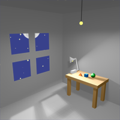
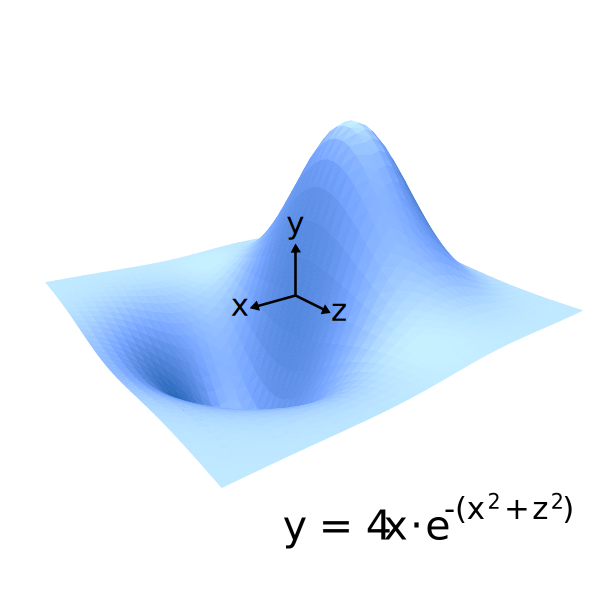
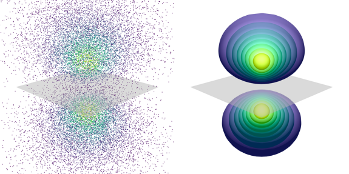
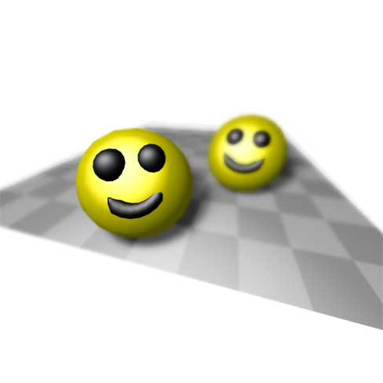

# VectSharp.ThreeD


**VectSharp.ThreeD** is a 3D graphics library addon for VectSharp that makes it possible to create vector and raster 3D images. VectSharp.ThreeD is released under an LGPLv3 licence.

It should be noted that real-time performance for complex scenes was *not* a goal while developing VectSharp.ThreeD. Thus, to increase portability, this library does not use any GPU acceleration. However, parallelisation is used when possible, which should increase the performance of the library when it is used on systems with multicore processors.

This document contains a general overview of the classes and interfaces implemented in VectSharp.ThreeD. More detailed information about each topic, algorithm details, and pictures are provided in separate files for each topic:

* [Getting started](#gettingStarted)
* [Renderer](#renderer)
* [Lights](#lights)
* [Camera](#camera)
* [Scene](#scene)
* [3D elements](#elements)
* [Materials](#materials)

All figures in these documents were produced using VectSharp and VectSharp.ThreeD.

Here are a few examples of 3D graphics produced with VectSharp.ThreeD:

* An indoors scene with moonlight and two lightbulbs.

<p align="center">
    
</p>

* The plot of a function of two variables.

<p align="center">
    
</p>

* Two visualisations of a _p_ orbital of the Hydrogen atom (_n_=2, _l_=1). On the left, as a point cloud (the probability of finding a point at a certain combination of coordinates is proportional to the squared modulus of the wave function); on the right, as a set of surfaces (the squared modulus of the wave function is constant on each surface; on the outer surface it is 20% of the maximum value and it increases by 10% for each surfance until the inner surface, where it is 90% of the maximum value). The nodal plane is highlighted in grey.

<p align="center">
    
</p>

* Two slightly creepy smileys:

<p align="center">
    
</p>

## <a name="gettingStarted"></a> Getting started

To use VectSharp.ThreeD, you should first of all install the NuGet package.

Then, the main idea behind VectSharp.ThreeD is to use a `renderer` object (implementing the `IRenderer` interface) to transform a 3D `scene` (implementing the `IScene` interface) into a 2D image, using the specified `camera` (which inherits from the `Camera` abstract class) and `light`s (implementing the `ILightSource` interface).

Here is a minimal example showing how to render a blue cube and save it as an SVG file:

```CSharp
using VectSharp;
using VectSharp.ThreeD;
using VectSharp.SVG;

[...]

    // Create a scene to contain 3D objects
    Scene scene = new Scene();

    // The static ObjectFactory class can be used to create "complex" 3D objects, such as a cube. These are returned as a list of triangles that can be added to the scene.
    scene.AddRange(ObjectFactory.CreateCube(new Point3D(0, 0, 0), 100, new IMaterial[] { new PhongMaterial(Colours.CornflowerBlue) }));
    
    // The light will be used to illuminate the object(s) in the scene and make them actually visible.
    ParallelLightSource light = new ParallelLightSource(0.5, new NormalizedVector3D(1, 2, 3));

    // A camera that renders the scene using a perspective projection.
    PerspectiveCamera camera = new PerspectiveCamera(new Point3D(-200, -200, -300), new NormalizedVector3D(2, 2, 3), 50, new Size(30, 30), 1);

    // A renderer to render the scene as a vector image.
    VectorRenderer renderer = new VectorRenderer() { DefaultOverFill = 0.02, ResamplingMaxSize = 1 };

    // Render the scene.
    Page pag = renderer.Render(scene, new ILightSource[] { light }, camera);

    // Save as an SVG image.
    pag.SaveAsSVG("Cube.svg");

[...]
```

The result should be similar to the following:

<p align="center">
    
</p>

More complex scenes can be created by adding multiple elements (either by using methods from the `ObjectFactory` class, or by manually creating the triangles) and/or multiple light sources. The `VectSharp.Demo3D` project shows an example of how a function of two variables can be plotted in 3D, complete with rudimentary camera controls using the mouse (drag while pressing the left mouse button to orbit, drag while pressing the right mouse button to pan, or use the mouse wheel to zoom in/out).

## <a name="renderer"></a> The Renderer

A renderer is an instance of a class implementing the `IRenderer` interface, whose only purpose is essentially to produce a VectSharp `Page` out of a scene, a set of lights and a camera. Indeed, the `IRenderer` interface defines only one method:

* `Page Render(IScene scene, IEnumerable<ILightSource> lights, Camera camera);`

    This method, when overridden in a class implementing this interface, will return a 2D representation (in the form of a `VectSharp.Page` object) of the 3D `scene` illuminated with the specified `lights` and viewed through the specified `camera`.

Each class implementing this interface renders the 3D scene using a different algorithm, and properties on these classes can be used to specify additional parameters for the algorithm. Currently, VectSharp.ThreeD contains three `IRenderer` implementations: the `VectorRenderer`, which renders the scene to a vector graphics object, the `RasterRenderer`, which produces a raster image using a rasterisation algorithm to draw the triangles in the scene, and the `RaycastingRenderer`, which produces a raster image using a raycasting algorithm.

More details about these implementations can be found in the [`Renderers.md` file](Renderers.md).

## <a name="lights"></a> The Lights

Light sources are necessary to make the elements in the scene visible. For example, if you remove the light source in the example code (passing an empty `ILightSource` array to the `renderer.Render` method), you will notice that the cube is completely black.

A light source implements the `ILightSource` interface, which stipulates that it must be able to determine how intense the light is at any point in 3D space, whether the light casts a shadow or not, and whether the light is obstructed or not at any point in space. The interface contains the following members:

* `LightIntensity GetLightAt(Point3D point);` 

    This method returns the light intensity and direction at any point in space. The `LightIntensity` struct contains two field members: a `double Intensity` and a `NormalizedVector3D Direction`.

    * The `Intensity`, unsurprisingly, represents how intense the light is at the specified point. How this value is interpreted depends on the specific `IMaterial` implementation (more on this later), but currently in the `PhongMaterial` an `Intensity` of 0 represents complete darkness (i.e. all colours appear as black), while an `Intensity` of 1 represent maximum brightness (i.e. all colours appear white).

    * The `Direction` represents the direction of incident light. For example, a point light source situated at point `A` would cast a light in point `B` along the direction of `B - A` (i.e. this vector points *from* the light source *to* the point). If the light does not have any specific direction (e.g. ambient light), a `NormalizedVector` whose three components are all `double.NaN` should be returned.

* `bool CastsShadow { get; }`

    This property determines whether the light source is able to cast a shadow or not. The interface requires only a `get`ter method, but implementations are free to include a `set` method as well, if appropriate. This makes it possible, for example, to disable shadow generation for a particular light source, while leaving it on for others. If this property is `false`, the renderer will *usually* save time by not testing whether the light is obstructed or not; it is however recommended that the value of this property be coherent with the output of `GetObstruction` (i.e. if this property is always `false`, `GetObstruction` should always return `0`).

* `bool GetObstruction(Point3D point, IEnumerable<Triangle3DElement> shadowingTriangles);`

    This method determines how much of the light reaches a certain point in space, given a set of triangles that could potentially cast a shadow ecompassing the point. For example, this could be achieved by following the light direction in reverse from the point to the source, and checking whether this ray of light intersects any of the triangles. If the returned value is `0`, the light is completely unobstructed. If the returned value is `1`, the light is completely obstructed. Values in the middle can be used to produce soft shadows.

VectSharp.ThreeD currently contains multiple `ILightSource` implementations:
* `AmbientLightSource`, which produces a diffuse ambient light that does not cast shadows;
* `ParallelLightSource`, which produces light that travels along a fixed direction (such as a very distant light source like the sun);
* `PointLightSource`, which emanates light from a point in all directions (similar to a lightbulb);
* `SpotLightSource`, whose light starts from a point and expands in a cone centered along a fixed direction (akin to a lamp with a shade);
* `MaskedLightSource`, which is similar to a `SpotLightSource`; however, instead of a conic light beam, it has a beam following an arbitrary shape (like a lightbulb in front of which a stencil mask has been placed).

More details about these light sources are available in the [`Lights.md` file](Lights.md).

## <a name="camera"></a> The Camera

Cameras are classes that inherit from the `Camera` abstract class and represent objects that are used to project points from 3D space to 2D space. In general, a camera works by projecting the 3D points to a plane (the "camera plane") in 3D space, and then manipulating the camera plane so that it is perpendicular to one of the three axes. This way, one of the coordinates can be dropped for each point, transforming the 3D points in their 2D representation. The camera plane is then cropped to obtain a 2D image of the required size.

The `Camera` class defines the following abstract members:

* `Point TopLeft { get; protected set; }`

    This represents the 2D coordinates of the top left corner of the image on the camera plane.

* `Size Size { get; protected set; }`

    This represents the size of the 2D image.

* `double ScaleFactor { get; }`

    This value represents a scale factor that is used to transform between coordinates on the camera plane and in the 2D image.

* `Point3D ViewPoint { get; }`

    This point represents the "position" of the camera, which is used by light sources to compute how much reflected light reaches the camera eye from a certain point in the 3D space.

* `Point Project(Point3D point);`

    This is the main method that a camera class needs to implement: this method transforms a point in 3D space into a point in 2D space, using a camera-specific approach (e.g. a perspective projection or an orthographic projection).

* `Point3D Deproject(Point point, Line3DElement element);`
    
    `Point3D Deproject(Point point, Triangle3DElement element);`

    These methods perform the conceptually opposite task of the `Project` method: given a point in 2D space and a 3D element (line or triangle), the methods return the 3D point of the 3D element whose projection corresponds to the specified 2D point. These methods assume that it has already been determined that the 2D point corresponds to a point belonging to the 3D line or triangle (e.g. by checking that the 2D point is enclosed within the 2D projection of the 3D element).

* `double ZDepth(Point3D point)`

    This method returns a value describing how "far" from the camera a 3D point is. This could be e.g. the distance from the camera eye, or from the camera plane. The smaller the value returned by this method, the closer to the camera the object is.

* `bool IsCulled(Element3D element)`

    This method determines whether the specified element should be "culled" when rendering the scene using the current camera. Culling elements improves performance by making it possible to avoid any rendering computation on objects that would be invisible. For example, culled elements could include elements that are placed behind the camera or elements that face the opposite way from the camera.

The camera class also defines a `virtual int Compare(Element3D element1, Element3D element2)` method. This method is used to compare two elements and determine whether one is in front of the other or they do not overlap. This method can return `-1` if `element1` is in front of `element2`, `1` if `element2` is in front of `element1`, or `0` if the elements intersect or do not overlap. Renderers can use this information to determine in which order to draw the elements. The default implementation of this method checks whether the 2D representations of the two elements overlap and, if they do, uses the `ZDepth` method to determine which one is in front of the other.

VectSharp.ThreeD currently contains two cameras: a `PerspectiveCamera` and an `OrthographicCamera`. Further information about cameras is available in the [`Cameras.md` file](Cameras.md).

## <a name="scene"></a> The Scene

A scene is an instance of a class implementing the `IScene` interface. This is essentially little more than a collection of `Element3D` objects, where each objects represents an entity (point, line or triangle) in 3D space.

The `IScene` interface defines the following members:

* `IEnumerable<Element3D> SceneElements { get; }`

    This is the main component of the scene, i.e. a collection of `Element3D` objects. Each of these objects represents an entity in 3D space, such as a triangle, a line or a point.

* `void AddElement(Element3D element);`

    `void AddRange(IEnumerable<Element3D> element);`

    These methods are used to add one or more elements to the scene.

* `void Replace(Func<Element3D, Element3D> replacementFunction);`

    `void Replace(Func<Element3D, IEnumerable<Element3D>> replacementFunction);`

    These methods are used to replace an element with another element or with a collection of other elements. This is useful e.g. to apply various kinds of transformations to objects that have already been added to the scene.
        
* `object SceneLock { get; }`

    This object should be used by renderers rendering the scene to ensure thread-safety (i.e. to ensure a consistent state of the scene elements across different rendering runs).

Currently, VectSharp.ThreeD contains only one implementation of this interface (the `Scene` class). The only additional member of this class is the `Tolerance` property, which can be used to change the tolerance value for comparisons between 3D objects (such a tolerance is necessary due to the finite precision of floating-point operations; however, the default value should be fine for most instances).

## <a name="elements"></a> 3D elements

The 3D elements that are included in a VectSharp.ThreeD scene all inherit from the `Element3D` abstract class. This class implements the `IReadOnlyList<Point3D>` interface; thus, in a way, elements can be seen as collections of 3D points. There are three kinds of 3D elements in VectSharp.ThreeD, depending on how many points they contains:

* The `Point3DElement` class represents individual points. Instances of this class contain only one `Point3D`.
* The `Line3DElement` class represents 3D segments. Instances of this class contain two points (i.e. the start and end point of the segment).
* The `Triangle3DElement` class represents 3D triangles. Instances of this class contain three points (the three vertices of the triangle).

More complex 3D objects (e.g. polygons or solids) are represented by combinations of these simple elements.

The `Element3D` class cannot be inherited by classes outside of the VectSharp.ThreeD assembly. In addition to the members required by the `IReadOnlyList<Point3D>` interface, the class defines the following abstract members:

* `string Tag { get; set; }`

    This property defines an arbitrary string payload associated with the element. This can be used e.g. to identify elements belonging to the same 3D object. The `VectorRenderer` included in VectSharp.ThreeD also transfers this tag to the 2D vector elements it draws.

* `int ZIndex { get; set; }`

    This property can be used as a "hint" to the renderer to determine in which order the elements should be drawn. Elements with a higher `ZIndex` should appear in front of elements with a lower `ZIndex`. Elements with the same `ZIndex` should instead be ordered based on the algorithm specified by the camera's `ZDepth` and `Compare` methods.

* `void SetProjection(Camera camera)`

    This method computes the 2D projection of the points constituting the element (using the `camera`'s `Project` method) and stores it within the element. The projection can then be retrieved using the next method. This is useful when the projected points are needed more then once, as it is more efficient than recomputing the projection every time.

* `Point[] GetProjection()`

    This method returns the 2D projection of the element's points that has been computed during the previous call to `SetProjection`. If `SetProjection` has never been called, this method returns `null`.

More information about the 3D elements can be found below and in the [`Primitives.md` file](Primitives.md).

### The `Point3DElement` class

Instances of this class represent individual points in 3D space that appear as circles when rendered. The class defines the following properties:

* `Point3D Point { get; }`

    This is the 3D coordinates of the point to be drawn.

* `double Diameter { get; set; }`

    This represents the diameter of the circle representing the point in camera plane units. Note that the circle will always have this diameter, regardless of where it is in the space (e.g. how far it is from the camera).

* `Colour Colour { get; set; }`

    This is the colour with which the circle will be filled, regardless of any lighting.

The constructor for this class accepts a single argument, i.e. the coordinates of the point.

### The `Line3DElement` class

Similarly, instances of this class represent segments between two 3D points. The following properties are defined:

* `Point3D Point1 { get; }`
* `Point3D Point2 { get; }`

    These points represent the coordinates of the start and end point of the segment.

* `Colour Colour { get; set; }`

    This is the line's colour (again, regardless of any light source).

* `double Thickness { get; set; }`

    The thickness in camera plane units of the line. The line will have a constant thickness, regardless of the positioning of the start and end point in 3D space.

* `LineCaps LineCap { get; set; }`

    The cap that will be used at each end of the line (`Butt`, `Round` or `Square`).

* `LineDash LineDash { get; set; }`

    The line dash pattern with which the line will be drawn.

The constructor for this class requires two arguments, corresponding to the start and end point of the line.

### The `Triangle3DElement` class

`Triangle3DElement` instances represent a single triangle in 3D space. This is the base shape to draw all sorts of 3D solids and surfaces. A `Triangle3DElement` has the following public properties:

* `Point3D Point1 { get; set; }`
    
    `Point3D Point2 { get; set; }`
    
    `Point3D Point3 { get; set; }`

    These points represent the vertices of the triangle.

* `Point3D Centroid { get; set; }`

    This point represents the centroid/barycenter of the triangle.

* `bool CastsShadow { get; set; }`
    
    `bool ReceivesShadow { get; set; }`

    These values determine whether the triangle can receive a shadow from other triangles and whether it can project a shadow itself. If `ReceivesShadow` is `false`, any light source is always deemed to be unobstructed for this triangle. Similarly, if `CastsShadow` is `false`, it is assumed that this triangle can never obstruct any light source.

* `NormalizedVector3D ActualNormal { get; }`

    This vector represents the normal to the plane in which the triangle lies, computed through the cross vector of the sides. This is used in geometric computations e.g. when projecting a point on the plane.

* `NormalizedVector3D Normal { get; }`

    This vector also represents the normal to the plane in which the triangle lies. However, this normal is used when performing lighting and shading computations. If the triangle is `flat`, the `Normal` and `ActualNormal` will usually coincide; if it is not (e.g. because it is part of a sphere), the `Normal` may be different from the `ActualNormal`. It is assumed that this normal applies at the centroid of the triangle.

* `NormalizedVector3D Point1Normal { get; }`
    
    `NormalizedVector3D Point2Normal { get; }`
    
    `NormalizedVector3D Point3Normal { get; }`

    Similarly, these vectors represent the normal at each vertex of the triangle. If the triangle is flat, they will all point in the same direction as the `ActualNormal`, otherwise they may all point in different directions. The normal at each point of the triangle is interpolated using these vertex normals.


* `List<IMaterial> Fill { get; protected set; }`

    This represents the "material(s)" of which the triangle is composed, which will determine the colour of the triangle depending on how much light hits it and in which direction. See below for further information about materials.

The class also defines the following public methods:

* `NormalizedVector GetNormalAt(Point3D point)`

    This method returns the normal at a specified point. It assumes that the `point` belongs to the triangle.

* `BarycentricPoint ComputeBarycentric(Point3D point)`

    This method computes the barycentric coordinates of a point. It is assumed that the point lies on the plane of the triangle. The `BarycentricPoint` structs has three fields, representing the three barycentric coordinates `U`, `V` and `W` (`U` is relative to `Point1`, `V` to `Point2` and `W` to `Point3`).

* `Point3D? ProjectOnThisPlane(Point3D point, NormalizedVector3D direction, bool positiveOnly, double maxD)`

    This method projects a point on the triangle's plane along a specified direction. If `positiveOnly` is true, the method returns `null` if the point is behind the plane with respect to the `direction`. The method also returns `null` if the point is in front of the plane and the distance between it and the plane along `direction` is greater than `maxD` (`maxD` can be set to `double.PositiveInfinity` to avoid this).

This class defines two constructors: one taking three `Point3D` arguments representing the vertices of the triangle, and one that also takes three `NormalizedVector3D` arguments that represent the vertex normals.

## <a name="materials"></a> Materials

Materials are used to determine how a triangle's surface reacts to incoming light. Materials implement the `IMaterial` interface, which defines a single method:

* `Colour GetColour(Point3D point, NormalizedVector3D surfaceNormal, Camera camera, IEnumerable<ILightSource> lights)`

    This method returns the colour of the specified 3D point, given the surface normal, camera and light sources. Note that this method does not check whether each light is obstructed or not - that should have been done before, so that only unobstructed lights are passed to this method.

VectSharp.ThreeD currently includes two implementations of this interface: the `ColourMaterial` and `PhongMaterial`.

### The `ColourMaterial` class

The `ColourMaterial` is a very simple material, which always appears of the same colour, regardless of how much light hits it. It has a single public property, `Colour Colour { get; }` which returns the colour of the material, and its constructor accepts a single argument, which is also the colour of the material.

### The `PhongMaterial` class

The `PhongMaterial` class represents a material which uses a Phong reflection model. This means that the light intensity at each point provided by any light source (except for ambient lights) is determined based on the angle of incidence of the light on the triangle surface, as well as the angle formed between the light, the point, and the camera viewpoint.

This material has the following properties:

* `Colour Colour { get; set; }`

    This is the base colour of the material. This is the colour that the material will have when the total light intensity is `0.5`.

* `double AmbientReflectionCoefficient { get; set; }`

    This coefficient is multiplied with the intensity of ambient lights to determine how much each ambient light contributes to the overall light intensity at the point.

* `double DiffuseReflectionCoefficient { get; set; }`

    This coefficient is multiplied with the intensity of diffuse lights (which depends on the light direction and surface normal) to determine how much they contribute to the overall light intensity.

* `double SpecularReflectionCoefficient { get; set; }`

    This coefficient is multiplied with the intensity of specular reflected lights (which depends on the light direction and the camera viewpoint position) to determine how much they contribute to the overall light intensity.

* `double SpecularShininess { get; set; }`

    This coefficient determines how "shiny" the surface is, i.e. how large or small the specular highlight is. If this value is high, the specular highlight is small and vice versa.

More information about materials is available in the [`Materials.md` file](Materials.md).

