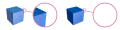
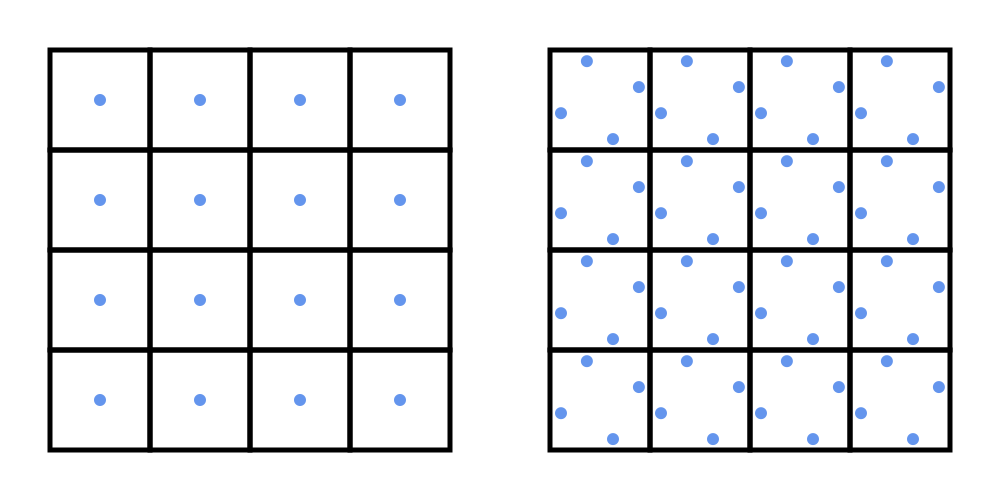
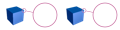

# Renderers

A renderer is an instance of a class implementing the `IRenderer` interface, whose only purpose is essentially to produce a VectSharp `Page` out of a scene, a set of lights and a camera. Indeed, the `IRenderer` interface defines only one method:

* `Page Render(IScene scene, IEnumerable<ILightSource> lights, Camera camera);`

    This method, when overridden in a class implementing this interface, will return a 2D representation (in the form of a `VectSharp.Page` object) of the 3D `scene` illuminated with the specified `lights` and viewed through the specified `camera`. The size of the page will be equal to the `Size` of the `camera`.

Each class implementing this interface renders the 3D scene using a different algorithm, and properties on these classes can be used to specify additional parameters for the algorithm. Currently, VectSharp.ThreeD contains three `IRenderer` implementations, each with its advantages and disadvantages:

* The `VectorRenderer` renders the scene to a vector graphics object.
    * For simple scenes, the performance of this renderer is much better than the others. The results are vector images, thus they can be scaled at any size without loss of detail.
    * Only one of the rendering steps (sorting the object) is parallelised.
    * Artifacts can arise relatively often, especially when specular highlights and shadows are activated.
* The `RasterRenderer` produces a raster image using a rasterisation algorithm to draw the triangles in the scene.
    * This renderer produces better results with more complex scenes.
    * Triangles are rendered one at a time, but each triangle is rendered in parallel.
    * It can have issues with multiple transparent objects one in front of the other and does not support anti-aliasing, which may also cause an annoying "edge" effect when 2D elements (lines and points) are included in the scene.
* The `RaycastingRenderer` produces a raster image using a raycasting algorithm.
    * This renderer produces the best-looking images, sometimes at the expense of performance (depending on the number of processors available). Optionally, it supports anti-aliasing.
    * Each pixel is rendered in parallel.
    * Performance is best when the computer has many processors available for rendering.

Note that none of these renderers uses GPU acceleration (this is both to keep the code simple and to maintain portability), although in principle it should be possible to write a renderer that uses GPU acceleration.

## The `VectorRenderer` class

The `VectorRenderer` class renders the scene as a series of vector graphics objects. Each `Point3DElement` in the scene is represented by a circle, `Line3DElement`s by lines, and `Triangle3DElement`s by triangles in vector coordinates.

This class has a parameterless constructor and the following public properties:

* `double DefaultOverFill { get; set; } = 0`

    This property determines the default value of the `OverFill` property for base `Triangle3DElement`s that do not implement the `IVectorRendererTriangle3DElement` interface.

* `double ResamplingMaxSize { get; set; } = double.NaN`

    This property determines the maximum size for the resampling step (see below). If this is `double.NaN`, resampling is disabled.

* `ResamplingTimes ResamplingTime { get; set; } = ResamplingTimes.AfterSorting`

    This property determines when the resampling step happens. The possible values are `ResamplingTimes.AfterSorting` (the default value), which means that resampling happens after the sorting step (this results in better performance), or `ResamplingTimes.BeforeSorting`, which means that resampling happens before the sorting step. The `ResamplingTimes` enum is defined within the `VectorRenderer` class.

* `bool ResampleLines { get; set; } = true`

    This value determines whether lines are also resampled during the resampling step. The main reason not to resample lines is that this would interfere with line caps and line dash styles.

The rendering algorithm of the `VectorRenderer` uses the following steps:

1. Convert
2. Cull
3. Resample (optional)
4. Project
5. Compute shadow list
6. Compare
7. Sort
8. Resample (optional)
9. Render

### 1. Converting

The conversion step iterates through all the elements in the scene, and converts any `Triangle3DElement` that does not implement the `IVectorRendererTriangle3DElement` interface into a `VectorRendererTriangle3DElement` with the same coordinates, normals and materials. This interface defines, in particular, an `OverFill` property that is used to address some of the artifacts that can arise when using the `VectorRenderer`. The value of the `OverFill` property of the new object is determined by the value of the `DefaultOverFill` property of the renderer.

### 2. Culling

In this step, the `Camera` is asked whether each of the objects in the scene should be culled or not. Non-culled objects are preserved in a list.

### 3. Resampling

Depending on the value of the `ResamplingTime` property of the renderer, this step can happen just after the culling or just after the sorting step. This step is also skipped if the `ResamplingMaxSize` property of the renderer has a value of `double.NaN`.

In this step, the renderer computes the area (in camera plane units) of 2D projection of each triangle in the camera plane. If this is greater than the `ResamplingMaxSize` of the renderer, the triangle is split into four triangles of equal area, and this is repeated until the size of the triangles is smaller than `ResamplingMaxSize`. A similar approach is followed for lines: the square of the length of each line is computed, and if this is greater than the thresold, the line is split in half. The length of each half is then computed and so on. Points are left unchanged.

This step helps solve some of the artifacts due to the nature of the algorithm, but causes a drop in performance (because the number of triangles in the scene increases dramatically). Performing the resampling step after the sorting step can help in reducing artifacts due to specular highlights or shadows, without causing too much of a performance hit. However, artifacts due to intersecting surfaces or circular dependencies can only be solved if the resampling is performed before the sorting step, and this has the potential to cause a massive slowdown due to the huge number of triangles that have to be sorted.

### 4. Projecting

In this step, the coordinates of the 2D projection of the triangles in the camera plane are computed using the `SetProjection` method of the 3D elements. These projections are stored within the 3D element object and are recalled later using the `GetProjection` method.

### 5. Computing the shadow list

At this stage, if any of the lights that have been used has its `CastsShadow` property set to `true`, the method computes a list of all triangles whose `CastsShadow` property is also `true`. Both culled and non-culled triangles are considered and, even if the resampling step has already happened, the original triangles are used instead of their resampled counterparts.

This list of triangles that cast shadows is later used to determine which light sources are not visible from each triangle that receives a shadow.

### 6. Comparing

This is usually the most time-consuming step of this algorithm. Each 3D element is compared with every other 3D element in the scene in order to determine which one lies in front with respect to the current camera. The `Compare` method of the `Camera` is used. If the scene contains  elements, then  comparisons have to be performed in this step.

When applied to two objects `A` and `B`, the `Compare` method can return one of three values for each comparison:

* If the method returns `-1`, then `A` is in front of `B` when viewed with the current camera. In this case, `A` will be drawn after `B` during the rendering step.
* If the method returns `1`, then `B` is in front of `A` when viewed with the current camera/. In this case, `B` will be drawn after `A` during the rendering step.
* If the method returns `0`, then either:
    * The two objects do not overlap; or
    * It was not possible to determine univocally which object is in front of the other (e.g. because the two objects intersect)
    
    In this case, which of the two objects will be drawn before the other during the rendering step is undefined and it will be determined during the sorting step based on the context of the other objects in the scene. In most cases, this decision will be either irrelevant (because the two objects do not overlap), or necessarily unsatisfactory (because if the two objects intersect, there is no "right" way to draw one in front of the other).

This step is performed separately from the following step, because, since comparing two objects does not depend on the other objects in the scene, it can be easily parallelised. This uses `Parallel.For` and thus should automatically use as many processor cores as there are avaiable. The results of the comparisons are stored in an array and used in the following step.

### 7. Sorting

The comparisons that have been performed in the previous step are used to perform a [topological ordering](https://en.wikipedia.org/wiki/Topological_sorting) of the elements in the 3D scene. The algorithm used is a variaton of the one described in this [CodeProject article](https://www.codeproject.com/Articles/869059/Topological-sorting-in-Csharp).

In addition to the caveat described above about intersecting elements, this algorithm will also fail to sort the elements properly in the presence of _cyclical dependencies_, e.g. three objects such that `A` is in front of `B`, `B` is in front of `C` and `C` is in front of `A`: in these case, it is not possible to determine a global ordering that preserves the pairwise relationships. An example of this and of how this can be addressed is provided below.

### 8. Resampling

If the resampling step has not been performed yet, it is performed now. This reduces the impact of resampling because the additional elements do not have to go through the comparison and sorting step, but it also makes it impossible to fix artifacts due to the sorting algorithm in this way.

### 9. Rendering

In this step, the actual rendering takes place. The elements are drawn back-to-front, based on the sorting that has been performed in step 7.

The colours of points and lines are determined trivially by their `Colour` property. For triangles, instead, a flat shading model is use, i.e. the whole triangle is filled with a single colour. The colour is determined by the `GetColour` method of the triangle, applied at the triangles centroid. The lights that are visible by the triangle are also determined based on the centroid of the triangle and the list of triangles that cast shadows.

This can cause artifacts when specular highlights are activated, because, based on the position of the centroid, even triangles that are coplanar may reflect a different amount of light towards the camera, thus they will be shaded differently. The same problem also happens in the case of any light source that is not a `ParallelLightSource` (because the angle of incidence will be different between different triangles, even if they are coplanar). Finally, artifacts will also appear when shadows are activated, because the whole area of a triangle whose centroid lies in the shadow of another triangle will be shadowed.

This step, combined with the previous comparison and sorting steps, are essentially an implementation of the [Painter's algorithm](https://en.wikipedia.org/wiki/Painter%27s_algorithm), with the associated advantages and drawbacks.

The following section shows examples of artifacts that can appear when a `VectorRenderer` is used and how they can be mitigated.

### Fantastic artifacts and how to avoid them

The following figure shows three examples of artifacts that happen due to the algorithm of the `VectorRenderer`. The numbers above each image are the number of milliseconds that were necessary to render the scene on a PC with a 12-core/24-thread AMD Ryzen 9 3900X processor.

<p align="center">
    <image src="images/VectorRendererArtifacts.svg" style="height: 16em" align="center" height="224">
</p>

For reference, here is how the scenes look like when rendered using a `RayCastingRenderer` (which does not cause the same kind of artifact) at a 1000x1000 pixel resolution each, with 4X bilinear antialiasing.

<p align="center">
    <image src="images/VectorRendererArtifacts_reference.svg" style="height: 16em" align="center" height="224">
</p>

* The first figure shows a cube illuminated by a `ParallelLightSource` that casts a shadow on a rectangle. The artifacts here are that:

    * There is a thin white line between the two triangles that make up each side of the cube and the rectangle. This is due to rounding errors and antialiasing.
    * The second issue is more subtle: the two triangles that make up each side of the cube and the rectangle, despite being coplanar, have different shadings (due to the specular highlights).
    * The shadow of the cube entirely covers one of the triangles constituting the floor rectangle.

    The first issue can be solved by using an appropriate value for the `DefaultOverFill` property of the `VectorRenderer` (or by converting the triangles to `VectorRendererTriangle3DElement`s and setting their `OverFill` property). For example, this is how the scene looks with a `DefaultOverFill` of `0.05`:
    
    <p align="center">
        <image src="images/VectorRendererArtifacts_cubeOverfill.svg" style="height: 16em" align="center" height="224">
    </p>

    Note that depending on your screen resolution and the program you are using to view the images, you may still notice a bit of a gap. The second issue can be solved by disabling the specular highlights on the cube and the triangle, i.e. by setting the `SpecularReflectionCoefficient` property of their materials to `0` (and increasing the `DiffuseReflectionCoefficient` to compensate):

    <p align="center">
        <image src="images/VectorRendererArtifacts_cubeOverfillNoSpecular.svg" style="height: 16em" align="center" height="224">
    </p>

    However, this still does not solve the shadow problem. The best that we can do here is to use `ResamplingMaxSize` property of the `VectorRenderer`. Here is how the scene looks with various values of this property (indicated by the orange numbers at the bottom):

    <p align="center">
        <image src="images/VectorRendererArtifacts_cubeOverfillResampling.svg" style="height: 16em" align="center" height="224">
    </p>

    Since this approach also solves the specular highlight problem, specular highlights have been re-enabled here. In this case, the `ResamplingTime` property does not have any effect, as the artifact is not due to the sorting algorithm.
    
    While this approach produces better results (especially with the smaller values for `ResamplingMaxSize`), it causes a significant increase in computation time. Furthermore, the computation time that is displayed here does not take into account the time to export the image to a file and the time that the viewer needs to draw the image (both of which are significantly increased); another factor to take into account is that the file size also increases significantly (the previous image was about 2.5MB in size, while the vector image without resampling only weighs about 7kB and the raster reference image is about 184kB).

    Considering that the "jagged" effect visible here cannot really be improved much more than this, even by reducing the threshold to unrealistically low values, the best approach here would be to disable shadows when using the `VectorRenderer` and to use another renderer if the shadows are really needed.

* The second figure shows two intersecting tetrahedra together with a line that intersects both of them. The artifacts here are that the intersections are mostly wrong, as it is not clear that the two tetrahedra intersect, and the line is overlaid on both of them, instead going through the corner. The only thing that we can do here is again to use the `ResamplingMaxSizeProperty`; in this case we also need to set the `ResamplingTime` property to `ResamplingTimes.BeforeSorting`, because the artifact is due to the sorting algorithm:

    <p align="center">
        <image src="images/VectorRendererArtifacts_tetrahedraOverfillResampling.svg" style="height: 16em" align="center" height="224">
    </p>

    This is better; however, some artifacts still persist around the line. The rendering can be improved further by disabling the line  resampling (i.e. by setting the `ResampleLines` property of the `VectorRenderer` to false) or by removing the line altoghether:

    <p align="center">
        <image src="images/VectorRendererArtifacts_tetrahedraOverfillResamplingNoLine.svg" style="height: 16em" align="center" height="224">
    </p>

    However, the scene with the line still shows a bit of an artifact and there really is no way to get definitively rid of that. Also note the great increase in rendering time.
    
* The third scene shows a "cyclical dependency", i.e. three objects none of which is above all the others. Similarly, we can address this by using the `ResampleMaxSize` property of the `VectorRenderer` with a `ResamplingTime` of `ResamplingTimes.BeforeSorting`:

    <p align="center">
        <image src="images/VectorRendererArtifacts_cyclicOverfillResampling.svg" style="height: 16em" align="center" height="224">
    </p>

    In this case, even a `ResamplingMaxSize` of `100` is enough to obtain a good result (discounting the patchwork effect that can be addressed by disabling specular highlights).

These examples show the artifacts that can arise when using the `VectorRenderer` and how they can be addressed. This can be generalised to obtain the following tips.

### Tips for using the `VectorRenderer`

* Use the `DefaultOverFill` property of the renderer, or set the `OverFill` property of the triangles to address the gaps between triangles.
* Avoid intersecting elements and cyclic dependencies.
* Only use `ParallelLightSource`s.
* Disable specular highlights.
* Disable shadows.
* Use the `ResamplingMaxSize` property to solve some issues at the expense of computation time and memory.
* When all else fails, manually split problematic elements and/or use the `ZIndex` property to manually sort them.

## The `RasterRenderer` class

The `RasterRenderer` class uses a different algorithm. Once the 2D vector coordinates of the elements are computed, the elements are rasterised in an arbitrary order. A "z-buffer" is used to keep track of the z-depth of the element that was rendered at each pixel.

The constructor for this class requires two `int` parameters, which represent the width and height (in pixels) of the rendered image. Note that the `Page` returned by the `Render` method will always have the same size as the camera's `Size` property.

This class defines the following public properties:

* `int RenderWidth { get; }`

    This property returns the width (in pixels) of the rendered image.

* `int RenderHeight { get; }`
        
    This property returns the height (in pixels) of the rendered image.

* `RasterImage RenderedImage { get; }`

    This is the raster image that resulted from the last rendering action that the renderer has performed.

* `DisposableIntPtr RenderedImageData { get; }`

    This is a disposable pointer that points to the address of the memory holding the data for the `RenderedImage`. Do not `Dispose` this manually - it will be automatically disposed once the `RenderedImage` is collected by the garbage collector and finalized.

* `bool InterpolateImage { get; set; } = true`

    This property determines whether the `RenderedImage` is interpolated once it is drawn on a `Graphics` object. If this is `false`, a "pixelated" effect can be obtained when the image is resized.

The rendering algorithm of the `RasterRenderer` works with the following steps:

1. Compute shadow list
2. Cull
3. Project
4. Initialise z-buffer
5. Render

### 1. Computing the shadow list

If any of the lights that have been used has its `CastsShadow` property set to `true`, the method computes a list of all triangles whose `CastsShadow` property is also `true`.

This list of triangles that cast shadows is later used to determine which light sources are not visible from each pixel of a triangle that receives a shadow.

### 2. Culling

In this step, the `Camera` is asked whether each of the objects in the scene should be culled or not. Non-culled objects are preserved in a list.

### 3. Projecting

In this step, the coordinates of the 2D projection of the triangles in the camera plane are computed using the `SetProjection` method of the 3D elements. These projections are stored within the 3D element object and are recalled later using the `GetProjection` method.

### 4. Initialising the z-buffer

Upon its creation, the renderer allocates sufficient memory to hold the z-buffer (which is an array of `double`s holding the z-depth of the element that caused each pixel to be rendered) and the z-index buffer (which is an array of `int`s holding the z-index of the element that caused each pixel to be rendered). However, these arrays need to be cleared before each rendering call, otherwise successive renderings would interfere with each other. In this step, the z-buffer is filled with `double.MaxValue`s and the z-index buffer is filled with `int.MinValue`s.

### 5. Rendering

In the rendering step, first of all for each element the rectangle that bounds all the pixels that fall within that element is computed.

Then, for each pixel in this rectangle (this step is parallelised), the renderer checks whether the pixel actually falls within the projection of the element.

* For a `Triangle3DElement`, this is simply a 2D point-in-triangle test.
* For a `Point3DElement`, the distance of the pixel from the projection of the point is computed, and if this is smaller than or equal to half of the `Diameter` of the `Point3DElement`, the pixel is considered to be "inside" the point. If the pixel is outside the point radius, but within 1 pixel, the pixel is considered to be partially inside the point.
* For a `Line3DElement`, the distance of the pixel from the projection of the line is computed.
    * If the projection of the pixel on the projection of the line is within the start and end points of the line and the pixel is closer than the line's `Thickness`, the pixel is considered to be "inside" the line. Like the case of the `Point3DElement`, if the pixel is outside of the line's `Thickness`, but still within 1 pixel, it is considered to be partially inside.
    * If the projection of the pixel on the projection of the line is before the start point or after the and end point, the renderer checks how far it is from the closest endpoint and determines whether the pixel is part of the line cap (if any).

For any point that is inside the relevant element, the z-depth is computed. Then, the renderer determines whether the pixel should be rendered in front or behind the current pixel by checking the z-index buffer and the z-buffer.

* If the z-index buffer at the pixel is less than the z-index of the element, or if they are equal and the z-depth of the pixel is smaller than the z-buffer at the pixel, the pixel should be rendered in front of the current colour at that pixel.
* Otherwise, the pixel should be rendered behind the current colour at that pixel. In this case, if the current colour at the pixel is completely opaque (an alpha value of 100%), the new pixel is immediately discarded, and no lighting or shadow computations take place.

If the pixel has not been discarded, the new colour for the pixel is computed, trivially for points and lines, and based on the lights and shadows for triangles. Then, if the new pixel is in front of the current pixel, the colours are blended accordingly, and the z-index buffer and the z-buffer are updated to hold the values for the new pixel. If the pixel is instead behind a transparent pixel, the colours are still blended appropriately, but the z-index buffer and the z-buffer are not updated. This can cause artifacts if there are multiple transparent objects one in front of the other (see below).

This process is repeated sequentially for each element in the scene, and then the final image is scaled on a `Page` of the size defined by the `Camera` and returned.

Note that if the same renderer is used to render different scenes, this will update **all** of the pages that have been previously returned by the renderer (this is a side effect of reusing the same `RasterImage` rather than allocating new memory at every rendering call). Therefore, if you want to keep access to the previously rendered scenes, you should either re-initialise the renderer whenever you render a different scene, or you should e.g. save to disk the rendered scene before rendering the next scene.

### `RasterRenderer` vs `VectorRenderer`

The `RasterRenderer` prevents the artifacts that arise from using a `VectorRenderer`, although the result is no longer a vector image. Furthermore, this renderer does not support anti-aliasing, which means that, when viewed at the wrong size, the images can have an ugly effect. The figure below shows a comparison of a detail of a cube rendered with a `VectorRenderer` (on the left) and with a `RasterRenderer` (on the right).

<p align="center">
    
</p>

While this effect can be reduced by increasing the resolution (which increases the rendering time and the amount of memory used), it can never be eliminated entirely. Furthermore, this renderer introduces new artifacts due to transparent pixels: since the render does not keep a full stack of the colours behind a transparent pixel, if the elements are processed in the "wrong" order, unexpected results may occur. This can manifest itself first of all as undesirable "edge" effects when `Line3DElement`s or `Point3DElement`s are used (because the primitive antialiasing used for them uses semi-transparent pixels):

<p align="center">
    
</p>

In the figure above, the colour of the second rectangle in the back "bleeds" through due to the semi-transparent pixels around the point.

However, the issue is much worse when a transparent element has two or more elements behind:

<p align="center">
    
</p>

In this case, the renderer drew first the solid blue rectangle, then the semi-transparent green rectangle on top of that, but when it was time to render the orange rectangle, the z-buffer at the overlap between the blue rectangle and the green rectangle already had the z-depth of the green rectangle, and the pixel was not transparent because the blue rectangle had already been rendered. This led to the artifact above.

The only way to address these problems would be to rearrange the order in which the elements are added to the scene in the code:

```CSharp
// Transparent element is not last: problem

// Blue rectangle
scene.AddRange(ObjectFactory.CreateRectangle(new Point3D(-100, -100, 50), new Point3D(100, -100, 50), new Point3D(100, 100, 50), new Point3D(-100, 100, 50), new IMaterial[] { new ColourMaterial(Colour.FromRgb(86, 180, 233)) }));

// Green rectangle
scene.AddRange(ObjectFactory.CreateRectangle(new Point3D(-100, -100, -50), new Point3D(100, -100, -50), new Point3D(100, 100, -50), new Point3D(-100, 100, -50), new IMaterial[] { new ColourMaterial(Colour.FromRgba(0, 158, 115, 0.5)) }));

// Orange rectangle
scene.AddRange(ObjectFactory.CreateRectangle(new Point3D(-100, -100, -0), new Point3D(100, -100, -0), new Point3D(100, 100, -0), new Point3D(-100, 100, -0), new IMaterial[] { new ColourMaterial(Colour.FromRgb(213, 94, 0)) }));


//Transparent element is last: problem solved

// Blue rectangle
scene.AddRange(ObjectFactory.CreateRectangle(new Point3D(-100, -100, 50), new Point3D(100, -100, 50), new Point3D(100, 100, 50), new Point3D(-100, 100, 50), new IMaterial[] { new ColourMaterial(Colour.FromRgb(86, 180, 233)) }));

// Orange rectangle
scene.AddRange(ObjectFactory.CreateRectangle(new Point3D(-100, -100, -0), new Point3D(100, -100, -0), new Point3D(100, 100, -0), new Point3D(-100, 100, -0), new IMaterial[] { new ColourMaterial(Colour.FromRgb(213, 94, 0)) }));

// Green rectangle
scene.AddRange(ObjectFactory.CreateRectangle(new Point3D(-100, -100, -50), new Point3D(100, -100, -50), new Point3D(100, 100, -50), new Point3D(-100, 100, -50), new IMaterial[] { new ColourMaterial(Colour.FromRgba(0, 158, 115, 0.5)) }));
```

<p align="center">
    
</p>

However, this is finicky and should not be relied upon (the order of the elements in the scene, or even the fact that there _is_ an order to them at all, is an implementation detail). In situations like these, it would be best to use another renderer. For comparison, here is how the images look like when rendered using the `VectorRenderer`:

<p align="center">
    
</p>

### Tips for using the `RasterRenderer`

* Use a high rendering resolution (maybe use a lower resolution during development, and then change to a higher resolution once you are satisfied with the arrangement of the objects in the scene).
* Avoid `Point3DElement`s and `Line3DElement`s. If you need to use them, add them to the 
scene after all other elements have been added.
* Avoid transparent elements. If you need to use them, add them to the scene after all other elements have been added.
* In most cases, using the `RaycastingRenderer` (see below) will produce better results than the `RasterRenderer`, though its performance can be worse depending on the scene, the resolutions, and the number of available processors.

## The `RaycastingRenderer` class

The `RaycastingRenderer` uses yet a different algorithm, which aims at solving the issues of the `RasterRenderer`. Working on a pixel-by-pixel basis, this renderer casts a ray from the camera eye through the coordinates of the pixel on the camera plane, and determines which objects the ray hits. It then sorts these objects based on their distance from the camera, and computes the colour of the pixel starting from the closest object and overlaying the colors one over the other until the pixel is completely opaque (or it reaches the last object).

This solves the issue with transparent objects lying one over the other, and also makes it trivial (though computationally expensive) to perform anti-aliasing. In a non-antialiased image, a single ray is cast for each pixel, aimed at the centre of the pixel. If 4X bilinear antialiasing (the only kind of antialiasing currently implemented) is enabled, four rays are instead cast for each pixel and the colour of the pixel is computed as the average of the colours obtained through each ray. In the figure below, each square represents a single pixel; the image on the left shows the point in the pixel through which the ray is cast when antialiasing is disabled, while the image on the right shows the points that are used when 4X antialiasing is enabled.

<p align="center">
    
</p>

The figure below shows how antialiasing can be used to reduce the jagged-edge effect. The image on the left is rendered without antialiasing (and is very similar to the `VectorRenderer` example above), while the image on the right has 4X bilinear antialiasing enabled.

<p align="center">
    
</p>

The main drawback of enabling antialiasing is that, since each pixel needs to be sampled four times, it causes a 400% increase in rendering time.

The constructor for this class requires two `int` parameters, which represent the width and height (in pixels) of the rendered image. Note that the `Page` returned by the `Render` method will always have the same size as the camera's `Size` property.

This class defines the following public members:

* `int RenderWidth { get; }`

    This property returns the width (in pixels) of the rendered image.

* `int RenderHeight { get; }`
        
    This property returns the height (in pixels) of the rendered image.

* `RasterImage RenderedImage { get; }`

    This is the raster image that resulted from the last rendering action that the renderer has performed.

* `DisposableIntPtr RenderedImageData { get; }`

    This is a disposable pointer that points to the address of the memory holding the data for the `RenderedImage`. Do not `Dispose` this manually - it will be automatically disposed once the `RenderedImage` is collected by the garbage collector and finalized.

* `bool InterpolateImage { get; set; } = true`

    This property determines whether the `RenderedImage` is interpolated once it is drawn on a `Graphics` object. If this is `false`, a "pixelated" effect can be obtained when the image is resized.

* `AntiAliasings AntiAliasing { get; set; }`

    This property determines whether anti-aliasing is used for the rendered image. The `AntiAliasings` enum is defined within this class; it can have two values: `AntiAliasings.None` (which disables antialiasing) and `AntiAliasings.Bilinear4X` (which causes each pixel to be sampled four times).

* `event EventHandler<RaycastingRendererProgressEventArgs> Progress`

    This event will be called up to 1000 times during the rendering process; the `RaycastingRendererProgressEventArgs` has a `Progress` property whose value will be between `0` (at the start of the rendering) and `1` (once every pixel in the image has been rendered), representing an _approximate_ indication of the progress of the rendering process.

The rendering algorithm of the `RaycastingRenderer` works with the following steps:

1. Obtain cameras
2. Compute shadow list
3. Cull
4. Project
5. Render

### 1. Obtaining cameras

If the camera that is being used implements the `IBlurrableCamera` interface, the `GetCameras` method of the camera is invoked to obtain the cameras that will be used to render and blur the scene.

### 2. Computing the shadow list

If any of the lights that have been used has its `CastsShadow` property set to `true`, the method computes a list of all triangles whose `CastsShadow` property is also `true`.

This list of triangles that cast shadows is later used to determine which light sources are not visible from each pixel of a triangle that receives a shadow.

### 3. Culling

In this step, each `Camera` is asked whether each of the objects in the scene should be culled or not. Non-culled objects are preserved in a list. One list is kept for each of the cameras from step 1.

### 4. Projecting

This step is only performed if there is only one camera (i.e. no blurring is to be performed). Here, the coordinates of the 2D projection of the triangles in the camera plane are computed using the `SetProjection` method of the 3D elements. These projections are stored within the 3D element object and are recalled later using the `GetProjection` method.

If more than one camera has been obtained in step 1, this projection step is not performed, and instead the projections are computed during the rendering step. This is one of the reasons why using blurring can increase the rendering time.

### 5. Rendering

During rendering, for each pixel and for each camera, the renderer sends a ray starting at the camera eye and passing through the centre of the pixel (if antialising is enabled, four rays are cast for each camera). The ray is compared with all non-culled elements in the scene, in order to determine which elements intersect it. These are then sorted, based on the distance between the element and the camera (and the z-index).

Starting from the element closest to the camera, the renderer determines the colour of the pixel due to that element. If the colour is completely opaque, the rendering of the pixel is complete. Otherwise, the colour of the next element is determined, and so on until the pixel is completely opaque or the last element in the intersection list has been reached.

This process is parallelised over the pixels using `Parallel.For`, which should use as many CPU cores as are available.

### `RaycastingRenderer` vs `RasterRenderer` vs `VectorRenderer`

Unlike the other renderers, the `RaycastingRenderer` should not cause any particular artifacts during rendering. It is therefore suitable to obtain a "reference" rendering, which can then e.g. be compared to rendering using the `VectorRenderer`, to determine whether there are any perceivable differences.

The main disadvantage of this renderer against the `RasterRenderer` and `VectorRenderer` is the slower performance. While anti-aliasing makes images obtained with a `RaycastingRenderer` still bearable even when magnified or reduced, they are still raster images; therefore, the vector images obtained using the `VectorRenderer` may be more suitable (depending on the purpose) when the final rendering resolution is not known.

### Tips for using the `RaycastingRenderer`

* Develop scenes using a lower rendering resolution and disabling effects that cause each pixel to be sampled multiple times (e.g. anti-aliasing, focus blur, soft shadows...). Once you are satisfied with the position of the objects, camera and lights, increase the resolution and activate the effects.
* Alternatively, you can also preview the scene using another renderer, and then switch to the `RaycastingRenderer` for the final rendering.
* Resampling effects have a cumulative effect on rendering time: for example, if 4X anti-aliasing is used together with focus blurring with 32 samples and soft shadows also with 32 shadow sampling points, each pixel will be sampled 32 * 4 = 128 times, and each of these will involve 32 shadow computations, for a total of 131'072 shadow computations per pixel!

## How to choose the best renderer

* If you need vector graphics output, you should use the `VectorRenderer`.
* Otherwise, you should use the `RaycastingRenderer`.
* If you find that in your case the `RasterRenderer` performs better than the `RaycastingRenderer`, and the reduced graphics quality is not a problem, you can use the `RasterRenderer`.