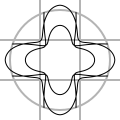
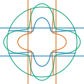

# Advanced transformations
{: .no_toc }

  

    Table of contents
  

  {: .text-delta }
1. TOC
{:toc}

The methods described when talking about [coordinate system transformations](transformations.html) can be used to apply affine transformations to objects on the `Graphics` surface. However, sometimes you may also want to apply some sort of arbitrary transformation to a `GraphicsPath` or to a `Graphics` object. You can do so by using their `Transform` method, with the overload that takes a `Func<Point, Point>` delegate.

## The `GraphicsPath.Transform` method

The `GraphicsPath.Transform` method takes a single parameter, which is a `Func<Point, Point>` delegate. This should be a method that, given a single `Point` as an argument, returns a new `Point` corresponding to the transformed point. When this method is used, arc segments are transformed into Bézier segments, and then all the end points of the segments, as well as all control points, are transformed using the supplied transformation method.

Since the path is not linearised before applying the transformation, you should keep in mind the following:

* If you are sure that the transformation is an affine transformation, you can apply it without any pre-processing.
* If instead the transformation is a projective transformation, you should linearise the path before applying it.
* If the transformation is not a projective transformation, in addition to linearising the path, you should make sure that the line segments that compose the path are not too long (this is because a non-projective transformation transforms lines into curves, thus having line segments that are too long might produce an inaccurate result).

The following example shows how to apply a non-projective transformation.

    

        
    

    Expand source code
  

  {: .text-delta }


using VectSharp;
using VectSharp.SVG;

Page page = new Page(120, 120);
Graphics graphics = page.Graphics;

// The original path, which will contain a grid and a circle.
GraphicsPath path = new GraphicsPath();
path.MoveTo(0, 40).LineTo(120, 40);
path.MoveTo(0, 80).LineTo(120, 80);
path.MoveTo(40, 0).LineTo(40, 120);
path.MoveTo(80, 0).LineTo(80, 120);
path.MoveTo(110, 60).Arc(60, 60, 50, 0, 2 * Math.PI).Close();

// Draw the original path in grey.
graphics.StrokePath(path, Colour.FromRgb(180, 180, 180), lineWidth: 2);

// Linearise the path.
GraphicsPath linearised = path.Linearise(10);

// Maximum length of a segment in the path.
double maxLength = 1;

// Process the linearised path, making sure that no segment is longer than maxlength.
GraphicsPath shortLinearisedPath = new GraphicsPath();

// Square of the max length - so that we avoid the square roots.
double maxLengthSq = maxLength * maxLength;

foreach (List<Point> points in linearised.GetPoints())
{
    // Start of the line segment.
    Point currPoint = points[0];
    shortLinearisedPath.MoveTo(currPoint);

    // Iterate over all the segments in the path.
    for (int i = 1; i < points.Count; i++)
    {
        // Length of the line segment.
        double lengthSq = (points[i].X - currPoint.X) * (points[i].X - currPoint.X) +
                          (points[i].Y - currPoint.Y) * (points[i].Y - currPoint.Y);

        // If the segment is shorter than the maximum length, keep it as is.
        if (lengthSq < maxLengthSq)
        {
            shortLinearisedPath.LineTo(points[i]);
        }
        // Otherwise, divide it.
        else
        {
            // Number of sub-segments in which to split the segment.
            int segmentCount = (int)Math.Ceiling(Math.Sqrt(lengthSq / maxLengthSq));

            // Add the individual subsegments.
            for (int j = 0; j < segmentCount - 1; j++)
            {
              Point endPoint = new Point(currPoint.X + (points[i].X - currPoint.X) * (j + 1) / segmentCount,
                                         currPoint.Y + (points[i].Y - currPoint.Y) * (j + 1) / segmentCount);
              shortLinearisedPath.LineTo(endPoint);
            }

            // Add the final subsegment.
            shortLinearisedPath.LineTo(points[i]);
        }

        // Advance the current point.
        currPoint = points[i];
    }
}

shortLinearisedPath.Close();

// Transformation function.
static Point TransformationFunction(Point point)
{
    // Convert to radial coordinates
    double r = Math.Sqrt((point.X - 60) * (point.X - 60) + (point.Y - 60) * (point.Y - 60));
    double theta = Math.Atan2(point.Y - 60, point.X - 60);

    // Apply the transformation.
    double transformedR = Math.Sqrt(r * 60) * (0.75 + 0.25 * Math.Cos(theta * 4));
    double transformedTheta = theta;

    // Convert back to rectangular coordinates.
    return new Point(60 + transformedR * Math.Cos(transformedTheta),
                     60 + transformedR * Math.Sin(transformedTheta));
}

// Transform the path.
GraphicsPath transformed = shortLinearisedPath.Transform(TransformationFunction);

// Stroke the transformed path.
graphics.StrokePath(transformed, Colours.Black);

page.SaveAsSVG("PathTransformation.svg");


[Back to top](#){: .btn }&nbsp;&nbsp;&nbsp;&nbsp;[Back to Advanced topics](advanced.html){: .btn }

## The `Graphics.Transform` method

The `Graphics.Transform` method can be used to do the same thing as the `Transform` method of the `GraphicsPath` class. This method has three overloads: an overload that takes six `double` parameter describing an affine transformation matrix, which has already been discussed in the context of [coordinate system transformations](transformations.html), and two overloads whose first parameter is a `Func<Point, Point>` like the `GraphicsPath.Transform` method.

One of these overloads takes just another parameter, a `double` representing the linearisation resolution; when this overload is used, the `Graphics` is linearised using the specified linearisation resolution, and then the transformation function is applied. The other overload, instead, in addition to the `linearisationResolution` also takes another parameter, representing the maximum length of any line segment in the plot. When this method is used, in addition to linearising all paths in the plot, line segments that are longer than the specified length are also divided in smaller segments, using a similar approach as the one used in the example above.

As discussed above, you should use the overload accepting only the linearisation resolution for transformations that you are sure are projective transformations; for generic transformations, you should use the overload that takes a maximum segment length as well.

The following example shows how to apply a non-projective transformation.

    

        
    

    Expand source code
  

  {: .text-delta }


using VectSharp;
using VectSharp.Filters;
using VectSharp.SVG;

Page page = new Page(120, 120);
Graphics graphics = page.Graphics;

// The original graphics object, which will contain a grid and a circle.
Graphics subject = new Graphics();

// Draw the horizontal grid lines in blue.
subject.StrokePath(new GraphicsPath().MoveTo(0, 40).LineTo(120, 40), Colour.FromRgb(0, 114, 178));
subject.StrokePath(new GraphicsPath().MoveTo(0, 80).LineTo(120, 80), Colour.FromRgb(0, 114, 178));

// Draw the vertical grid lines in orange.
subject.StrokePath(new GraphicsPath().MoveTo(40, 0).LineTo(40, 120), Colour.FromRgb(213, 94, 0));
subject.StrokePath(new GraphicsPath().MoveTo(80, 0).LineTo(80, 120), Colour.FromRgb(213, 94, 0));

// Draw the circle in green.
subject.StrokePath(new GraphicsPath().Arc(60, 60, 50, 0, 2 * Math.PI).Close(), Colour.FromRgb(0, 158, 115));

// Draw the original graphics with a filter making it semi-transparent
graphics.DrawGraphics(0, 0, subject, new ColourMatrixFilter(ColourMatrix.Identity.WithAlpha(0.25)));

// Transformation function.
static Point TransformationFunction(Point point)
{
    // Convert to radial coordinates
    double r = Math.Sqrt((point.X - 60) * (point.X - 60) + (point.Y - 60) * (point.Y - 60));
    double theta = Math.Atan2(point.Y - 60, point.X - 60);

    // Apply the transformation.
    double transformedR = Math.Sqrt(r * 60) * (0.75 + 0.25 * Math.Cos(theta * 4));
    double transformedTheta = theta;

    // Convert back to rectangular coordinates.
    return new Point(60 + transformedR * Math.Cos(transformedTheta), 60 + transformedR * Math.Sin(transformedTheta));
}

// Linearisation resolution.
double linearisationResolution = 10;

// Maximum segment length.
double maxLength = 1;

// Transform the graphics.
Graphics transformed = subject.Transform(TransformationFunction, linearisationResolution, maxLength);

// Draw the transformed graphics.
graphics.DrawGraphics(0, 0, transformed);

page.SaveAsSVG("GraphicsTransformation.svg");


[Back to top](#){: .btn }&nbsp;&nbsp;&nbsp;&nbsp;[Back to Advanced topics](advanced.html){: .btn }
