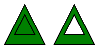

# Drawing arbitrary shapes
{: .no_toc }

  

    Table of contents
  

  {: .text-delta }
1. TOC
{:toc}

In addition to rectangle, it is possible to fill or stroke arbitrary shapes. This is achieved by using the `FillPath` and `StrokePath` methods of the `Graphics` object. These methods accept a `GraphicsPath` parameter, which describes the shape that will be drawn.

Various methods of the `GraphicsPath` class can be used to create any kind of shape. To set the starting point of the path, you should always start by using the `MoveTo` method. Then, different methods let you add different kinds of segments to the path; for example, `LineTo` adds a straight line, while `CubicBezierTo` adds a cubic Bézier segment.

All these methods return the `GraphicsPath` itself, which makes it possible to chain the calls. For example, the following two examples are perfectly equivalent:


// Option 1: independent calls.
GraphicsPath path = new GraphicsPath();
path.MoveTo(10, 10);
path.LineTo(90, 90);

// Option 2: chained calls.
GraphicsPath path = new GraphicsPath().MoveTo(10, 10).LineTo(90, 90);


## Drawing a line

As explained above, a straight line can be drawn by setting the start point with the `MoveTo` method, and the end point with the `LineTo` method. Like most methods of the `GraphicsPath` class, these methods have an overload that accepts the coordinates of the points as two `double`s (i.e., `x` and `y`), as well as an overload that accepts a single `Point` argument containing both coordinates.

The following example shows how a straight line can be stroked (of course, there is no point in filling a line):

    <iframe src="Blazor?line" style="width: 100%; height: 15em; border: 0px solid black"></iframe>


using VectSharp;
using VectSharp.SVG;

Page page = new Page(100, 100);
Graphics graphics = page.Graphics;

// Create the GraphicsPath object.
GraphicsPath path = new GraphicsPath();

// Start point.
double p1X = 20;
double p1Y = 30;

// End point.
Point p2 = new Point(80, 70);

// Add the line to the path.
path.MoveTo(p1X, p1Y).LineTo(p2);

// Stroke the path.
graphics.StrokePath(path, Colours.Black, lineWidth: 10);

page.SaveAsSVG("Line.svg");


[Back to top](#){: .btn }

## Drawing a curve

In addition to drawing straight lines, VectSharp can be used to draw cubic [Bézier curve](https://en.wikipedia.org/wiki/B%C3%A9zier_curve) segments.

A cubic Bézier curve is identified by four points: the start point (P0), the end point (P3), and two control points (P1 and P2). The start point is the end point of the previous segment in the path (as always, if the Bézier curve is the first segment in the path, you should use the `MoveTo` method to set it), while the other three points are supplied as parameters to the `CubicBezierTo` method. Like before, each point can be specified either by a pair of `double`s, or by a single `Point` object.

The following example shows how to fill and stroke a cubic Bézier curve:

    <iframe src="Blazor?bezier" style="width: 100%; height: 19em; border: 0px solid black"></iframe>


using VectSharp;
using VectSharp.SVG;

Page page = new Page(100, 100);
Graphics graphics = page.Graphics;

// Create the GraphicsPath object.
GraphicsPath path = new GraphicsPath();

// Start point.
Point p0 = new Point(20, 30);

// Control point 1.
Point p1 = new Point(50, 20);

// Control point 2.
Point p2 = new Point(80, 40);

// End point.
Point p3 = new Point(80, 70);

// Add the Bézier segment to the path.
path.MoveTo(p0).CubicBezierTo(p1, p2, p3);

// Fill the path.
graphics.FillPath(path, Colours.Green);

// Stroke the path.
graphics.StrokePath(path, Colours.Black, lineWidth: 2);

page.SaveAsSVG("Bezier.svg");


[Back to top](#){: .btn }

## Drawing a circular arc

The `Arc` method of the `GraphicsPath` class can be used to add a circular arc segment to the path.

The parameters of this method specify the circular arc by providing the centre of the circle (as usual, either as a couple of `double` values, or as a single `Point`), the radius, the start angle of the arc and the end angle of the arc. Angles are specified in radiants. An angle of 0 corresponds to the positive X direction.

The start and end point of the arc are determined by these parameters, i.e. they are independent from the last point in the path (unlike the start point of lines and Bézier curves). Therefore, if the starting point of the arc does not coincide with the last point in the path, a line segment is also added to the path, connecting the last point to the starting point of the arc.

The following example shows how to fill and stroke a circular arc. Note that filling the arc only fills the circular segment (⌓); if you wish to fill the circular sector (⌔, i.e. the "pie slice") instead, you will need to add a `MoveTo` call that sets the starting point of the path to the centre of the circle.

    <iframe src="Blazor?circularArc" style="width: 100%; height: 15em; border: 0px solid black"></iframe>


using VectSharp;
using VectSharp.SVG;

Page page = new Page(100, 100);
Graphics graphics = page.Graphics;

// Create the GraphicsPath object.
GraphicsPath path = new GraphicsPath();

// Centre of the circle.
Point centre = new Point(50, 50);

// Radius of the circle.
double radius = 40;

// Start angle. π / 4 = 45°
double startAngle = Math.PI / 4;

// End angle. π = 180°
double endAngle = Math.PI;

// Add the arc to the path. The starting point of the path
// will coincide with the starting point of the arc.
path.Arc(centre, radius, startAngle, endAngle);

// If you want to fill the circular sector, use this instead:
// path.MoveTo(centre).Arc(centre, radius, startAngle, endAngle);

// Fill the circular segment.
graphics.FillPath(path, Colours.Green);

// Stroke the arc.
graphics.StrokePath(path, Colours.Black, lineWidth: 2);

page.SaveAsSVG("CircularArc.svg");


If the coordinates of the start and end point of the arc are needed, they can be obtained with some simple trigonometric formulae:

$$x_0 = x_c + r \cdot \cos{\theta_0} \\
y_0 = y_c + r \cdot \sin{\theta_0}$$

$$x_1 = x_c + r \cdot \cos{\theta_1} \\
y_1 = y_c + r \cdot \sin{\theta_1}$$

Where $x_0$ and $y_0$ are the coordinates of the start point, $x_1$ and $y_1$ are the coordinates of the end point, $x_c$ and $y_c$ are the coordinates of the centre of the circle, $r$ is the radius, $\theta_0$ is the start angle and $\theta_1$ is the end angle.

[Back to top](#){: .btn }

## Drawing an elliptical arc

A more complex way to draw an arc is by using an elliptical arc. This can be achieved with the `EllipticalArc` method.

The parameters for this method are:

* Two `double`s that specify the length of the two semi-axes of the ellipse.
* Another `double` specifying the angle between the first axis of the ellipse and the horizontal axis of the coordinate system.
* A `bool` indicating whether the large or small arc should be drawn.
* Another `bool` determining whether the arc is drawn in a clockwise or counter-clockwise direction.
* A `Point` specifying the end point of the arc.

The method uses these parameters to draw an elliptical arc connecting the last point in the path (i.e., the end point of the previous segment) with the `Point` specified in the last parameter. The algorithms used are the same as described in [Appendix B.2 of the SVG specification](https://www.w3.org/TR/SVG/implnote.html#ArcImplementationNotes).

The following example shows how this method can be used to fill and stroke an elliptical arc.

    <iframe src="Blazor?ellipticalArc" style="width: 100%; height: 15em; border: 0px solid black"></iframe>


using VectSharp;
using VectSharp.SVG;

Page page = new Page(100, 100);
Graphics graphics = page.Graphics;

// Create the GraphicsPath object.
GraphicsPath path = new GraphicsPath();

// Starting point.
Point p0 = new Point(20, 30);

// End point.
Point p1 = new Point(80, 70);

// Radius of the first semi-axis.
double radiusX = 40;

// Radius of the second semi-axis.
double radiusY = 35;

// Orientation of the ellipse.
double axisAngle = 0;

// Large arc flag.
bool largeArc = false;

// Arc direction.
bool clockwise = false;

// Move to the starting point and add the arc to the path.
path.MoveTo(p0).EllipticalArc(radiusX, radiusY, axisAngle, largeArc, clockwise, p1);

// Fill and stroke.
graphics.FillPath(path, Colours.Green);
graphics.StrokePath(path, Colours.Black, lineWidth: 2);

page.SaveAsSVG("EllipticalArc.svg");


[Back to top](#){: .btn }

## Drawing a smooth spline

Sometimes, it might be necessary to create a path that passes through a set of points "smoothly", i.e. without any sharp edges. The `AddSmoothSpline` method uses Bézier segments to create a smooth path that passes through the specified points. This method accepts a variable number of `Point` arguments that correspond to the points though which the path should pass, or a `Point[]` array with the same function.

The following example illustrates how this method can be used.

    <iframe src="Blazor?smoothSpline" style="width: 100%; height: 15em; border: 0px solid black"></iframe>


using VectSharp;
using VectSharp.SVG;

Page page = new Page(100, 100);
Graphics graphics = page.Graphics;

// The points through which the path will pass.
Point p1 = new Point(10, 30);
Point p2 = new Point(30, 70);
Point p3 = new Point(50, 50);
Point p4 = new Point(70, 70);
Point p5 = new Point(90, 30);

// Create the GraphicsPath object.
GraphicsPath path = new GraphicsPath();

// Add the smooth spline.
path.AddSmoothSpline(p1, p2, p3, p4, p5);

// Stroke the path.
graphics.StrokePath(path, Colours.Black, lineWidth: 2);

page.SaveAsSVG("SmoothSpline.svg");


[Back to top](#){: .btn }

## Path figures

All the elements described above can be combined in order to produce a complex shape. If you want to draw a closed shape, you should call the `Close` method after adding the last segment. This will finish off the path by adding a straight segment to the path's starting point.

This action completes a "path figure". A single `GraphicsPath` can contain multiple path figures; to add a new figure after closing the previous one, you should just call the `MoveTo` method again.

When a path contains multiple figures that overlap each other, VectSharp uses the [non-zero winding rule](https://en.wikipedia.org/wiki/Nonzero-rule) to determine whether a point is inside or outside the path.

The following example shows how to produce a path with or without a "hole".

    

        
    


using VectSharp;
using VectSharp.SVG;

Page page = new Page(200, 100);
Graphics graphics = page.Graphics;

// Create a new GraphicsPath.
GraphicsPath full = new GraphicsPath();

// Add the first (outer) triangle. Note that this is drawn in clockwise order.
full.MoveTo(10, 90).LineTo(50, 10).LineTo(90, 90).Close();

// Add the second (inner) triangle. Note that this is also drawn in clockwise
// order; thus, the path will be completely filled.
full.MoveTo(30, 70).LineTo(50, 30).LineTo(70, 70).Close();

// Fill and stroke the path.
graphics.FillPath(full, Colours.Green);
graphics.StrokePath(full, Colours.Black, lineWidth: 2);

// Translate the axes so the two figures do not overlap.
graphics.Translate(100, 0);

// Create a new GraphicsPath.
GraphicsPath hole = new GraphicsPath();

// Add the first (outer) triangle. Same code as above.
hole.MoveTo(10, 90).LineTo(50, 10).LineTo(90, 90).Close();

// Add the second (inner) triangle. In this case, the triangle is drawn in
// counter-clockwise order and, thus, the path has a hole in the middle.
hole.MoveTo(30, 70).LineTo(70, 70).LineTo(50, 30).Close();

// Fill and stroke the path.
graphics.FillPath(hole, Colours.Green);
graphics.StrokePath(hole, Colours.Black, lineWidth: 2);

page.SaveAsSVG("PathFigures.svg");


[Back to top](#){: .btn }

## Stroke options

Like the `StrokeRectangle` method described in [Fill and stroke](), the `StrokePath` method takes a number of arguments that make it possible to customise the appearance of the stroke, including the line thickness, the line caps, the line joints, and the dash style.

The following example demonstrates the effect of these parameters. In particular, note how the line cap options interact with dashed lines.

    <iframe src="Blazor?strokeOptions" style="width: 100%; height: 19em; border: 0px solid black"></iframe>


using VectSharp;
using VectSharp.SVG;

Page page = new Page(100, 100);
Graphics graphics = page.Graphics;

// Create the GraphicsPath object.
GraphicsPath path = new GraphicsPath().MoveTo(10, 10).LineTo(90, 10).CubicBezierTo(80, 30, 40, 70, 20, 80);

// Thickness of the line.
double thickness = 10;

// Line cap
LineCaps cap = LineCaps.Butt;

// Line joint
LineJoins join = LineJoins.Miter;

// Dash style
LineDash dash = new LineDash(25, 15, 5);

// Stroke the path.
graphics.StrokePath(path, Colours.Black, lineWidth: thickness, lineCap: cap, lineJoin: join, lineDash: dash);

page.SaveAsSVG("StrokeOptions.svg");


[Back to top](#){: .btn }