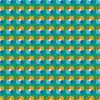

# Copying graphics

Sometimes, you may want to reuse a set of graphic elements multiple times, e.g. a "sprite", or just a collection of paths. You can achieve this by using the `DrawGraphics` method, which lets you draw the contents of a `Graphics` object on another `Graphics` object.

The first step is to create a `Graphics` object to hold the image that will be copied; you can do this by invoking the parameterless `Graphics` constructor. Then you can draw on this new object as normal. Finally, you invoke the `DrawGraphics` method on the original `Graphics` object that you obtained from the page, passing the new `Graphics` as an argument, together with a `Point` or two `doubles` that determine where the origin of the copied `Graphics` will be placed.

The following example shows how this method can be used.

    

        
    


using VectSharp;
using VectSharp.SVG;

Page page = new Page(100, 100);
Graphics graphics = page.Graphics;

// Create a new Graphics object to contain the symbol.
Graphics symbol = new Graphics();

// Draw something on this graphics object.
symbol.FillPath(new GraphicsPath().Arc(5, 5, 5, 0, 2 * Math.PI), Colour.FromRgb(0, 158, 115));
symbol.FillPath(new GraphicsPath().Arc(2, 2, 2, 0, 2 * Math.PI), Colour.FromRgb(0, 114, 178));
symbol.FillPath(new GraphicsPath().Arc(8, 2, 2, 0, 2 * Math.PI), Colour.FromRgb(86, 180, 233));
symbol.FillPath(new GraphicsPath().Arc(2, 8, 2, 0, 2 * Math.PI), Colour.FromRgb(230, 159, 0));
symbol.FillPath(new GraphicsPath().Arc(8, 8, 2, 0, 2 * Math.PI), Colour.FromRgb(213, 94, 0));

// Copy the symbol multiple times on the page.
for (int i = 0; i < 10; i++)
{
    for (int j = 0; j < 10; j++)
    {
        graphics.DrawGraphics(i * 10, j * 10, symbol);
    }
}

page.SaveAsSVG("DrawGraphics.svg");


The `DrawGraphics` method also has another overload, which accepts an additional parameter; this is used to apply filters to the image, and is described in the [next section](filters.html).