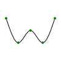

# Extracting points from a path
{: .no_toc }

  

    Table of contents
  

  {: .text-delta }
1. TOC
{:toc}

Another interesting thing to do is to extract some points from a `GraphicsPath`. This can be achieved using a number of methods of the `GraphicsPath` class.

## The `GetPoints` method

The `GetPoints` method returns the end points of all the segments in the path (regardless of whether each segment is a line segment, an arc, or a Bézier curve). The method returns a `IEnumerable<List<Point>>`, where each `List` contained in the `IEnumerable` corresponds to the points of a different figure (a figure is initiated on each call to `MoveTo`).

The following example shows how to use this method.

    

        
    


using VectSharp;
using VectSharp.SVG;

Page page = new Page(100, 100);
Graphics graphics = page.Graphics;

// The points through which the path will pass.
Point p1 = new Point(10, 30);
Point p2 = new Point(30, 70);
Point p3 = new Point(50, 50);
Point p4 = new Point(70, 70);
Point p5 = new Point(90, 30);

// Create the GraphicsPath object.
GraphicsPath path = new GraphicsPath();

// Add a smooth spline.
path.AddSmoothSpline(p1, p2, p3, p4, p5);

// Stroke the path.
graphics.StrokePath(path, Colours.Black);

// Get the end points of the segments in the path.
IEnumerable<List<Point>> points = path.GetPoints();

// Plot each point as a green circle.
foreach (List<Point> figurePoints in points)
{
    foreach (Point point in figurePoints)
    {
        graphics.FillPath(new GraphicsPath().Arc(point, 2, 0, 2 * Math.PI), Colours.Green);
    }
}

page.SaveAsSVG("GetPoints.svg");


Note that the `IEnumerable` returned by this method is enumerated lazily; therefore, if you need to reuse the points multiple times, it may be beneficial to convert it to a `List` or an array, so that it does not have to be enumerated more than once.

[Back to top](#){: .btn }&nbsp;&nbsp;&nbsp;&nbsp;[Back to Advanced topics](advanced.html){: .btn }

## The `GetPointAtAbsolute` and `GetPointAtRelative` methods

The `GetPointAtAbsolute` and `GetPointAtRelative` methods make it possible to obtain the point at the specified position in the path (even if it is not the end point of a segment).

Both methods require a single `double` parameter, which determines the position in the path of the point to be returned. For the `GetPointAtAbsolute` method, this is expressed in graphics units; for the `GetPointAtRelative` method, this is expressed as a fraction of the total length of the path.

The library measures the length of each segment in the path until it finds the point at the specified offset from the beginning of the path.

The following example shows how to use the `GetPointAtRelative` method:

    <iframe src="Blazor?getPointAtRelative" style="width: 100%; height: 15em; border: 0px solid black"></iframe>


using VectSharp;
using VectSharp.SVG;

Page page = new Page(100, 100);
Graphics graphics = page.Graphics;

// The points through which the path will pass.
Point p1 = new Point(10, 30);
Point p2 = new Point(30, 70);
Point p3 = new Point(50, 50);
Point p4 = new Point(70, 70);
Point p5 = new Point(90, 30);

// Create the GraphicsPath object.
GraphicsPath path = new GraphicsPath();

// Add a smooth spline.
path.AddSmoothSpline(p1, p2, p3, p4, p5);

// Stroke the path.
graphics.StrokePath(path, Colours.Black);

// The relative position along the path whose point will be returned.
double position = 0.33;

// Get the point at position.
Point point = path.GetPointAtRelative(position);

// Draw the point as a green circle.
graphics.FillPath(new GraphicsPath().Arc(point, 2, 0, 2 * Math.PI), Colours.Green);

page.SaveAsSVG("GetPointAtRelative.svg");


[Back to top](#){: .btn }&nbsp;&nbsp;&nbsp;&nbsp;[Back to Advanced topics](advanced.html){: .btn }

## Getting the tangent and normal at a specific point

In addition to `GetPointAtAbsolute`/`GetPointAtRelative`, other methods can be used to compute the tangent and the normal at a specific point in the path. These are `GetNormalAtAbsolute`/`GetNormalAtRelative` (for the normal) and `GetTangentAtAbsolute`/`GetTangentAtRelative` (for the tangent).

Each method takes a single `double` argument representing the position of the point at which the normal/tangent is computed (the difference between the "relative" and "absolute" methods is the same as for the `GetPointAtAbsolute`/`GetPointAtRelative` methods). These methods return a `Point` whose length is 1, representing a versor in the direction of the tangent/normal.

The following example shows how to use these methods.

    <iframe src="Blazor?tangentNormal" style="width: 100%; height: 15em; border: 0px solid black"></iframe>


using VectSharp;
using VectSharp.SVG;

Page page = new Page(100, 100);
Graphics graphics = page.Graphics;

// The points through which the path will pass.
Point p1 = new Point(10, 30);
Point p2 = new Point(30, 70);
Point p3 = new Point(50, 50);
Point p4 = new Point(70, 70);
Point p5 = new Point(90, 30);

// Create the GraphicsPath object.
GraphicsPath path = new GraphicsPath();

// Add a smooth spline.
path.AddSmoothSpline(p1, p2, p3, p4, p5);

// Stroke the path.
graphics.StrokePath(path, Colours.Black);

// The relative position along the path whose point will be returned.
double position = 0.33;

// Get the point at position.
Point point = path.GetPointAtRelative(position);

// Get the normal at the position.
Point normal = path.GetNormalAtRelative(position);

// Get the tangent at the position.
Point tangent = path.GetTangentAtRelative(position);

// Length of the lines representing the normal and tangent vectors.
double vectorLength = 10;

// Draw the tangent as a blue line.
graphics.StrokePath(new GraphicsPath().MoveTo(point)
                  .LineTo(point.X + tangent.X * vectorLength, point.Y + tangent.Y * vectorLength),
                  Colour.FromRgb(86, 180, 233));

// Draw the normal as an orange line.
graphics.StrokePath(new GraphicsPath().MoveTo(point)
                  .LineTo(point.X + normal.X * vectorLength, point.Y + normal.Y * vectorLength),
                  Colour.FromRgb(213, 94, 0));

// Draw the point as a green circle.
graphics.FillPath(new GraphicsPath().Arc(point, 2, 0, 2 * Math.PI), Colour.FromRgb(0, 158, 115));

page.SaveAsSVG("TangentNormal.svg");


[Back to top](#){: .btn }&nbsp;&nbsp;&nbsp;&nbsp;[Back to Advanced topics](advanced.html){: .btn }