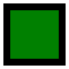

# Fill and stroke

The previous example showed how to draw a filled rectangle. However, you may also want to _stroke_ the rectangle, i.e., draw its outline.

Stroking a rectangle is very similar to filling it; however, instead of the `FillRectangle` method, you need to use the `StrokeRectangle` method:

    

        
    


using VectSharp;
using VectSharp.SVG;

Page page = new Page(100, 100);
Graphics graphics = page.Graphics;

// The colour for stroking the rectangle.
Colour strokeColour = Colours.Black;

// Draw the rectangle.
graphics.StrokeRectangle(10, 10, 80, 80, strokeColour);

page.SaveAsSVG("StrokedRectangle.svg");


The `StrokeRectangle` method takes a number of optional arguments that are not used by `FillRectangle`. These are:

* A `double` determining the line thickness.

* A `LineCaps` enumeration that determines the line cap used to draw the rectangle. This parameter is useful when stroking open paths (i.e., lines where the start point does not coincide with the end point). Since rectangles are closed, this parameter does not actually affect the plot.

    If the path were open, a value of `LineCaps.Butt` would specify a stroke that starts and ends abruply at the start and end points of the path. A value of `LineCaps.Round` uses specifies rounded line endings. A value of `LineCaps.Square` specifies line endings that extend beyond the start and end point, by a value corresponding to half the line thickness.

* A `LineJoins` enumeration that determines the way the lines are joined at the sides.

    If this is `LineJoins.Miter`, a sharp corner is used. If this is `LineJoins.Round`, a round corner is used. If this is `LineJoins.Bevel`, a bevelled corner is used.

* A `LineDash` object, specifying how the line is dashed.
    A `LineDash` object is created by specifying how many units the line should be "on" (i.e., drawn) and "off" (i.e. not drawn). A third parameter to the `LineDash` constructor specifies the "phase" of the dashing pattern with respect to the start point.
    
    A `LineDash` where the units on and off are both 0 corresponds to a solid line.

    Additional overloads of the `LineDash` struct accept a `double[]` parameter, which can be used to specify complex dash patterns.

The following code strokes a rectangle with a thick outline, rounded corners, and a dashed line.

    <iframe src="Blazor?strokedRectangle" style="width: 100%; height: 15em; border: 0px solid black"></iframe>


using VectSharp;
using VectSharp.SVG;

Page page = new Page(100, 100);
Graphics graphics = page.Graphics;

// Thickness of the stroke.
double lineWidth = 10;

// Use rounded corners to join the lines at corners.
LineJoins lineJoin = LineJoins.Round;

// Units on and off and phase for the dashed line pattern.
double unitsOn = 26;
double unitsOff = 11;
double phase = 0;

// Dashed line pattern.
LineDash lineDash = new LineDash(unitsOn, unitsOff, phase);

// Draw the rectangle.
graphics.StrokeRectangle(10, 10, 80, 80, Colours.Black, lineWidth: lineWidth, lineJoin: lineJoin,
    lineDash: lineDash);

page.SaveAsSVG("StrokedRectangle2.svg");


More complex dash patterns can be created by using one of the `LineDash` constructors that accept a `double[]` parameter. For example:

    

        
    


using VectSharp;
using VectSharp.SVG;

Page page = new Page(100, 100);
Graphics graphics = page.Graphics;

// Dashed line pattern.
LineDash lineDash = new LineDash(new double[] { 10, 2, 5, 2, 2, 2 });

// Draw the rectangle.
graphics.StrokeRectangle(10, 10, 80, 80, Colours.Black, lineDash: lineDash);

page.SaveAsSVG("ComplexDash.svg");


If you wish to both fill and stroke a rectangle, you will have to call both `FillRectangle` and `StrokeRectangle`. This also gives you the flexibility to choose whether the stroke is applied on top or below the fill.

    

        
    


using VectSharp;
using VectSharp.SVG;

Page page = new Page(100, 100);
Graphics graphics = page.Graphics;

// Fill the rectangle.
graphics.FillRectangle(10, 10, 80, 80, Colours.Green);

// Stroke the rectangle.
graphics.StrokeRectangle(10, 10, 80, 80, Colours.Black, lineWidth: 10);

page.SaveAsSVG("FilledAndStrokedRectangle.svg");

