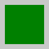

# The first plot

To create a plot in VectSharp, the first step is to create a `Page` object, providing the width and height of image. These are expressed in arbitrary units, and serve as a reference for the coordinates of objects that are drawn on the page.


using VectSharp;
using VectSharp.SVG;

// Width of the page.
double width = 100;

// Height of the page.
double height = 100;

// Create the page.
Page page = new Page(width, height);


Afterwards, you can access the `Graphics` property of the `Page`, and use methods on this object to draw elements on the plot.


// Get the Graphics object.
Graphics graphics = page.Graphics;


One of the simplest things that can be plotted is a rectangle, which can be achieved by using the `FillRectangle` method. This method has multiple overloads; one of these has five mandatory arguments:

* The X coordinate of the rectangle (i.e. the coordinate of the left side of the rectangle).
* The Y coordinate of the rectangle (i.e. the coordinate of the top side of the rectangle).
* The width of the rectangle.
* The height of the rectangle.
* The colour with which the rectangle will be filled.


// Position and size of the rectangle.
double rectangleX = 10;
double rectangleY = 10;
double rectangleWidth = 80;
double rectangleHeight = 80;

// Colour of the rectangle.
Colour fillColour = Colours.Green;

// Draw the rectangle.
graphics.FillRectangle(rectangleX, rectangleY, rectangleWidth, rectangleHeight, fillColour);


The colour of the rectangle can be chosen in two main ways: first, as we have done here, you can use one of the static members of the `Colours` class, which contains a list of "known" web colours. If you wish to specify the RGB values of the colour, instead, you can use the `Colour.FromRgb` and `Colour.FromRgba` methods.

`Colour.FromRgb` takes three arguments, corresponding to the red, green and blue components of the colour; `Colour.FromRgba` also takes a fourth argument corresponding to the alpha (opacity) component. These can be specified as `int`s from `0` to `255`, or as `double`s between `0` and `1`.

For example:


// A known colour.
Colour cornflowerBlue = Colours.CornflowerBlue.

// An opaque red colour.
Colour red = Colour.FromRgb(255, 0, 0);

// A semi-transparent blue colour.
Colour blue = Colour.FromRgb(0, 0, 1.0, 0.5);


The rectangle could also be filled using a more complex "brush", e.g. a gradient. This will be the topic of a different tutorial.

By default, the image will have a transparent background. You can change the background colour through the `Background` property of the `Page` object:


// Set the page background to a light grey.
page.Background = Colour.FromRgb(200, 200, 200);


Finally, now that you have drawn the rectangle on the page and changed its background, you can export the page as an SVG file:


// Output file name.
string outputFile = "Rectangle.svg";

// Save the page as an SVG document.
page.SaveAsSVG(outputFile);


This will create a file called `Rectangle.svg` in the same path as the executable. The resulting SVG image should look like this:

    

The full code for this example is available below.


using VectSharp;
using VectSharp.SVG;

// Width of the page.
double width = 100;

// Height of the page.
double height = 100;

// Create the page.
Page page = new Page(width, height);

// Get the Graphics object.
Graphics graphics = page.Graphics;

// Position and size of the rectangle.
double rectangleX = 10;
double rectangleY = 10;
double rectangleWidth = 80;
double rectangleHeight = 80;

// Colour of the rectangle.
Colour fillColour = Colours.Green;

// Draw the rectangle.
graphics.FillRectangle(rectangleX, rectangleY, rectangleWidth, rectangleHeight, fillColour);

// Set the page background to a light grey.
page.Background = Colour.FromRgb(200, 200, 200);

// Output file name.
string outputFile = "Rectangle.svg";

// Save the page as an SVG document.
page.SaveAsSVG(outputFile);


