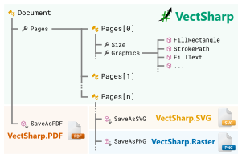

# VectSharp: a light library for C# vector graphics

**VectSharp** is a library to create vector graphics (including text) in C#, without too many dependencies.

This website contains a number of examples and tutorials to help you get started using VectSharp.

You can also access the detailed API documentation from [here](/api/), or [download it as a PDF file](/api/VectSharp.pdf). You can find the source code for VectSharp in the [VectSharp GitHub repository](https://github.com/arklumpus/VectSharp).

## The idea

    

The "top-level" unit in VectSharp is the `Document` object, which is simply a collection of `Page` objects. Each `Page` object has a `Size`, and a `Graphics` surface that on which the contents of the page are drawn. The [VectSharp NuGet package](https://www.nuget.org/packages/VectSharp/) contains these classes, as well as methods that make it possible to draw on this abstract `Graphics` surface.

The `Document` or the `Page`s can then be exported to a standard file format using the VectSharp "output layers": for example, [VectSharp.PDF](https://www.nuget.org/packages/VectSharp.PDF/) can be used to produce PDF documents, or [VectSharp.SVG](https://www.nuget.org/packages/VectSharp.SVG/) to create SVG images.

The benefit of this approach is that you can use the same code to produce documents in various formats (or even to display a preview of the image on screen), without having to bother with the details of how each drawing operation is represented by different formats.
