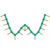

# Linearising paths
{: .no_toc }

  

    Table of contents
  

  {: .text-delta }
1. TOC
{:toc}

A `GraphicsPath` can contain line segments, cubic Bézier segments and arc segments. This allows great flexibility, but it can be inconvenient in some situations, and can cause some computations to take a relatively long time (since there are no analytical formulae for some properties of Bézier curves, which have to be approximated using numerical approaches).

To simplify working with a `GraphicsPath`, it is possible to "linearise" it, i.e. to replace all curves (arcs and Bézier curves) with straight segments that approximate them. This can greatly simplify some computations.

## The `GraphicsPath.Linearise` method

To linearise a `GraphicsPath`, you can use the `Linearise` method. This method requires a single parameter, a `double` specifing the "resolution" of the linearisation in graphics units, i.e. the length of the straight segments that are used to approximate each curve. The smaller this value, the more accurate the approximation; however, the resulting path will contain more segments.

The following example shows how to use this method:

    <iframe src="Blazor?linearise" style="width: 100%; height: 15em; border: 0px solid black"></iframe>


using VectSharp;
using VectSharp.SVG;

Page page = new Page(100, 100);
Graphics graphics = page.Graphics;

// The points through which the path will pass.
Point p1 = new Point(10, 30);
Point p2 = new Point(30, 70);
Point p3 = new Point(50, 50);
Point p4 = new Point(70, 70);
Point p5 = new Point(90, 30);

// Create the original GraphicsPath object.
GraphicsPath path = new GraphicsPath();

// Add a smooth spline.
path.AddSmoothSpline(p1, p2, p3, p4, p5);

// Stroke the original path.
graphics.StrokePath(path, Colour.FromRgb(220, 220, 220), lineWidth: 4);

// The resolution for the linearisation.
double resolution = 10;

// Get the linearised path.
GraphicsPath linearised = path.Linearise(resolution);

// Stroke the new path.
graphics.StrokePath(linearised, Colour.FromRgb(0, 158, 115), lineWidth: 2);

page.SaveAsSVG("Linearise.svg");


[Back to top](#){: .btn }&nbsp;&nbsp;&nbsp;&nbsp;[Back to Advanced topics](advanced.html){: .btn }

## The `GetLinearisationPointsNormals` method

When a smooth path is linearised using the `Linearise` method, the normal of the path is not continuous any more, because a singularity is introduced at every joining point of two segments. The `GetLinearisationPointsNormals` method, when used on the original `GraphicsPath` object at the same resolution as the `Linearise` method, returns a collection of `Points` that correspond to the normals of the path at the end points of each segment. These can be e.g. interpolated to produce a smooth approximation of the original path.

The following example shows how to use this method.

    

        
    


using VectSharp;
using VectSharp.SVG;

Page page = new Page(100, 100);
Graphics graphics = page.Graphics;

// The points through which the path will pass.
Point p1 = new Point(10, 30);
Point p2 = new Point(30, 70);
Point p3 = new Point(50, 50);
Point p4 = new Point(70, 70);
Point p5 = new Point(90, 30);

// Create the original GraphicsPath object.
GraphicsPath path = new GraphicsPath();

// Add a smooth spline.
path.AddSmoothSpline(p1, p2, p3, p4, p5);

// Stroke the original path.
graphics.StrokePath(path, Colour.FromRgb(220, 220, 220), lineWidth: 4);

// The resolution for the linearisation.
double resolution = 11;

// Get the linearised path.
GraphicsPath linearised = path.Linearise(resolution);

// Stroke the new path.
graphics.StrokePath(linearised, Colour.FromRgb(0, 158, 115), lineWidth: 2);

// Get the points of the linearised path.
List<List<Point>> points = linearised.GetPoints().ToList();

// Get the normals from the original path.
List<List<Point>> normals = path.GetLinearisationPointsNormals(resolution).ToList();

// Length of the lines representing the normal vectors.
double vectorLength = 10;

for (int i = 0; i < points.Count; i++)
{
    for (int j = 0; j < points[i].Count; j++)
    {
        // Draw the normal as an orange line.
        graphics.StrokePath(new GraphicsPath().MoveTo(points[i][j])
                            .LineTo(points[i][j].X + normals[i][j].X * vectorLength,
                                    points[i][j].Y + normals[i][j].Y * vectorLength),
                            Colour.FromRgb(213, 94, 0));

        // Draw the point as a green circle.
        graphics.FillPath(new GraphicsPath().Arc(points[i][j], 2, 0, 2 * Math.PI),
                          Colour.FromRgb(0, 158, 115));
    }
}

page.SaveAsSVG("GetLinearisationNormals.svg");


[Back to top](#){: .btn }&nbsp;&nbsp;&nbsp;&nbsp;[Back to Advanced topics](advanced.html){: .btn }

## The `Graphics.Linearise` method

Sometimes, you may want to linearise multiple `GraphicsPath`s that have been drawn on a `Graphics` surface. You can do so by using the `Linearise` method of the `Graphics` class. This method has a single `double` parameter, representing the linearisation resolution, that has the same meaning as the parameter of the `GraphicsPath.Linearise` method. It returns a new `Graphics` object, in which:

* Rectangles and raster images are left unchanged.
* Paths are linearised using the specified resolution.
* Text objects are transformed into paths and then linearised using the specified resolution.

You can then use the new `Graphics` object as normal (e.g. drawing it on another `Graphics` surface).

[Back to top](#){: .btn }&nbsp;&nbsp;&nbsp;&nbsp;[Back to Advanced topics](advanced.html){: .btn }
