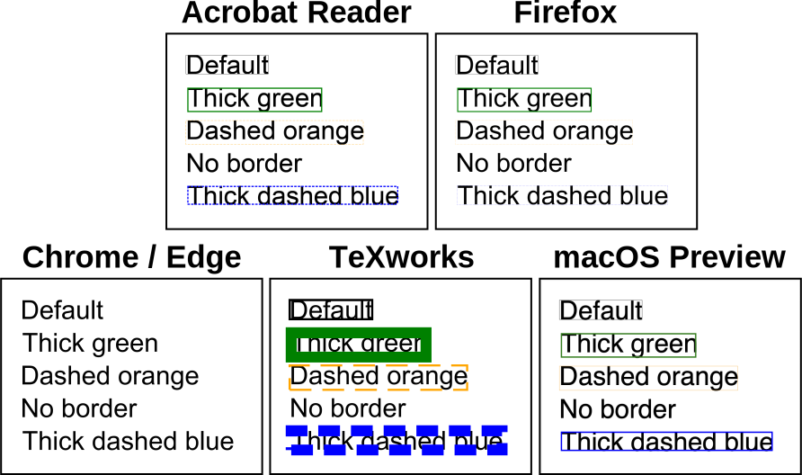

# Specifying annotation appearance
{: .no_toc }

  

    Table of contents
  

  {: .text-delta }
1. TOC
{:toc}

When links are included in a PDF document, an "annotation" is added to the document. The annotation connects the bounding box of the object being linked to the requested action (e.g., moving somewhere else in the document, opening a webpage, or changing the state of an optional content group). It is possible to customise the appearance of these annotations, i.e. the thickness, colour and dash pattern of the rectangle corresponding to the bounding box.

This is achieved using the optional `annotationStyles` parameter of the `SaveAsPDF` method. This can be used to define a default annotation stile, as well as different styles for specific annotations; if this parameter is not provided, the default is a 1px solid black border.

## Defining annotation styles

The following example shows how to define annotation styles.

    

        <a href="assets/tutorials/AnnotationStyles.pdf" download>Download the example PDF</a>
    


using VectSharp;
using VectSharp.PDF;

// Create the document.
Document doc = new Document();

// Create the page and add it to the document.
Page pag = new Page(120, 90);
doc.Pages.Add(pag);

// Define a font to draw text.
Font font = new Font(FontFamily.ResolveFontFamily(FontFamily.StandardFontFamilies.Helvetica), 12);

// Draw text for the links.
pag.Graphics.FillText(10, 10, "Default", font, Colours.Black, tag: "defaultStyle");
pag.Graphics.FillText(10, 25, "Thick green", font, Colours.Black, tag: "thickGreenStyle");
pag.Graphics.FillText(10, 40, "Dashed orange", font, Colours.Black, tag: "dashedOrangeStyle");
pag.Graphics.FillText(10, 55, "No border", font, Colours.Black, tag: "noBorderStyle");
pag.Graphics.FillText(10, 70, "Thick dashed blue", font, Colours.Black, tag: "thickDashedBlueStyle");

// Create the links (all of them pointing to the VectSharp documentation homepage.
Dictionary<string, string> links = new Dictionary<string, string>()
{
    { "defaultStyle", "https://giorgiobianchini.com/VectSharp/" },
    { "thickGreenStyle", "https://giorgiobianchini.com/VectSharp/" },
    { "dashedOrangeStyle", "https://giorgiobianchini.com/VectSharp/" },
    { "noBorderStyle", "https://giorgiobianchini.com/VectSharp/" },
    { "thickDashedBlueStyle", "https://giorgiobianchini.com/VectSharp/" }
};

// Define the annotation styles.
AnnotationStyleCollection linkStyles = new AnnotationStyleCollection()
{
    // This style is used for elements whose tag is not included in the Styles dictionary.
    DefaultStyle = new AnnotationStyle(),

    // This dictionary associates an annotation style to each tagged object.
    Styles = new Dictionary<string, AnnotationStyle>()
    {
        { "thickGreenStyle", new AnnotationStyle(borderWidth: 5, borderColour: Colours.Green) },
        { "dashedOrangeStyle", new AnnotationStyle(borderDash: new LineDash(10, 5, 0), borderColour: Colours.Orange) },
        { "noBorderStyle", new AnnotationStyle(borderWidth: 0) }, // Alternatively, you could set a completely transparent colour.
        { "thickDashedBlueStyle", new AnnotationStyle(borderWidth: 5, borderDash: new LineDash(10, 5, 0), borderColour: Colours.Blue) }
    }
};

// Save the PDF document.
doc.SaveAsPDF("AnnotationStyles.pdf", linkDestinations: links, annotationStyles: linkStyles);


## Annotation style support

Like other PDF features, not all viewers fully support specifying annotation styles. Here is a summary as of April 4th 2024:

* Adobe Acrobat Reader fully supports annotation styles. The border thickness is interpreted in device space units (i.e., if you define a border with width 5, this will be 5px wide regardless of the zoom level).
* Mozilla Firefox kind of supports annotation styles. However, the dash style is not accurate, and using a dashed border forces thickness to 1 pixel. The border thickness is interpreted in device space units.
* Google Chrome, Microsoft Edge, and SumatraPDF do not support annotation styles (annotations are invisible).
* TeXworks supports annotation styles. Here, border thickness and dash are interpreted in document units and not pixel units (i.e., the border thickness in pixels will change as the document is zoomed in or out).
* The macOS Preview program supports changing border thickness and colour, but does not support dashed borders. The border thickness is interpreted in device space units.

It is unclear whether the "correct" behaviour is to interpret the border thickness in device space units or in user space units. According to the specification, user space units should be used (i.e., like TeXworks does); however, Adobe Acrobat Reader generally implements the "correct" interpretation of the specification, hence it is unusual that it would be wrong in this case. [I have reported this as a bug to Adobe](https://acrobat.uservoice.com/forums/926812-acrobat-reader-for-windows-and-mac/suggestions/48225377-bug-report-annotation-thickness-is-interpreted-in).

As things stand, the safest option in terms of compatibility is probably to hide annotation borders (by setting the border thickness to `0` and/or the border colour to a fully transparent colour) and instead "manually" draw things on the graphics surface.

This is a preview of how the document produced by the example above looks like in different PDF viewers:

    

