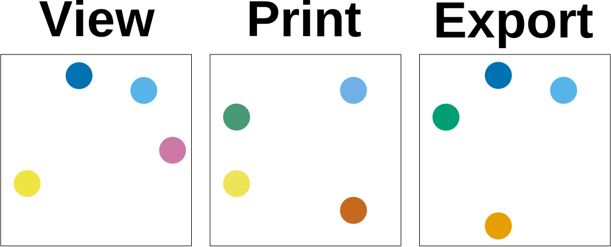

# Optional content groups
{: .no_toc }

  

    Table of contents
  

  {: .text-delta }
1. TOC
{:toc}

Optional content groups (also known as layers) can be used to assign tagged graphics objects to groups whose visibility can be toggled by the user (assuming that the PDF viewer supports it).

Using this feature involves the following steps:
* Drawing the graphics that should be affected using appropriate `tag`s.
* Creating `OptionalContentGroup` items (optionally specifying the default state).
* Assigning a "visibility expression" to each tag.
* Optionally, creating a tree-like structure describing how the optional content groups should be presented to the user.

A vibility expression (represented by instances of classes derived from `OptionalContentGroupExpression`) determines the state of an object based on the state of one or more `OptionalContentGroups`. For example:


// Create three optional content groups.
OptionalContentGroup group1 = new OptionalContentGroup("Group 1");
OptionalContentGroup group2 = new OptionalContentGroup("Group 2");
OptionalContentGroup group3 = new OptionalContentGroup("Group 3");

// Objects are visible when group1 is enabled.
OptionalContentGroupExpression expr1 = group1;

// Objects are visible when both group2 and group3 are enabled.
OptionalContentGroupExpression expr2 = group2 && group3;

// Objects are visible when group1 is enabled, or when group2 is
// enabled and group3 is disabled.
OptionalContentGroupExpression expr3 = group1 || (group2 && !group3);


## Creating a document with optional content groups

The following example shows how to create a basic document with optional content groups.

This document contains six circles, drawn with primary (red, green, blue) and secondary (yellow, cyan, magenta) colours. The visibility of the primary colour circles is controlled directly by a single optional content group, while secondary colours are visible only when both their primary colour constituents are enabled. When the document is first opened, the red, green and yellow circles should be visible, while the blue, cyan, and magenta circles should be hidden.

    

        <a href="assets/tutorials/OptionalContentGroups.pdf" download>Download the example PDF</a>
    


using VectSharp;
using VectSharp.PDF;
using VectSharp.PDF.OptionalContentGroups;

// Create a document.
Document doc = new Document();

// Create a page and add it to the document.
Page pag = new Page(100, 100);
doc.Pages.Add(pag);

// Draw circles using primary colours.
pag.Graphics.FillPath(new GraphicsPath().Arc(25, 75, 15, 0, 2 * Math.PI), Colour.FromRgb(255, 0, 0), tag: "redCircle");
pag.Graphics.FillPath(new GraphicsPath().Arc(75, 75, 15, 0, 2 * Math.PI), Colour.FromRgb(0, 255, 0), tag: "greenCircle");
pag.Graphics.FillPath(new GraphicsPath().Arc(50, 31.7, 15, 0, 2 * Math.PI), Colour.FromRgb(0, 0, 255), tag: "blueCircle");

// Draw circles using secondary colours.
pag.Graphics.FillPath(new GraphicsPath().Arc(50, 75, 7.5, 0, 2 * Math.PI), Colour.FromRgb(255, 255, 0), tag: "yellowCircle");
pag.Graphics.FillPath(new GraphicsPath().Arc(62.5, 53.35, 7.5, 0, 2 * Math.PI), Colour.FromRgb(0, 255, 255), tag: "cyanCircle");
pag.Graphics.FillPath(new GraphicsPath().Arc(37.5, 53.35, 7.5, 0, 2 * Math.PI), Colour.FromRgb(255, 0, 255), tag: "magentaCircle");

// Create optional content groups.
OptionalContentGroup ocgRed = new OptionalContentGroup("Red");
OptionalContentGroup ocgGreen = new OptionalContentGroup("Green");
// When the document is open, the blue OCG is off.
OptionalContentGroup ocgBlue = new OptionalContentGroup("Blue", defaultState: false);

// Assign visibility to the tagged objects.
Dictionary<string, OptionalContentGroupExpression> ocgVisibility = new Dictionary<string, OptionalContentGroupExpression>()
{
    // Each primary colour circle is visible only when the corresponding OCG is on.
    { "redCircle", ocgRed },
    { "greenCircle", ocgGreen },
    { "blueCircle", ocgBlue },

    // Secondary colour circles are only visible when both their corresponding OCGs are on.
    { "yellowCircle", ocgRed && ocgGreen },
    { "cyanCircle", ocgBlue && ocgGreen },
    { "magentaCircle", ocgRed && ocgBlue }
};

// Create optional content group settings.
OptionalContentGroupSettings ocgSettings = new OptionalContentGroupSettings() { Groups = ocgVisibility };

// Save the document in PDF format, including the optional content groups.
doc.SaveAsPDF("OptionalContentGroups.pdf", optionalContentGroupSettings: ocgSettings);


## Optional content group support

Like outline formats, most PDF viewers do not fully support optional content groups. Here is a summary of the ones I tested as of April 4th 2024:

* Adobe Acrobat Reader fully supports optional content groups.
* Google Chrome and Microsoft Edge honour the initial state of optional content groups (both when viewing and when printing a document), but they do not include an interface to change the group state nor do they support links that change the state of an optional content group.
* Mozilla Firefox supports optional content groups for graphics elements, but not for annotations. This means that if you have a link on an object within an optional content group, the link will always be clickable, even when the object is hidden. Furthermore, it does not support different view/print/export default states for optional content groups. The tree-like layer structure also does not work well and radio button groups are not supported.
* TeXworks works similarly to Google Chrome and Microsoft Edge, but it does not support different view/print/export default states.
* SumatraPDF and the macOS Preview program do not support optional content groups (everything is always visibile).

## Optional content group trees and radio buttons

By default, optional content groups are presented to the user in a "flat" list. However, it is also possible to specify a custom tree structure that should be used by the PDF viewer. Furthermore, multiple optional content groups can be assigned to a single "radio button group", which will ensure that at most one group is enabled.

The following example shows how to create a document with optional content groups presented in a tree structure with radio button groups.

    

        <a href="assets/tutorials/OptionalContentGroupsTree.pdf" download>Download the example PDF</a>
    


using VectSharp;
using VectSharp.PDF;
using VectSharp.PDF.OptionalContentGroups;

// Create a document.
Document doc = new Document();

// Create a page and add it to the document.
Page pag = new Page(110, 60);
doc.Pages.Add(pag);

// Draw coloured rectangles.
pag.Graphics.FillRectangle(10, 10, 15, 15, Colours.Red, tag: "darkRed");
pag.Graphics.FillRectangle(10, 35, 15, 15, Colours.Pink, tag: "lightRed");

pag.Graphics.FillRectangle(35, 10, 15, 15, Colours.Blue, tag: "darkBlue");
pag.Graphics.FillRectangle(35, 35, 15, 15, Colours.LightBlue, tag: "lightBlue");

pag.Graphics.FillRectangle(60, 10, 15, 15, Colours.DarkOrange, tag: "darkOrange");
pag.Graphics.FillRectangle(60, 35, 15, 15, Colours.Orange, tag: "lightOrange");

pag.Graphics.FillRectangle(85, 10, 15, 15, Colours.Green, tag: "darkGreen");
pag.Graphics.FillRectangle(85, 35, 15, 15, Colours.LightGreen, tag: "lightGreen");

// Create optional content groups.

// Colours
OptionalContentGroup ocgRed = new OptionalContentGroup("Red");
OptionalContentGroup ocgBlue = new OptionalContentGroup("Blue");
OptionalContentGroup ocgOrange = new OptionalContentGroup("Orange");
OptionalContentGroup ocgGreen = new OptionalContentGroup("Green");

// Dark colours
OptionalContentGroup ocgDarkRed = new OptionalContentGroup("Dark");
OptionalContentGroup ocgDarkBlue = new OptionalContentGroup("Dark", defaultState: false);
OptionalContentGroup ocgDarkOrange = new OptionalContentGroup("Dark");
OptionalContentGroup ocgDarkGreen = new OptionalContentGroup("Dark", defaultState: false);

// Light colours
OptionalContentGroup ocgLightRed = new OptionalContentGroup("Light", defaultState: false);
OptionalContentGroup ocgLightBlue = new OptionalContentGroup("Light");
OptionalContentGroup ocgLightOrange = new OptionalContentGroup("Light", defaultState: false);
OptionalContentGroup ocgLightGreen = new OptionalContentGroup("Light");

// Assign visibility to the tagged objects.
Dictionary<string, OptionalContentGroupExpression> ocgVisibility = new Dictionary<string, OptionalContentGroupExpression>()
{
    { "darkRed", ocgRed && ocgDarkRed },
    { "lightRed", ocgRed && ocgLightRed },

    { "darkBlue", ocgBlue && ocgDarkBlue },
    { "lightBlue", ocgBlue && ocgLightBlue },

    { "darkOrange", ocgOrange && ocgDarkOrange },
    { "lightOrange", ocgOrange && ocgLightOrange },

    { "darkGreen", ocgGreen && ocgDarkGreen },
    { "lightGreen", ocgGreen && ocgLightGreen },
};

// Create the optional content group tree.
List<OptionalContentGroupTreeNode> ocgTree = new List<OptionalContentGroupTreeNode>()
{
    // Items created with a text string represent groupings that do not correspond to an optional content group.
    new ("Warm colours")
    {
        new(ocgRed) // Items created with an optional content group represent "superlayers".
        {
            ocgDarkRed, ocgLightRed // Leaf nodes can be specified directly through an optional content group.
        },

        new (ocgOrange)
        {
            ocgDarkOrange, ocgLightOrange
        }
    },

    new ("Cold colours")
    {
        new (ocgBlue) { ocgDarkBlue, ocgLightBlue },
        new (ocgGreen) { ocgDarkGreen, ocgLightGreen },
    }
};

// Create radio button groups.
List<List<OptionalContentGroup>> radioButtonGroups = new List<List<OptionalContentGroup>>()
{
    new() { ocgDarkRed, ocgLightRed  }, // Only one between dark red and light red can be activated at the same time.
    new() { ocgDarkBlue, ocgLightBlue },
    new() { ocgDarkOrange, ocgLightOrange },
    new() { ocgDarkGreen, ocgLightGreen },
};

// Create optional content group settings.
OptionalContentGroupSettings ocgSettings = new OptionalContentGroupSettings()
                                           { 
                                               Groups = ocgVisibility,
                                               OptionalContentGroupTree = ocgTree,
                                               RadioButtonGroups = radioButtonGroups
                                           };

// Save the document in PDF format, including the optional content groups.
doc.SaveAsPDF("OptionalContentGroupsTree.pdf", optionalContentGroupSettings: ocgSettings);


## View, print and export default states

When creating an optional content group, you can specify its default state (i.e., the state that the optional content group will be in when the document is first opened). You can also specify different states for three kinds of visualisation:

* The `view` state, i.e. when the document is opened in a PDF viewer.
* The `print` state, i.e. when the document is printed.
* The `export` state, i.e. when the document is exported to a format that does not support optional content groups (e.g., a raster image).

All of these can be specified using optional parameters of the `OptionalContentGroup` constructor (by default, everything is on). This feature is useful, for example, if you wish to include print guides only in the printed version of a document, while hiding them when the document is viewed on-screen.

The following example shows how to use these options.

    

        <a href="assets/tutorials/OptionalContentGroupsVisibility.pdf" download>Download the example PDF</a>
    


using VectSharp;
using VectSharp.PDF;
using VectSharp.PDF.OptionalContentGroups;

// Create a document.
Document doc = new Document();

// Create a page and add it to the document.
Page pag = new Page(100, 100);
doc.Pages.Add(pag);

// Draw seven coloured circles.
for (int i = 0; i < 7; i++)
{
    double x = 50 + Math.Cos(i * Math.PI * 2 / 7) * 40;
    double y = 50 + Math.Sin(i * Math.PI * 2 / 7) * 40;

    pag.Graphics.FillPath(new GraphicsPath().Arc(x, y, 7, 0, 2 * Math.PI), Gradients.OkabeItoRainbow.GetColourAt(i / 6.0), tag: "circle" + i.ToString());
}

// Create optional content groups.
OptionalContentGroup view = new OptionalContentGroup("View", defaultViewState: true, defaultPrintState: false, defaultExportState: false);
OptionalContentGroup print = new OptionalContentGroup("Print", defaultViewState: false, defaultPrintState: true, defaultExportState: false);
OptionalContentGroup export = new OptionalContentGroup("Export", defaultViewState: false, defaultPrintState: false, defaultExportState: true);

OptionalContentGroup viewAndPrint = new OptionalContentGroup("View & Print", defaultViewState: true, defaultPrintState: true, defaultExportState: false);
OptionalContentGroup printAndExport = new OptionalContentGroup("Print & Export", defaultViewState: false, defaultPrintState: true, defaultExportState: true);
OptionalContentGroup viewAndExport = new OptionalContentGroup("View & Export", defaultViewState: true, defaultPrintState: false, defaultExportState: true);

OptionalContentGroup viewPrintExport = new OptionalContentGroup("View Print Export", defaultViewState: true, defaultPrintState: true, defaultExportState: false);

// Assign visibility to the tagged objects.
Dictionary<string, OptionalContentGroupExpression> ocgVisibility = new Dictionary<string, OptionalContentGroupExpression>()
{
    { "circle0", view },
    { "circle1", print },
    { "circle2", export },
    { "circle3", viewAndPrint }, // Or view || print
    { "circle4", printAndExport }, // Or print || export
    { "circle5", viewAndExport }, // Or view || export
    { "circle6", viewPrintExport }, // Or view || print || export
};

// Create optional content group settings.
OptionalContentGroupSettings ocgSettings = new OptionalContentGroupSettings() { Groups = ocgVisibility };

// Save the document in PDF format, including the optional content groups.
doc.SaveAsPDF("OptionalContentGroupsVisibility.pdf", optionalContentGroupSettings: ocgSettings);


When the document is viewed, printed or exported using a compliant PDF viewer, this is what it should look like:

    

## Using `Graphics` layers to create optional content groups

In a perhaps more conventional use of the word "layers", you may have an image that consists of multiple superimposed groups of graphics objects (e.g, a background and a foreground), and you may want to treat each of these layers as an optional content group. The following example shows how to assign an optional content group to all elements contained in a `Graphics` object.

    

        <a href="assets/tutorials/OptionalContentGroupsLayers.pdf" download>Download the example PDF</a>
    


using VectSharp;
using VectSharp.PDF;
using VectSharp.PDF.OptionalContentGroups;

// Create a document.
Document doc = new Document();

// Create a page and add it to the document.
Page pag = new Page(100, 100);
doc.Pages.Add(pag);

// Background layer, with a mix of tagged and untagged objects.
Graphics background = new Graphics();
background.FillRectangle(0, 0, 50, 50, Colours.Red, tag: "bg1");
background.FillRectangle(50, 0, 50, 50, Colours.Green, tag: "bg2");
background.FillRectangle(50, 50, 50, 50, Colours.Orange);
background.FillRectangle(0, 50, 50, 50, Colours.Blue);

// Foreground layer, with a mix of tagged and untagged objects.
Graphics foreground = new Graphics();
foreground.FillPath(new GraphicsPath().Arc(25, 25, 20, 0, 2 * Math.PI), new RadialGradientBrush(new Point(25, 25), new Point(25, 25), 20, Gradients.Viridis));
foreground.FillPath(new GraphicsPath().Arc(75, 25, 20, 0, 2 * Math.PI), new RadialGradientBrush(new Point(75, 25), new Point(75, 25), 20, Gradients.Magma));
foreground.FillPath(new GraphicsPath().Arc(75, 75, 20, 0, 2 * Math.PI), new RadialGradientBrush(new Point(75, 75), new Point(75, 75), 20, Gradients.Turbo), tag: "turbo");
foreground.FillPath(new GraphicsPath().Arc(25, 75, 20, 0, 2 * Math.PI), new RadialGradientBrush(new Point(25, 75), new Point(25, 75), 20, Gradients.Cividis), tag: "cividis");

// Stroke layer, with a mix of tagged and untagged objects.
Graphics stroke = new Graphics();
stroke.StrokePath(new GraphicsPath().Arc(25, 25, 20, 0, 2 * Math.PI), Colours.Black, 4);
stroke.StrokePath(new GraphicsPath().Arc(75, 25, 20, 0, 2 * Math.PI), Colours.Black, 4, tag: "stroke2");
stroke.StrokePath(new GraphicsPath().Arc(75, 75, 20, 0, 2 * Math.PI), Colours.Black, 4, tag: "stroke2");
stroke.StrokePath(new GraphicsPath().Arc(25, 75, 20, 0, 2 * Math.PI), Colours.Black, 4);

// Draw the layers on the page, with a tag.
pag.Graphics.DrawGraphics(0, 0, background, tag: "backgroundLayer");
pag.Graphics.DrawGraphics(0, 0, foreground, tag: "foregroundLayer");
pag.Graphics.DrawGraphics(0, 0, stroke, tag: "strokeLayer");

// Create optional content groups.
OptionalContentGroup ocgBackground = new OptionalContentGroup("Background");
OptionalContentGroup ocgForeground = new OptionalContentGroup("Foreground");
OptionalContentGroup ocgStroke = new OptionalContentGroup("Stroke");

// Create the optional content group visibility dictionary.
Dictionary<string, OptionalContentGroupExpression> ocgVisibility = new Dictionary<string, OptionalContentGroupExpression>();

// Get all the tags defined in the page.
foreach (string tag in pag.Graphics.GetTags())
{
    // Objects drawn using the DrawGraphics method with a tag will have an effective tag that
    // starts with the tag used as a parameter to DrawGraphics.
    if (tag.StartsWith("backgroundLayer"))
    {
        ocgVisibility[tag] = ocgBackground;
    }
    else if (tag.StartsWith("foregroundLayer"))
    {
        ocgVisibility[tag] = ocgForeground;
    }
    else if (tag.StartsWith("strokeLayer"))
    {
        ocgVisibility[tag] = ocgStroke;
    }
}

// Create optional content group settings.
OptionalContentGroupSettings ocgSettings = new OptionalContentGroupSettings() { Groups = ocgVisibility };

// Save the document in PDF format, including the optional content groups.
doc.SaveAsPDF("OptionalContentGroupsLayers.pdf", optionalContentGroupSettings: ocgSettings);


## Creating "buttons" to change optional content group states

An interesting feature is the possibility of changing the state of an optional content group through a link within the PDF document. With this, you can e.g. create "buttons" that enable or disable certain parts of the document.

To use this feature, you need to associate to a tagged item a special "link" that will enable or disable one or more optional content groups. These links are represented by a `string` with a specific format, and should be supplied in the `linkDestinations` optional parameter of the `SaveAsPDF` method. The easiest way to create these links is by using the `OptionalContentGroup.CreateSetOCGStateLink` static method.

The following example shows how to use this feature.

    

        <a href="assets/tutorials/OptionalContentGroupsControls.pdf" download>Download the example PDF</a>
    


using VectSharp;
using VectSharp.PDF;
using VectSharp.PDF.OptionalContentGroups;

// Create a document.
Document doc = new Document();

// Create a page and add it to the document.
Page pag = new Page(200, 100);
doc.Pages.Add(pag);

// Create some graphics.
pag.Graphics.FillRectangle(0, 0, 100, 100, Colours.Red, tag: "background");
pag.Graphics.FillPath(new GraphicsPath().Arc(50, 50, 40, 0, 2 * Math.PI), Colours.Blue, tag: "foreground");
pag.Graphics.StrokePath(new GraphicsPath().Arc(50, 50, 40, 0, 2 * Math.PI), Colours.Black, 2, tag: "stroke");

// Create the controls.
Font font = new Font(FontFamily.ResolveFontFamily(FontFamily.StandardFontFamilies.Helvetica), 12);

pag.Graphics.FillRectangle(110, 5, 10, 10, Colour.FromRgb(240, 240, 240), tag: "backgroundBoxBG");
pag.Graphics.StrokePath(new GraphicsPath().MoveTo(112, 10).LineTo(115, 13).LineTo(118, 7), Colour.FromRgb(0, 114, 178), 2, lineCap: LineCaps.Round, lineJoin: LineJoins.Round, tag: "backgroundCheckMark");
pag.Graphics.StrokeRectangle(110, 5, 10, 10, Colours.Black, 1);
pag.Graphics.FillText(125, 15, "Background", font, Colours.Black, TextBaselines.Baseline, tag: "backgroundText");

pag.Graphics.FillRectangle(110, 25, 10, 10, Colour.FromRgb(240, 240, 240), tag: "foregroundBoxBG");
pag.Graphics.StrokePath(new GraphicsPath().MoveTo(112, 30).LineTo(115, 33).LineTo(118, 27), Colour.FromRgb(0, 114, 178), 2, lineCap: LineCaps.Round, lineJoin: LineJoins.Round, tag: "foregroundCheckMark");
pag.Graphics.StrokeRectangle(110, 25, 10, 10, Colours.Black, 1);
pag.Graphics.FillText(125, 35, "Foreground", font, Colours.Black, TextBaselines.Baseline, tag: "foregroundText");

pag.Graphics.FillRectangle(110, 45, 10, 10, Colour.FromRgb(240, 240, 240), tag: "strokeBoxBG");
pag.Graphics.StrokeRectangle(110, 45, 10, 10, Colours.Black, 1);
pag.Graphics.StrokePath(new GraphicsPath().MoveTo(112, 50).LineTo(115, 53).LineTo(118, 47), Colour.FromRgb(0, 114, 178), 2, lineCap: LineCaps.Round, lineJoin: LineJoins.Round, tag: "strokeCheckMark");
pag.Graphics.FillText(125, 55, "Stroke", font, Colours.Black, TextBaselines.Baseline, tag: "strokeText");

pag.Graphics.FillRectangle(110, 65, 80, 12, Colour.FromRgb(200, 200, 200), tag: "buttonShowAll");
pag.Graphics.FillText(150 - font.MeasureText("Show all").Width * 0.5, 75, "Show all", font, Colours.Black, TextBaselines.Baseline, tag: "buttonShowAll");

pag.Graphics.FillRectangle(110, 85, 80, 12, Colour.FromRgb(200, 200, 200), tag: "buttonHideAll");
pag.Graphics.FillText(150 - font.MeasureText("Hide all").Width * 0.5, 95, "Hide all", font, Colours.Black, TextBaselines.Baseline, tag: "buttonHideAll");

// Create the optional content groups.
OptionalContentGroup ocgBackground = new OptionalContentGroup("Background");
OptionalContentGroup ocgForeground = new OptionalContentGroup("Foreground");
OptionalContentGroup ocgStroke = new OptionalContentGroup("Stroke");

// Set object visibility.
Dictionary<string, OptionalContentGroupExpression> ocgVisibility = new Dictionary<string, OptionalContentGroupExpression>()
{
    { "background", ocgBackground },
    { "foreground", ocgForeground },
    { "stroke", ocgStroke },

    { "backgroundCheckMark", ocgBackground },
    { "foregroundCheckMark", ocgForeground },
    { "strokeCheckMark", ocgStroke },

    { "buttonShowAll", !ocgBackground || !ocgForeground || !ocgStroke },
    { "buttonHideAll", ocgBackground || ocgForeground || ocgStroke },
};

// Create optional content group settings. Setting OptionalContentGroupTree to an empty list will hide the layer
// controls from the interface of the PDF viewer, hence layer visibility will only be controlled by our controls.
OptionalContentGroupSettings ocgSettings = new OptionalContentGroupSettings() { Groups = ocgVisibility, OptionalContentGroupTree = new List<OptionalContentGroupTreeNode>() };

// Create a link that will toggle the state of the background layer.
string toggleBackground = OptionalContentGroup.CreateSetOCGLink(toggle: new[] { ocgBackground });
// Create a link that will toggle the state of the foreground layer.
string toggleForeground = OptionalContentGroup.CreateSetOCGLink(toggle: new[] { ocgForeground });
// Create a link that will toggle the state of the stroke layer.
string toggleStroke = OptionalContentGroup.CreateSetOCGLink(toggle: new[] { ocgStroke });

// Create a link that will turn on all layers.
string showAll = OptionalContentGroup.CreateSetOCGLink(on: new[] { ocgBackground, ocgForeground, ocgStroke });
// Create a link that will turn off all layers.
string hideAll = OptionalContentGroup.CreateSetOCGLink(off: new[] { ocgBackground, ocgForeground, ocgStroke });

// Create the link dictionary.
Dictionary<string, string> links = new Dictionary<string, string>()
{
    // Background check box.
    { "backgroundBoxBG", toggleBackground },
    { "backgroundCheckMark", toggleBackground },
    { "backgroundText", toggleBackground },

    // Foreground check box.
    { "foregroundBoxBG", toggleForeground },
    { "foregroundCheckMark", toggleForeground },
    { "foregroundText", toggleForeground },

    // Stroke check box.
    { "strokeBoxBG", toggleStroke },
    { "strokeCheckMark", toggleStroke },
    { "strokeText", toggleStroke },

    // Show all button.
    { "buttonShowAll", showAll },

    // Hide all button.
    { "buttonHideAll", hideAll }
};

// Save the document in PDF format, including the optional content groups and the links.
doc.SaveAsPDF("OptionalContentGroupsControls.pdf", optionalContentGroupSettings: ocgSettings, linkDestinations: links);


## Implementing complex logic (noughts and crosses/tic-tac-toe)

Optional content groups can be used to create surprisingly complex logic. The following example produces a PDF file that can be used by two players to play noughts and crosses (tic-tac-toe). You will probably have to open this with Adobe Acrobat Reader, since no other PDF viewer that I could find actually supports all optional content features.

    

        <a href="assets/tutorials/NoughtsCrosses.pdf" download>Download the example PDF</a>
    


using VectSharp;
using VectSharp.PDF;
using VectSharp.PDF.OptionalContentGroups;

// Create the document.
Document doc = new Document();

// Create the page and add it to the document.
Page pag = new Page(100, 100);
doc.Pages.Add(pag);

Graphics gpr = pag.Graphics;

// Draw the grid.
gpr.StrokePath(new GraphicsPath().MoveTo(35, 10).LineTo(35, 90), Colours.Black, 3);
gpr.StrokePath(new GraphicsPath().MoveTo(65, 10).LineTo(65, 90), Colours.Black, 3);
gpr.StrokePath(new GraphicsPath().MoveTo(10, 35).LineTo(90, 35), Colours.Black, 3);
gpr.StrokePath(new GraphicsPath().MoveTo(10, 65).LineTo(90, 65), Colours.Black, 3);

// O symbol
GraphicsPath oPath = new GraphicsPath().Arc(0, 0, 7, 0, 2 * Math.PI);
// X symbol
GraphicsPath xPath = new GraphicsPath().MoveTo(-7, -7).LineTo(7, 7).MoveTo(-7, 7).LineTo(7, -7);
// Undo symbol
GraphicsPath undoPath = new GraphicsPath().Arc(0, 0, 7, 0, 3 * Math.PI / 2).LineTo(4, -7).MoveTo(0, -10).LineTo(4, -7).LineTo(0, -4);

// Cell positions in the grid.
Dictionary<string, Point> positions = new Dictionary<string, Point>()
            {
                { "topLeft", new Point(20, 20) },
                { "topCenter", new Point(50, 20) },
                { "topRight", new Point(80, 20) },

                { "middleLeft", new Point(20, 50) },
                { "middleCenter", new Point(50, 50) },
                { "middleRight", new Point(80, 50) },

                { "bottomLeft", new Point(20, 80) },
                { "bottomCenter", new Point(50, 80) },
                { "bottomRight", new Point(80, 80) },
            };

// Draw the Os and Xs
foreach (KeyValuePair<string, Point> position in positions)
{
    // Draw the symbol.
    gpr.Save();
    gpr.Translate(position.Value);
    gpr.StrokePath(oPath, Colour.FromRgb(213, 94, 0), 2, tag: position.Key + "O");
    gpr.StrokePath(xPath, Colour.FromRgb(0, 114, 178), 2, tag: position.Key + "X");

    // Draw the button that writes an O in this cell.
    gpr.Save();
    gpr.Translate(-5, -9);
    gpr.Scale(0.25, 0.25);
    gpr.StrokePath(oPath, Colour.FromRgb(220, 220, 220), 2, tag: position.Key + "_controls_O");
    gpr.Restore();

    // Draw the button that writes an X in this cell.
    gpr.Save();
    gpr.Translate(5, -9);
    gpr.Scale(0.25, 0.25);
    gpr.StrokePath(xPath, Colour.FromRgb(220, 220, 220), 2, tag: position.Key + "_controls_X");
    gpr.Restore();

    // Draw the "undo" buttons.
    gpr.Save();
    gpr.Translate(-5, -9);
    gpr.Scale(0.25, 0.25);
    gpr.StrokePath(undoPath, Colour.FromRgb(220, 220, 220), 2, tag: position.Key + "_undo_O");
    gpr.Restore();
    gpr.Save();
    gpr.Translate(5, -9);
    gpr.Scale(0.25, 0.25);
    gpr.StrokePath(undoPath, Colour.FromRgb(220, 220, 220), 2, tag: position.Key + "_undo_X");
    gpr.Restore();

    gpr.Restore();
}

// Draw the horizontal victory lines
gpr.StrokePath(new GraphicsPath().MoveTo(positions["topLeft"]).LineTo(positions["topRight"]), Colour.FromRgb(0, 158, 115), 4, lineCap: LineCaps.Round, tag: "victoryTop");
gpr.StrokePath(new GraphicsPath().MoveTo(positions["middleLeft"]).LineTo(positions["middleRight"]), Colour.FromRgb(0, 158, 115), 4, lineCap: LineCaps.Round, tag: "victoryMiddle");
gpr.StrokePath(new GraphicsPath().MoveTo(positions["bottomLeft"]).LineTo(positions["bottomRight"]), Colour.FromRgb(0, 158, 115), 4, lineCap: LineCaps.Round, tag: "victoryBottom");

// Draw the vertical victory lines
gpr.StrokePath(new GraphicsPath().MoveTo(positions["topLeft"]).LineTo(positions["bottomLeft"]), Colour.FromRgb(0, 158, 115), 4, lineCap: LineCaps.Round, tag: "victoryLeft");
gpr.StrokePath(new GraphicsPath().MoveTo(positions["topCenter"]).LineTo(positions["bottomCenter"]), Colour.FromRgb(0, 158, 115), 4, lineCap: LineCaps.Round, tag: "victoryCenter");
gpr.StrokePath(new GraphicsPath().MoveTo(positions["topRight"]).LineTo(positions["bottomRight"]), Colour.FromRgb(0, 158, 115), 4, lineCap: LineCaps.Round, tag: "victoryRight");

// Draw the diagonal victory lines
gpr.StrokePath(new GraphicsPath().MoveTo(positions["topLeft"]).LineTo(positions["bottomRight"]), Colour.FromRgb(0, 158, 115), 4, lineCap: LineCaps.Round, tag: "victoryDiag1");
gpr.StrokePath(new GraphicsPath().MoveTo(positions["topRight"]).LineTo(positions["bottomLeft"]), Colour.FromRgb(0, 158, 115), 4, lineCap: LineCaps.Round, tag: "victoryDiag2");

// Optional content visibility dictionary.
Dictionary<string, OptionalContentGroupExpression> optionalContentGroups = new Dictionary<string, OptionalContentGroupExpression>();

// Radio button groups.
List<List<OptionalContentGroup>> radioButtonGroups = new List<List<OptionalContentGroup>>();

// Links to show/hide optional content groups.
Dictionary<string, string> linkDestinations = new Dictionary<string, string>();

// Optional content group that tracks whose turn it is.
OptionalContentGroup OsTurn = new OptionalContentGroup("It's O's turn", defaultState: false);

// Create optional content groups and start setting visibility states.
foreach (string position in positions.Keys)
{
    // Corresponds to an O in the current position.
    OptionalContentGroup positionO = new OptionalContentGroup("O", defaultState: false);

    // Corresponds to an X in the current position.
    OptionalContentGroup positionX = new OptionalContentGroup("X", defaultState: false);

    // Undo O button for the current position.
    OptionalContentGroup positionUndoO = new OptionalContentGroup("Undo O", defaultState: false);

    // Undo X button for the current position.
    OptionalContentGroup positionUndoX = new OptionalContentGroup("Undo X", defaultState: false);

    // Show the symbol in each position.
    optionalContentGroups.Add(position + "O", positionO);
    optionalContentGroups.Add(position + "X", positionX);

    // Show undo buttons only when appropriate.
    optionalContentGroups.Add(position + "_undo_O", positionUndoO);
    optionalContentGroups.Add(position + "_undo_X", positionUndoX);

    // Create a radio button group for the O and X in each position.
    radioButtonGroups.Add(new List<OptionalContentGroup>() { positionO, positionX });
}

// Set visibility for the victory lines "by hand".
optionalContentGroups["victoryTop"] = (optionalContentGroups["topLeftO"] && optionalContentGroups["topCenterO"] && optionalContentGroups["topRightO"]) || (optionalContentGroups["topLeftX"] && optionalContentGroups["topCenterX"] && optionalContentGroups["topRightX"]);
optionalContentGroups["victoryMiddle"] = (optionalContentGroups["middleLeftO"] && optionalContentGroups["middleCenterO"] && optionalContentGroups["middleRightO"]) || (optionalContentGroups["middleLeftX"] && optionalContentGroups["middleCenterX"] && optionalContentGroups["middleRightX"]);
optionalContentGroups["victoryBottom"] = (optionalContentGroups["bottomLeftO"] && optionalContentGroups["bottomCenterO"] && optionalContentGroups["bottomRightO"]) || (optionalContentGroups["bottomLeftX"] && optionalContentGroups["bottomCenterX"] && optionalContentGroups["bottomRightX"]);

optionalContentGroups["victoryLeft"] = (optionalContentGroups["topLeftO"] && optionalContentGroups["middleLeftO"] && optionalContentGroups["bottomLeftO"]) || (optionalContentGroups["topLeftX"] && optionalContentGroups["middleLeftX"] && optionalContentGroups["bottomLeftX"]);
optionalContentGroups["victoryCenter"] = (optionalContentGroups["topCenterO"] && optionalContentGroups["middleCenterO"] && optionalContentGroups["bottomCenterO"]) || (optionalContentGroups["topCenterX"] && optionalContentGroups["middleCenterX"] && optionalContentGroups["bottomCenterX"]);
optionalContentGroups["victoryRight"] = (optionalContentGroups["topRightO"] && optionalContentGroups["middleRightO"] && optionalContentGroups["bottomRightO"]) || (optionalContentGroups["topRightX"] && optionalContentGroups["middleRightX"] && optionalContentGroups["bottomRightX"]);

optionalContentGroups["victoryDiag1"] = (optionalContentGroups["topLeftO"] && optionalContentGroups["middleCenterO"] && optionalContentGroups["bottomRightO"]) || (optionalContentGroups["topLeftX"] && optionalContentGroups["middleCenterX"] && optionalContentGroups["bottomRightX"]);
optionalContentGroups["victoryDiag2"] = (optionalContentGroups["topRightO"] && optionalContentGroups["middleCenterO"] && optionalContentGroups["bottomLeftO"]) || (optionalContentGroups["topRightX"] && optionalContentGroups["middleCenterX"] && optionalContentGroups["bottomLeftX"]);

// Victory condition used to stop the game.
OptionalContentGroupExpression anyVictory = optionalContentGroups["victoryTop"] || optionalContentGroups["victoryMiddle"] || optionalContentGroups["victoryBottom"] ||
    optionalContentGroups["victoryLeft"] || optionalContentGroups["victoryCenter"] || optionalContentGroups["victoryRight"] ||
    optionalContentGroups["victoryDiag1"] || optionalContentGroups["victoryDiag2"];

// Continue setting visibility states.
foreach (string position in positions.Keys)
{
    // Get the previously-defined optional content groups for this position.
    OptionalContentGroup positionO = (OptionalContentGroup)optionalContentGroups[position + "O"];
    OptionalContentGroup positionX = (OptionalContentGroup)optionalContentGroups[position + "X"];
    OptionalContentGroup positionUndoO = (OptionalContentGroup)optionalContentGroups[position + "_undo_O"];
    OptionalContentGroup positionUndoX = (OptionalContentGroup)optionalContentGroups[position + "_undo_X"];

    // Get all the undo optional content groups.
    List<OptionalContentGroup> allUndoO = optionalContentGroups.Where(x => x.Key.EndsWith("_undo_O")).Select(x => (OptionalContentGroup)x.Value).ToList();
    List<OptionalContentGroup> allUndoX = optionalContentGroups.Where(x => x.Key.EndsWith("_undo_X")).Select(x => (OptionalContentGroup)x.Value).ToList();

    // Remove the undo group for the current position.
    allUndoO.Remove(positionUndoO);
    allUndoX.Remove(positionUndoX);

    // Show the controls in each position only when it's the correct player's turn, the position is not already set, and the game is not over.
    optionalContentGroups.Add(position + "_controls_O", !positionO && !positionX && OsTurn && !anyVictory);
    optionalContentGroups.Add(position + "_controls_X", !positionO && !positionX && !OsTurn && !anyVictory);

    // Create the control links.

    // When clicking on the O button, turn on the O in the current position, as well as the undo O button, and turn off O's turn and all X undo buttons.
    linkDestinations.Add(position + "_controls_O", OptionalContentGroup.CreateSetOCGLink(on: new[] { positionO, positionUndoO }, off: new[] { OsTurn }.Concat(allUndoX).ToList()));

    // When clicking on the X button, turn on the X in the current position, as well as the undo X button and O's turn, and turn off all O undo buttons.
    linkDestinations.Add(position + "_controls_X", OptionalContentGroup.CreateSetOCGLink(on: new[] { positionX, positionUndoX, OsTurn }, off: allUndoO));

    // When clicking on the undo O button, turn back on O's turn and turn off the O in the current position and the undo O button.
    linkDestinations.Add(position + "_undo_O", OptionalContentGroup.CreateSetOCGLink(on: new[] { OsTurn }, off: new[] { positionO, positionUndoO }));

    // When clicking on the undo X button, turn off O's turn and turn off the X in the current position and the undo X button.
    linkDestinations.Add(position + "_undo_X", OptionalContentGroup.CreateSetOCGLink(off: new[] { OsTurn, positionX, positionUndoX }));
}

// Create optional content group settings.
OptionalContentGroupSettings settings = new OptionalContentGroupSettings()
{
    Groups = optionalContentGroups,
    RadioButtonGroups = radioButtonGroups,
    OptionalContentGroupTree = new List<OptionalContentGroupTreeNode>() // Hide the layer controls from the PDF viewer interface (no cheating!).
};

// Create an annotation style collection that hides the link borders.
AnnotationStyleCollection linkStyles = new AnnotationStyleCollection(new AnnotationStyle(0));

// Save the PDF document.
doc.SaveAsPDF("NoughtsCrosses.pdf", optionalContentGroupSettings: settings, linkDestinations: linkDestinations, annotationStyles: linkStyles);
