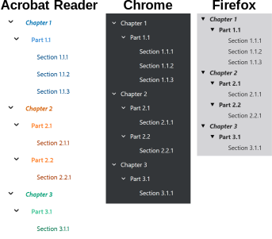

# Document outline
{: .no_toc }

  

    Table of contents
  

  {: .text-delta }
1. TOC
{:toc}

A document outline is a tree-like visualisation that provides an overview of the structure of the document. This can be used, e.g., to provide a list of chapters and subsections of a document.

By default, PDF documents created by VectSharp do not include an outline. If you wish to include an outline, you should create an `OutlineTree` object and provide it as an optional parameter to the `SaveAsPDF` method. The `TopLevelItems` property of the `OutlineTree` class contains a list of the top-level items in the outline, and each item can have zero or more `Children`.

## Creating a basic outline

When creating an outline item, you can supply a tag to an element in the document; when the outline item is clicked, the document will scroll to the position of that element. You can also create an outline item without supplying a tag; in this case, the outline item will still be presented in the tree structure, but it will not be clickable.

The following example shows how to create a document with an outline. 

    

        <a href="assets/tutorials/Outline_Example.pdf" download>Download the example PDF</a>
    


using VectSharp;
using VectSharp.PDF;

// Create a new document.
Document doc = new Document();

// Fonts.
Font chapterFont = new Font(FontFamily.ResolveFontFamily(FontFamily.StandardFontFamilies.HelveticaBold), 32);
Font partFont = new Font(FontFamily.ResolveFontFamily(FontFamily.StandardFontFamilies.HelveticaBold), 24);
Font sectionFont = new Font(FontFamily.ResolveFontFamily(FontFamily.StandardFontFamilies.HelveticaOblique), 16);

// Create an A4 page.
Page pag1 = new Page(595, 842);

// Draw some headings.
pag1.Graphics.FillText(20, 20, "Chapter 1: The First Chapter", chapterFont, Colours.Black, tag: "chapter_1");
pag1.Graphics.FillText(20, 80, "Part 1.1: The First Part of the First Chapter", partFont, Colours.Black, tag: "part_1.1");
pag1.Graphics.FillText(20, 120, "Section 1.1.1: The first section of the first part of the first chapter", sectionFont, Colours.Black, tag: "section_1.1.1");
pag1.Graphics.FillText(20, 400, "Section 1.1.2: The second section of the first part of the first chapter", sectionFont, Colours.Black, tag: "section_1.1.2");

// Add the page to the document.
doc.Pages.Add(pag1);

// Second page.
Page pag2 = new Page(595, 842);
pag2.Graphics.FillText(20, 20, "Section 1.1.3: The third section of the first part of the first chapter", sectionFont, Colours.Black, tag: "section_1.1.3");
doc.Pages.Add(pag2);

// Third page.
Page pag3 = new Page(595, 842);
pag3.Graphics.FillText(20, 20, "Chapter 2: The Second Chapter", chapterFont, Colours.Black, tag: "chapter_2");
pag3.Graphics.FillText(20, 80, "Part 2.1: The First Part of the Second Chapter", partFont, Colours.Black, tag: "part_2.1");
pag3.Graphics.FillText(20, 120, "Section 2.1.1: The first section of the first part of the second chapter", sectionFont, Colours.Black, tag: "section_2.1.1");
doc.Pages.Add(pag3);

// Fourth page.
Page pag4 = new Page(595, 842);
pag4.Graphics.FillText(20, 20, "Part 2.2: The Second Part of the Second Chapter", partFont, Colours.Black, tag: "part_2.2");
pag4.Graphics.FillText(20, 60, "Section 2.2.1: The first section of the second part of the second chapter", sectionFont, Colours.Black, tag: "section_2.2.1");
pag4.Graphics.FillText(20, 320, "Chapter 3: The Third Chapter", chapterFont, Colours.Black, tag: "chapter_3");
pag4.Graphics.FillText(20, 380, "Part 3.1: The First Part of the Third Chapter", partFont, Colours.Black, tag: "part_3.1");
pag4.Graphics.FillText(20, 420, "Section 3.1.1: The first section of the first part of the third chapter", sectionFont, Colours.Black, tag: "section_3.1.1");
doc.Pages.Add(pag4);

// Create the outline tree.
OutlineTree outlineTree = new OutlineTree()
{
    new ("Chapter 1", "chapter_1")
    {
        new ("Part 1.1", "part_1.1")
        {
            new ("Section 1.1.1", "section_1.1.1"),
            new ("Section 1.1.2", "section_1.1.2"),
            new ("Section 1.1.3", "section_1.1.3")
        }
    },

    new ("Chapter 2", "chapter_2")
    {
        new ("Part 2.1", "part_2.1")
        {
            new ("Section 2.1.1", "section_2.1.1")
        },
        new ("Part 2.2", "part_2.2")
        {
            new ("Section 2.2.1", "section_2.2.1")
        }
    },

    new ("Chapter 3", "chapter_3")
    {
        new ("Part 3.1", "part_3.1")
        {
            new ("Section 3.1.1", "section_3.1.1")
        }
    }
};

// Save the PDF document, including the outline.
doc.SaveAsPDF("Outline_Example.pdf", outline: outlineTree);


## Customising the outline format

Outlines in PDF can be customised: the colour of each heading can be specified, and the headings can be draw in bold, italics, or both. These settings can be specified while creating the outline tree. The following example shows how to create an outline tree specifying the format for each heading:

    

        <a href="assets/tutorials/Outline_Format.pdf" download>Download the example PDF</a>
    


// Create the outline tree.
OutlineTree outlineTree = new OutlineTree()
{
    new ("Chapter 1", "chapter_1", colour: Colour.FromRgb(0, 114, 178), bold: true, italic: true)
    {
        new ("Part 1.1", "part_1.1", Colour.FromRgb(75, 152, 220), true)
        {
            new ("Section 1.1.1", "section_1.1.1", Colour.FromRgb(0, 78, 138)),
            new ("Section 1.1.2", "section_1.1.2", Colour.FromRgb(0, 78, 138)),
            new ("Section 1.1.3", "section_1.1.3", Colour.FromRgb(0, 78, 138))
        }
    },

    new ("Chapter 2", "chapter_2", Colour.FromRgb(213, 94, 0), true, true)
    {
        new ("Part 2.1", "part_2.1", Colour.FromRgb(255, 134, 51), true)
        {
            new ("Section 2.1.1", "section_2.1.1", Colour.FromRgb(166, 55, 0))
        },
        new ("Part 2.2", "part_2.2", Colour.FromRgb(255, 134, 51), true)
        {
            new ("Section 2.2.1", "section_2.2.1", Colour.FromRgb(166, 55, 0))
        }
    },

    new ("Chapter 3", "chapter_3", Colour.FromRgb(0, 158, 115), true, true)
    {
        new ("Part 3.1", "part_3.1", Colour.FromRgb(72, 199, 154), true)
        {
            new ("Section 3.1.1", "section_3.1.1", Colour.FromRgb(0, 118, 78))
        }
    }
};


Unfortunately, most PDF viewers do not support formatted outlines. As of April 4th 2024, this is the software I tested:
* Adobe Acrobat Reader supports both colours and text styles.
* Mozilla Firefox only supports text styles, but not colours.
* Google Chrome, Microsoft Edge, TeXworks, SumatraPDF, and the macOS Preview program support neither text styles nor colours.

Here is how the outline looks like in different software:

    

## Creating an outline from a Markdown document

If you are creating a PDF document from a Markdown document using VectSharp.Markdown, you can use the headings in the Markdown document to automatically create an outline.

The `MarkdownRenderer.Render` and `MarkdownRenderer.RenderSinglePage` methods have an `out` parameter that returns a heading tree. You can supply this object to the static `OutlineTree.CreateFromHeadings` method, in order to receive an `OutlineTree` object that can be included in a PDF document. This method has an optional parameter `topLevel`, which can be used to exclude headings above a certain level from the outline. This is useful, for example, if the Markdown document has a single level 1 heading containing the document title.

The following example shows how to render the VectSharp readme as a PDF document including the outline.

    

        <a href="assets/tutorials/VectSharp_Readme.pdf" download>Download the example PDF</a>
    


using VectSharp;
using VectSharp.Markdown;
using VectSharp.MuPDFUtils;
using VectSharp.PDF;

// Download the Markdown source for the VectSharp readme.
string markdownSource = new HttpClient()
                        .GetStringAsync(@"https://raw.githubusercontent.com/arklumpus/VectSharp/master/Readme.md")
                        .Result;

// Create a Markdown renderer.
MarkdownRenderer renderer = new MarkdownRenderer();
renderer.BaseImageUri = "https://raw.githubusercontent.com/arklumpus/VectSharp/master/";
renderer.RasterImageLoader = imageFile => new RasterImageFile(imageFile);

// Render the Markdown document to a VectSharp.Document object. The heading tree will be
// contained in the out headingTree variable.
Document doc = renderer.Render(markdownSource, out Dictionary<string, string> linkDestinations,
                               out List<(int level, string heading, string tag)> headingTree);

// Create an outline tree from the heading tree extracted from the Markdown document.
// We use topLevel: 2 so that headings at level 1 (in this case, the first line in the
// document, containing the document title) do not show up in the outline.
OutlineTree outline = OutlineTree.CreateFromHeadings(headingTree, topLevel: 2);

// Save the document in PDF format, including the outline.
doc.SaveAsPDF("VectSharp_Readme.pdf", linkDestinations: linkDestinations, outline: outline);
