# Plots

The [VectSharp.Plots]() NuGet package can be used to create a number of plots/charts from different kinds of data, such as histograms, function plots, and more. Plots can be created either by using one of the methods of the `Plot.Create` static class to create one of the predefined kinds of plots, or by manually composing individual plot elements (such as axes, labels, points...).

## Types of plots in VectSharp.Plots

<table style="text-align: center" id="plotTypes">
  <tr>
    <td>
      <a href="{{ site.baseurl }}">
        <table>
          <tr>
            <td style="border: 0" class="plotThumbnail">
              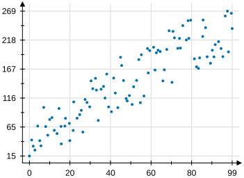
            </td>
          </tr>
          <tr>
            <td>
              Scatter plots
            </td>
          </tr>
        </table>
      </a>
    </td>
    <td>
      <a href="{{ site.baseurl }}">
        <table>
          <tr>
            <td style="border: 0" class="plotThumbnail">
              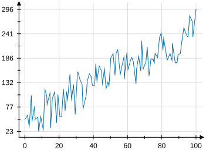
            </td>
          </tr>
          <tr>
            <td>
              Line charts
            </td>
          </tr>
        </table>
      </a>
    </td>
    <td>
      <a href="{{ site.baseurl }}">
        <table>
          <tr>
            <td style="border: 0" class="plotThumbnail">
              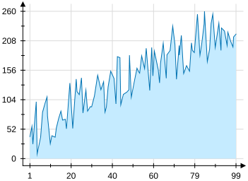
            </td>
          </tr>
          <tr>
            <td>
              Area charts
            </td>
          </tr>
        </table>
      </a>
    </td>
  </tr>

  <tr>
    <td>
      <a href="{{ site.baseurl }}">
        <table>
          <tr>
            <td style="border: 0" class="plotThumbnail">
              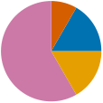
            </td>
          </tr>
          <tr>
            <td>
              Pie charts
            </td>
          </tr>
        </table>
      </a>
    </td>
    <td>
      <a href="{{ site.baseurl }}">
        <table>
          <tr>
            <td style="border: 0" class="plotThumbnail">
              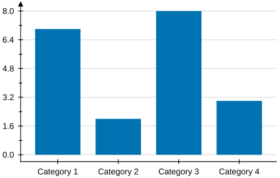
            </td>
          </tr>
          <tr>
            <td>
              Bar charts
            </td>
          </tr>
        </table>
      </a>
    </td>
    <td>
      <a href="{{ site.baseurl }}">
        <table>
          <tr>
            <td style="border: 0" class="plotThumbnail">
              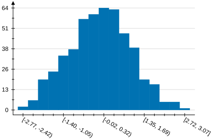
            </td>
          </tr>
          <tr>
            <td>
              Histograms
            </td>
          </tr>
        </table>
      </a>
    </td>
  </tr>
  
  <tr>
    <td>
      <a href="{{ site.baseurl }}">
        <table>
          <tr>
            <td style="border: 0" class="plotThumbnail">
              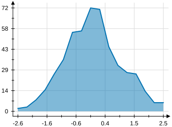
            </td>
          </tr>
          <tr>
            <td>
              Distributions
            </td>
          </tr>
        </table>
      </a>
    </td>
    <td>
      <a href="{{ site.baseurl }}">
        <table>
          <tr>
            <td style="border: 0" class="plotThumbnail">
              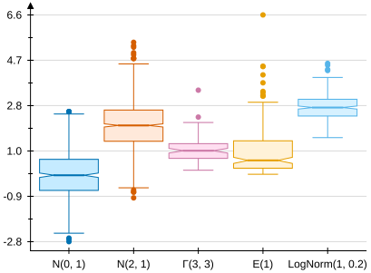
            </td>
          </tr>
          <tr>
            <td>
              Box plots
            </td>
          </tr>
        </table>
      </a>
    </td>
    <td>
      <a href="{{ site.baseurl }}">
        <table>
          <tr>
            <td style="border: 0" class="plotThumbnail">
              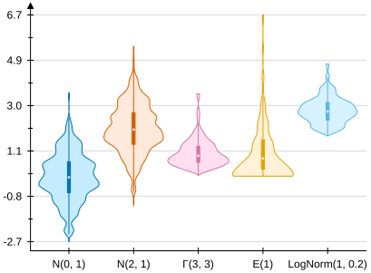
            </td>
          </tr>
          <tr>
            <td>
              Violin plots
            </td>
          </tr>
        </table>
      </a>
    </td>
  </tr>

  <tr>
    <td>
      <a href="{{ site.baseurl }}">
        <table>
          <tr>
            <td style="border: 0" class="plotThumbnail">
              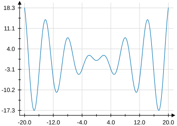
            </td>
          </tr>
          <tr>
            <td>
              Functions of one variable
            </td>
          </tr>
        </table>
      </a>
    </td>
    <td>
      <a href="{{ site.baseurl }}">
        <table>
          <tr>
            <td style="border: 0" class="plotThumbnail">
              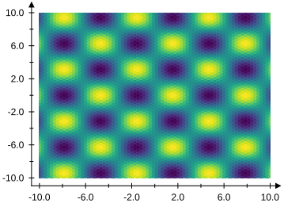
            </td>
          </tr>
          <tr>
            <td>
              Functions of two variables
            </td>
          </tr>
        </table>
      </a>
    </td>
    <td>
      <a href="{{ site.baseurl }}">
        <table>
          <tr>
            <td style="border: 0" class="plotThumbnail">
              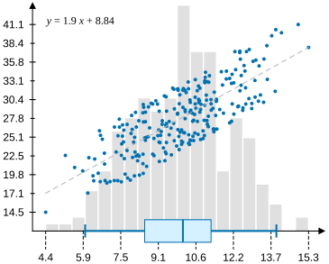
            </td>
          </tr>
          <tr>
            <td>
              Custom plots
            </td>
          </tr>
        </table>
      </a>
    </td>
  </tr>

</table>

## General information

A plot is represented as a `Plot` object, containing multiple elemnts that implement the `IPlotElement` interface. This interface requires every plot element to implement two members:

* The `Plot` method, that is used to draw the plot element on the full plot.
* The `CoordinateSystem` property that is used to specify the coordinate system used by the plot element.

### Coordinate systems

Conceptually, a coordinate system is a function that transforms elements from the "data space" to the "plot space". For example, a coordinate system could be used to maps values in $\mathbb{R}^2$ to points on the plot surface, which will have a finite and small range, e.g. from $\left \\\{ 0, 0 \right \\\}$ to $\left \\\{ 350, 250 \right \\\}$. The data space does not necessarily have to be a vector space; for example, a coordinate system could transform strings (e.g., categories) to points.

Coordinate systems implement the `ICoordinateSystem<T>` interface, where `T` is the type of the data space (e.g., `double[]` or `string`). This interface requires the implementation of a method `Point ToPlotCoordinates(T dataPoint)`, which does the conversion between data space and plot space.

For certain kinds of data spaces (e.g. $R^n$, where `T` is `double[]`), the coordinate system may be able to make additional guarantees about the transformation. If the coordinate system implements the `IContinuousCoordinateSystem` interface, the transformation is guaranteed to be continuous (i.e., arbitrarily close points in the data space will also be arbitrarily close in the plot space). This interface requires four additional members:

* The `bool IsLinear` property should be set to `true` if the transformation is linear (i.e., $f\left (A + k\cdot B \right) = f\left(A \right) + k \cdot f \left (B\right)$).
* In cases where the transformation is not linear, the `bool IsDirectionStraight(IReadOnlyList<double> direction)` method should return `true` if data points along `direction` will all be transformed into plot points that lie on the same line. Note that this does not necessarily mean that transformations along `direction` are linear. 

  For example, a logarithmic coordinate system $f\left ( \left \\\{ x, y \right \\\} \right ) = \left \\\{ \log(x), \log(y) \right \\\}$ is not linear along any direction, but respects this property for data points along lines parallel to each of the two axes.

* The `double[] Resolution` property should return a value (in data space) specifying how close two points have to be in data space in order for them to be practically indistinguishable in plot space. Where this is not well-defined (or where the value should change depending on the location of the points, such as in a logarithmic coordinate system), a reasonable approximation should be returned.

* The `double[] GetAround(IReadOnlyList<double> point, IReadOnlyList<double> direction)` method should return a point in data space that is arbitrarily close to the supplied `point`, along the specified `direction`. This is similar to the `Resolution` property, but can produce different values for each point and each direction.

Furthermore, if the transformation is invertible, the coordinate system can implement the `IContinuousInvertibleCoordinateSystem` interface, which defines an additional method `double[] ToDataCoordinates(Point plotPoint)` that should perform the inverse transformation (from plot space to data space).

VectSharp.Plots implements some commonly-used coordinate systems:

* A `LinearCoordinateSystem2D` is a continuous invertible coordinate system, converting points in $R^2$ (represented as `double[]`s or `IReadOnlyList<double>`s) using a linear transformation. Given six values $x_{min}$, $x_{max}$, $y_{min}$, $y_{max}$, $w$ and $h$, the direct transformation is:

  $$
  f \left ( \left \{ x, y \right \} \right ) = \left \{ \frac{x - x_{min}}{x_{max} - x_{min}} \cdot w, \left ( 1 - \frac{y - y_{min}}{y_{max} - y_{min}} \right ) \cdot h \right \}
  $$

  This class has three constructors. In the constructor accepting six `double` parameters, the six values are specified directly; in the constructors accepting a collection of data points (either as an `IReadOnlyList<IReadOnlyList<double>>` or as a `double[n, 2]` 2D array), $x_{min}$, $x_{max}$, $y_{min}$, $y_{max}$ are determined from the data, while $w$ and $h$ are specified as additional parameters.

* A `LogarithmicCoordinateSystem2D` is another continuous invertible coordinate system, which transforms points using a logarithmic transformation. Given $x_{min}$, $x_{max}$, $y_{min}$, $y_{max}$, $w$ and $h$, the direct transformation is:

  $$
  f \left ( \left \{ x, y \right \} \right ) = \left \{ \frac{\log \left (x \right) - \log \left (x_{min} \right )}{\log \left (x_{max}\right ) - \log \left (x_{min}\right )} \cdot w, \left ( 1 - \frac{\log \left (y \right )- \log \left (y_{min}\right )}{\log \left (y_{max}\right ) - \log \left (y_{min} \right )} \right ) \cdot h \right \}
  $$

  Like a `LinearCoordinateSystem2D`, a `LogarithmicCoordinateSystem2D` can be constructed either by providing the six values, or by providing a collection of data points.

* A `LinLogCoordinateSystem2D` performs a logarithmic transformation on the $x$ axis, and a linear transformation on the $y$ axis:

  $$
  f \left ( \left \{ x, y \right \} \right ) = \left \{ \frac{\log \left (x \right) - \log \left (x_{min} \right )}{\log \left (x_{max}\right ) - \log \left (x_{min}\right )} \cdot w, \left ( 1 - \frac{y - y_{min}}{y_{max} - y_{min}} \right ) \cdot h \right \}
  $$

  Like a `LinearCoordinateSystem2D`, a `LinLogCoordinateSystem2D` can be constructed either by providing the six values, or by providing a collection of data points.

* A `LogLinCoordinateSystem2D` performs a logarithmic transformation on the $y$ axis, and a linear transformation on the $x$ axis:

  $$
  f \left ( \left \{ x, y \right \} \right ) = \left \{  \frac{x - x_{min}}{x_{max} - x_{min}} \cdot w, \left ( 1 - \frac{\log \left (y \right )- \log \left (y_{min}\right )}{\log \left (y_{max}\right ) - \log \left (y_{min} \right )} \right ) \cdot h \right \}
  $$

  Like a `LinearCoordinateSystem2D`, a `LogLinCoordinateSystem2D` can be constructed either by providing the six values, or by providing a collection of data points.

* A `CoordinateSystem<T>` can be used if you want to specify a custom method to compute the coordinates without creating a whole new implementation of the `ICoordinateSystem2D` interface. The constructor for this type requires the method used to compute the coordinates as a parameter.

In addition to these classes, a number of classes and interfaces are defined dealing with 1-D coordinate systems. The intention is that these can be combined flexibly to create 2D coordinate systems. The `ICoordinateSystem1D<T>` interface defines a 1-D coordinate system and requires the implementation of a method `double ToPlotCoordinates(T dataPoint)`, converting a point in data space to a `double` (e.g., a coordinate along one of the axes of the plot). Four implementations of this interface are provided:

 * A `LinearCoordinateSystem1D` is a like a `LinearCoordinateSystem2D`, but for a single coordinate.

 * A `LogarithmicCoordinateSystem1D` is a like a `LogarithmicCoordinateSystem2D`, but for a single coordinate.

 * A `CategoricalCoordinateSystem1D<T>` assigns a coordinate value to a object of type `T`, where `T` is a type that can have discrete values (e.g., a `string` or a `char`). This class can be initialised either by providing a `Dictionary<T, double>` containing the coordinate values, or by providing a list of all the possible values, which will be used to build the dictionary internally.

 * A `CoordinateSystem1D` uses a custom method to compute the plot coordinate. You can use this if you want to specify a the way the coordinates should be computed without creating a whole class implementing the `ICoordinateSystem1D` interface.

The class `CompositeCoordinateSystem2D<T1, T2>` can be used to combine two `ICoordinateSyste1D`s to produce a 2D coordinate system. This could be used, e.g. to combine a categorical coordinate system and a linear coordinate system to produce a hybrid coordinate system to use in a histogram.
