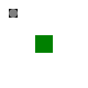

# Coordinate system transformations
{: .no_toc }

  

    Table of contents
  

  {: .text-delta }
1. TOC
{:toc}

Normally, in VectSharp the origin of the coordinate system (i.e., the point at $\left( 0, 0 \right )$) is placed in the top-left corner of the image, with the `x` axis pointing horizontally to the right, and the `y` axis vertically towards the bottom. However, a number of methods of the `Graphics` class can be used to (temporarily) alter the coordinate system. This can be used in multiple ways - e.g., to reuse code to draw the same objects at different locations or to draw stretched or rotated text.

## Translating the coordinate system

The `Translate` method makes it possible to translate the coordinate system. This method accepts the coordinates of a point (either as a `Point` object, or as two `double`s), which represent the coordinates of the origin of the translated coordinate system in the previous coordinate system. In practice, translating by $\left( t_x, t_y \right )$ means that all the subsequent drawing calls will behave as if the `X` coordinate of all the supplied points had been increased by $t_x$, and the `Y` coordinate by $t_y$.

The following example illustrates the effect of this transformation:

    <iframe src="Blazor?translation" style="width: 100%; height: 15em; border: 0px solid black"></iframe>


using VectSharp;
using VectSharp.SVG;

Page page = new Page(100, 100);
Graphics graphics = page.Graphics;

// Draw the original coordinate system. The X axis is in blue, the Y axis in orange, the origin is in grey.
graphics.StrokePath(new GraphicsPath().MoveTo(0, 0).LineTo(10, 0), Colour.FromRgba(0, 114, 178, 0.5));
graphics.StrokePath(new GraphicsPath().MoveTo(0, 0).LineTo(0, 10), Colour.FromRgba(213, 94, 0, 0.5));
graphics.FillPath(new GraphicsPath().Arc(0, 0, 1, 0, 2 * Math.PI), Colour.FromRgb(220, 220, 220));

// Amount to translate on the X axis.
double translationX = 30;

// Amount to translate on the Y axis.
double translationY = 50;

// Translate the coordinate system.
graphics.Translate(translationX, translationY);

// Draw the new coordinate system.
graphics.StrokePath(new GraphicsPath().MoveTo(0, 0).LineTo(10, 0), Colour.FromRgb(0, 114, 178));
graphics.StrokePath(new GraphicsPath().MoveTo(0, 0).LineTo(0, 10), Colour.FromRgb(213, 94, 0));
graphics.FillPath(new GraphicsPath().Arc(0, 0, 1, 0, 2 * Math.PI), Colour.FromRgb(180, 180, 180));

page.SaveAsSVG("Translation.svg");


[Back to top](#){: .btn }

## Scaling the axes

The `Scale` method, instead, applies a scaling of the coordinate system. The parameters for this method are two `double`s, the scaling factor for the `X` axis and the scaling factor for the `Y` axis. In practice, scaling by $\left( s_x, s_y \right )$ means that all the subsequent drawing calls will behave as if the `X` coordinate of all the supplied points had been multiplied by $s_x$, and the `Y` coordinate by $s_y$. Note that if $s_x$ and $s_y$ are $ > 1$, the plot increases in size, while if $s_x$ and $s_y$ are $< 1$ the plot becomes smaller.

The following example illustrates the effect of this transformation. Since there is no translation, the original axes would be behind the new axes, therefore they are not drawn in this example.

    <iframe src="Blazor?scaling" style="width: 100%; height: 15em; border: 0px solid black"></iframe>


using VectSharp;
using VectSharp.SVG;

Page page = new Page(100, 100);
Graphics graphics = page.Graphics;

// Amount to scale on the X axis.
double scaleX = 1.5;

// Amount to scale on the Y axis.
double scaleY = 1.5;

// Translate the coordinate system.
graphics.Scale(scaleX, scaleY);

// Draw the new coordinate system. The X axis is in blue, the Y axis in orange, the origin is in grey.
graphics.StrokePath(new GraphicsPath().MoveTo(0, 0).LineTo(10, 0), Colour.FromRgb(0, 114, 178));
graphics.StrokePath(new GraphicsPath().MoveTo(0, 0).LineTo(0, 10), Colour.FromRgb(213, 94, 0));
graphics.FillPath(new GraphicsPath().Arc(0, 0, 1, 0, 2 * Math.PI), Colour.FromRgb(180, 180, 180));

page.SaveAsSVG("Scaling.svg");


[Back to top](#){: .btn }

## Rotating the axes

Another option is to rotate the axes using the `Rotate` method. This method has a single parameter, corresponding to the rotation angle (in radiants). After using this method, the axes stay perpendicular to each other, but they are not horizontal/vertical any more. In practice, the effect is that all subsequent drawing calls will behave as if each point had been rotated by the specified angle, using the origin as a pivot.

The following example illustrates the effect of rotating the axes.

    <iframe src="Blazor?rotation" style="width: 100%; height: 15em; border: 0px solid black"></iframe>


using VectSharp;
using VectSharp.SVG;

Page page = new Page(100, 100);
Graphics graphics = page.Graphics;

// Draw the original coordinate system. The X axis is in blue, the Y axis in orange, the origin is in grey.
graphics.StrokePath(new GraphicsPath().MoveTo(0, 0).LineTo(10, 0), Colour.FromRgba(0, 114, 178, 0.5));
graphics.StrokePath(new GraphicsPath().MoveTo(0, 0).LineTo(0, 10), Colour.FromRgba(213, 94, 0, 0.5));
graphics.FillPath(new GraphicsPath().Arc(0, 0, 1, 0, 2 * Math.PI), Colour.FromRgb(220, 220, 220));

// Rotation angle, in radiants.
double angle = Math.PI / 4;

// Translate the coordinate system.
graphics.Rotate(angle);

// Draw the new coordinate system.
graphics.StrokePath(new GraphicsPath().MoveTo(0, 0).LineTo(10, 0), Colour.FromRgb(0, 114, 178));
graphics.StrokePath(new GraphicsPath().MoveTo(0, 0).LineTo(0, 10), Colour.FromRgb(213, 94, 0));
graphics.FillPath(new GraphicsPath().Arc(0, 0, 1, 0, 2 * Math.PI), Colour.FromRgb(180, 180, 180));

page.SaveAsSVG("Rotation.svg");


In addition to the `Rotate` method, which rotates the coordinate system around the origin, the `RotateAt` method can be used to rotate the axes using a `Point` as a pivot. The following example shows the effect of this method:

    <iframe src="Blazor?rotationAt" style="width: 100%; height: 15em; border: 0px solid black"></iframe>


using VectSharp;
using VectSharp.SVG;

Page page = new Page(100, 100);
Graphics graphics = page.Graphics;

// Draw the original coordinate system. The X axis is in blue, the Y axis in orange, the origin is in grey.
graphics.StrokePath(new GraphicsPath().MoveTo(0, 0).LineTo(10, 0), Colour.FromRgba(0, 114, 178, 0.5));
graphics.StrokePath(new GraphicsPath().MoveTo(0, 0).LineTo(0, 10), Colour.FromRgba(213, 94, 0, 0.5));
graphics.FillPath(new GraphicsPath().Arc(0, 0, 1, 0, 2 * Math.PI), Colour.FromRgb(220, 220, 220));

// Rotation angle, in radiants.
double angle = Math.PI / 4;

// The pivot for the rotation.
Point pivot = new Point(0, 50);

// Translate the coordinate system.
graphics.RotateAt(angle, pivot);

// Draw the new coordinate system.
graphics.StrokePath(new GraphicsPath().MoveTo(0, 0).LineTo(10, 0), Colour.FromRgb(0, 114, 178));
graphics.StrokePath(new GraphicsPath().MoveTo(0, 0).LineTo(0, 10), Colour.FromRgb(213, 94, 0));
graphics.FillPath(new GraphicsPath().Arc(0, 0, 1, 0, 2 * Math.PI), Colour.FromRgb(180, 180, 180));

page.SaveAsSVG("RotationAt.svg");


[Back to top](#){: .btn }

## Combining multiple transformations

Naturally, you can combine multiple transformations by calling these methods in sequence. Each transformation will be applied in the reverse of the order that you specified them. For example, consider the following code:


graphics.Translate(20, 20);
graphics.Scale(2, 2);

graphics.FillPath(new GraphicsPath().Arc(15, 15, 5, 0, 2 * Math.PI), Colours.Black);


This code fills a circle centered at $\left (15, 15 \right)$ in the final coordinate system, with radius $5$. What would be the coordinates of the centre and the radius in the original coordinate system (i.e., before the calls to `Translate` and `Scale`)?

We need to first apply the scale, and then the translation, thus the result is $15 \cdot 2 + 20 = 50$: the circle is centered at $(50, 50)$ in the original coordinate system. The translation does not affect the radius, thus the radius of the circle is $5 \cdot 2 = 10$ in the original coordinate system.

[Back to top](#){: .btn }

## Affine transformations

All the transformations described up to here (including those obtained by combining multiple different transformations) are [affine transformations](https://en.wikipedia.org/wiki/Affine_transformation). This means that by applying such transformations, a straight line will always be transformed into a straight line, and two parallel lines will still be parallel after the transformation.

In general, an affine transformation can be represented by a _transformation matrix_ of the following form:

$$\mathbf{M} = \begin{bmatrix} a & c & e \\ b & d & f \\ 0 & 0 & 1 \end{bmatrix}$$

A point with coordinates $\left (x, y \right )$ is instead represented by a vector:

$$\mathbf{P} = \begin{bmatrix} x \\ y \\ 1 \end{bmatrix}$$

The transformation is applied to the point by multiplying the vector by the matrix:

$$\mathbf{P^\prime} = \mathbf{M} \cdot \mathbf{P} = \begin{bmatrix} a & c & e \\ b & d & f \\ 0 & 0 & 1 \end{bmatrix} \cdot \begin{bmatrix} x \\ y \\ 1 \end{bmatrix} = \begin{bmatrix} ax + cy + e \\ bx + dy + f \\ 1 \end{bmatrix}$$

This notation makes it possible to generalise the effect of the transformations described above by using the `Transform` method, which accepts 6 `double` parameters corresponding to $a$, $b$, $c$, $d$, $e$, and $f$ (this method has an overload which accepts a `Func<Point, Point>`, but this will be described in [another section](advanced_transformations.html)).

You can easily verify that a translation by $\left (t_x, t_y \right )$ corresponds to the following matrix:

$$\mathbf{T} = \begin{bmatrix} 1 & 0 & t_x \\ 0 & 1 & t_y \\ 0 & 0 & 1 \end{bmatrix}$$

While a scaling by $\left (s_x, s_y \right )$ is represented by:

$$\mathbf{S} = \begin{bmatrix} s_x & 0 & 0 \\ 0 & s_y & 0 \\ 0 & 0 & 1 \end{bmatrix}$$

And a rotation by $\theta$ corresponds to:

$$\mathbf{R} = \begin{bmatrix} \cos \theta & -\sin \theta & 0 \\ \sin \theta & \cos \theta & 0 \\ 0 & 0 & 1 \end{bmatrix}$$

Multiple transformations can be combined by multiplying the correponding matrices. For example, a translation followed by a scaling (as in the example above) would be represented by:

$$\mathbf{M} = \mathbf{T} \cdot \mathbf{S} = \begin{bmatrix} 1 & 0 & t_x \\ 0 & 1 & t_y \\ 0 & 0 & 1 \end{bmatrix} \cdot \begin{bmatrix} s_x & 0 & 0 \\ 0 & s_y & 0 \\ 0 & 0 & 1 \end{bmatrix} = \begin{bmatrix} s_x & 0 & t_x \\ 0 & s_y & t_y \\ 0 & 0 & 1 \end{bmatrix}$$

The following example shows the effect of applying an arbitrary affine transformation:

    <iframe src="Blazor?affine" style="width: 100%; height: 15em; border: 0px solid black"></iframe>


using VectSharp;
using VectSharp.SVG;

Page page = new Page(100, 100);
Graphics graphics = page.Graphics;

// Draw the original coordinate system. The X axis is in blue, the Y axis in orange, the origin is in grey.
graphics.StrokePath(new GraphicsPath().MoveTo(0, 0).LineTo(10, 0), Colour.FromRgba(0, 114, 178, 0.5));
graphics.StrokePath(new GraphicsPath().MoveTo(0, 0).LineTo(0, 10), Colour.FromRgba(213, 94, 0, 0.5));
graphics.FillPath(new GraphicsPath().Arc(0, 0, 1, 0, 2 * Math.PI), Colour.FromRgb(220, 220, 220));

// Elements of the transformation matrix.
// [  1.5   -1.5   40 ] 
// [ 0.75   0.75   35 ]
// [    0      0    1 ]
double a = 1.5;
double b = 0.75;
double c = - 1.5;
double d = 0.75;
double e = 40;
double f = 35;

// Apply the transformation matrix.
graphics.Transform(a, b, c, d, e, f);

// Draw the new coordinate system.
graphics.StrokePath(new GraphicsPath().MoveTo(0, 0).LineTo(10, 0), Colour.FromRgb(0, 114, 178));
graphics.StrokePath(new GraphicsPath().MoveTo(0, 0).LineTo(0, 10), Colour.FromRgb(213, 94, 0));
graphics.FillPath(new GraphicsPath().Arc(0, 0, 1, 0, 2 * Math.PI), Colour.FromRgb(180, 180, 180));

page.SaveAsSVG("Affine.svg");


[Back to top](#){: .btn }

## Saving and restoring the coordinate system

Sometimes, after performing a transformation of the coordinate system, you may need to reverse it. In principle, you _could_ do this by performing the inverse transformation (e.g., if you translated by $\left (x, y \right)$, you could translate again by $\left (-x , -y \right)$); however, keeping track of all the transformations that have been performed and reversing them in order can be tedious.

To address this, the `Graphics` object exposes two methods, `Save` and `Restore`. When you call the `Save` method, the current graphics state (including the transformation matrix) is pushed on top of a stack of graphics states. Then, when you call `Restore`, the current graphics state is discarded and replaced by popping the state on top of the stack.

In this way, a pair of calls to `Save` and `Restore` effectively isolate the effect of a group of transformation calls. For example, consider the following code:

    

        
    


using VectSharp;
using VectSharp.SVG;

Page page = new Page(100, 100);
Graphics graphics = page.Graphics;

// Draw a black rectangle at 10, 10.
graphics.FillRectangle(10, 10, 10, 10, Colours.Black);

// Save the graphics state.
graphics.Save();

// Translate the origin.
graphics.Translate(20, 20);

// Scale the axes;
graphics.Scale(2, 2);

// Draw a green rectangle at 10, 10.
graphics.FillRectangle(10, 10, 10, 10, Colours.Green);

// Restore the graphics state.
graphics.Restore();

// Draw a grey circle at 15, 15.
graphics.FillPath(new GraphicsPath().Arc(15, 15, 5, 0, 2 * Math.PI), Colours.Grey);

page.SaveAsSVG("SaveRestore.svg");


In this code, the call to `Save` saves the original coordinate system, and the call to `Restore` restores it. As a result, the grey circle is drawn over the black rectangle, and not over the green rectangle.

An important point is that the number of calls to `Save` must always match the number of calls to `Restore`; otherwise, you will get an exception when trying to save the image.

[Back to top](#){: .btn }